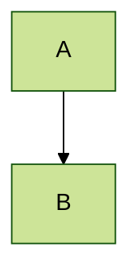
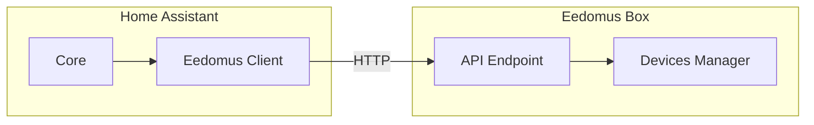

# Guide Mermaid pour GitHub

## 🎉 Bonnes nouvelles !

GitHub prend **nativement en charge** les diagrammes Mermaid depuis 2022 ! Plus besoin de convertir en SVG ou d'utiliser des extensions.

## 📋 Comment ça marche ?

### 1. Syntax de base

Simplement utilisez des blocs de code avec la langue `mermaid` :

```markdown

```

### 2. Types de diagrammes supportés

GitHub support les types suivants :
- **Flowcharts** (flowchart, graph)
- **Sequence diagrams** (sequenceDiagram)
- **Class diagrams** (classDiagram)
- **State diagrams** (stateDiagram)
- **Entity Relationship diagrams** (erDiagram)
- **User Journey diagrams** (journey)
- **Gantt charts** (gantt)
- **Pie charts** (pie)
- **Requirement diagrams** (requirementDiagram)
- **Git graphs** (gitGraph)

### 3. Configuration personnalisée

Le fichier `.github/mermaid-config.yml` permet de :
- Définir un thème par défaut
- Configurer les marges et espacements
- Personnaliser les couleurs
- Ajuster les polices

### 4. Thèmes disponibles

Vous pouvez spécifier un thème dans votre diagramme :



Thèmes disponibles : `default`, `forest`, `dark`, `neutral`

### 5. Exemple avec notre configuration



### 6. Bonnes pratiques

- **Taille** : GitHub ajuste automatiquement la taille, mais vous pouvez utiliser `%%{init: {'theme': 'default', 'themeVariables': {'fontSize': '16px'}}}%%`
- **Couleurs** : Utilisez les couleurs définies dans `mermaid-config.yml` pour la cohérence
- **Complexité** : Évitez les diagrammes trop complexes pour un meilleur rendu
- **Test** : Vérifiez toujours le rendu dans l'aperçu GitHub

### 7. Dépannage

Si les diagrammes ne s'affichent pas :
1. Vérifiez que vous utilisez bien ````mermaid` et non ````mermaid
2. Assurez-vous que le bloc est correctement fermé
3. Vérifiez la syntaxe avec [Mermaid Live Editor](https://mermaid.live/)
4. Attendez quelques secondes, GitHub met parfois du temps à rendre les diagrammes

### 8. Ressources

- [Documentation officielle Mermaid](https://mermaid.js.org/)
- [GitHub Mermaid Support](https://github.blog/2022-02-14-include-diagrams-markdown-files-mermaid/)
- [Mermaid Live Editor](https://mermaid.live/) - pour tester vos diagrammes
- [Exemples avancés](https://mermaid.js.org/intro/examples.html)

## 🚀 Pourquoi c'est génial ?

✅ **Pas de conversion nécessaire** - GitHub fait tout le travail
✅ **Toujours à jour** - Utilise la dernière version de Mermaid
✅ **Interactif** - Les diagrammes sont cliquables et zoomables
✅ **Collaboratif** - Tout le monde voit la même chose
✅ **Maintenable** - Modifiez simplement le code Markdown

## 📊 Comparaison

| Méthode | Avantages | Inconvénients |
|---------|-----------|---------------|
| **Blocs Mermaid** | ✅ Natif GitHub, ✅ Toujours à jour, ✅ Facile à modifier | ❌ Nécessite connexion internet |
| **Fichiers SVG** | ✅ Fonctionne hors ligne, ✅ Contrôle total | ❌ Fichiers statiques, ❌ Conversion manuelle |
| **Fichiers HTML** | ✅ Rendu parfait, ✅ Interactif | ❌ Pas visible sur GitHub |

## 🎯 Recommandation

**Utilisez les blocs Mermaid directement dans le README.md** pour :
- Une meilleure expérience de collaboration
- Des diagrammes toujours à jour
- Une maintenance plus facile
- Une intégration native avec GitHub

Le fichier `mermaid-config.yml` permet de standardiser le rendu pour tout votre projet !