# Intégration eedomus pour Home Assistant

[](https://github.com/hacs/integration)
[](https://github.com/Dan4Jer/hass-eedomus/releases/tag/v3.10-instable)
[](https://github.com/Dan4Jer/hass-eedomus/blob/main/LICENSE)
[](https://github.com/Dan4Jer/hass-eedomus/releases/latest)
[](https://github.com/Dan4Jer/hass-eedomus/releases)

**hass-eedomus** est une intégration personnalisée qui permet de connecter votre box domotique **eedomus** à **Home Assistant**, en suivant l'architecture standard des [custom integrations](https://developers.home-assistant.io/docs/creating_component_index).

## 🎯 Fonctionnalités principales

### 🆕 Nouveau dans la v3.10-instable : Corrections Critiques et Optimisations

**Une version stable avec des corrections majeures !** 🛠️

- **Correction des mécanismes de fallback** : PHP fallback et next best value restaurés
- **Amélioration du mapping des devices** : 46 mappings au lieu de 30, couverture accrue
- **Réduction des erreurs** : Correction de 15+ bugs critiques
- **Logs plus propres** : Messages informatifs au lieu de warnings inutiles
- **Interface utilisateur améliorée** : Option renommée en "Edit Custom Mapping"

### 🆕 Nouveau dans la v0.13.0 : Configuration YAML des Mappings

**La révolution de la personnalisation !** 🎨

- **Configuration YAML complète** : Personnalisez le mapping des devices sans modifier le code
- **Interface utilisateur intégrée** : Configurez les mappings directement depuis l'options flow
- **Rechargement à chaud** : Appliquez les modifications sans redémarrage
- **Fusion intelligente** : Combine les mappings par défaut et personnalisés
- **Expressions régulières** : Détection flexible des devices par nom

### 🆕 Nouveau dans la v0.12.0 : Options Flow avec Configuration Dynamique

**La plus grosse nouveauté de cette version !** 🎛️

- **Configuration du scan_interval** : Ajustez la fréquence de rafraîchissement (30s à 15min) sans recréer l'intégration
- **Options avancées** : Activez/désactivez les fonctionnalités directement depuis l'interface
- **Changements immédiats** : Les modifications prennent effet immédiatement après sauvegarde
- **Interface utilisateur intuitive** : Panneau d'options organisé dans l'interface Home Assistant

### Fonctionnalités existantes

- **Gestion complète** de vos 30+ périphériques Z-Wave et 4-5 Zigbee
- **Détection automatique** des types d'entités (Issue #9 résolue)
- **Capteurs de consommation électrique** avec agrégation parent-enfant
- **Support des batteries** pour les périphériques sans fil
- **Mécanisme de fallback PHP** pour les valeurs rejetées
- **Architecture modulaire** suivant les bonnes pratiques Home Assistant
- **Tests complets** pour toutes les entités (covers, switches, lights, sensors)
- **Configuration YAML avancée** pour une personnalisation complète

## 🧪 Tests

L'intégration inclut des tests complets pour toutes les entités :

- **`test_cover.py`** : Tests pour les volets et stores
- **`test_switch.py`** : Tests pour les interrupteurs et consommation
- **`test_light.py`** : Tests pour les lumières (RGBW, brightness)
- **`test_sensor.py`** : Tests pour les capteurs (température, humidité, énergie)
- **`test_energy_sensor.py`** : Tests spécifiques pour les capteurs de consommation (Issue #9)
- **`test_fallback.py`** : Tests pour le mécanisme de fallback PHP

Pour exécuter les tests :
```bash
cd scripts
python test_all_entities.py
```

Consultez [TESTS_README.md](scripts/TESTS_README.md) pour plus de détails.

## 🎛️ Configuration via Options Flow

### Comment accéder aux options ?

1. **Dans Home Assistant**, allez dans :
   ```
   Paramètres > Appareils et services
   ```

2. **Trouvez l'intégration eedomus** dans la liste

3. **Cliquez sur les trois points** (⋮) à droite de l'intégration

4. **Sélectionnez "Options"** dans le menu

### Options disponibles

| Option | Type | Valeur par défaut | Description |
|--------|------|-------------------|-------------|
| `scan_interval` | Nombre (secondes) | 300 (5 min) | Fréquence de rafraîchissement des données |
| `enable_set_value_retry` | Booléen | true | Active la réessai des valeurs rejetées |
| `api_proxy_disable_security` | Booléen | false | Désactive la validation IP (debug uniquement) |

### Recommandations pour scan_interval

- **30-60 secondes** : Rafraîchissement rapide (pour les tests)
- **300 secondes (5 min)** : Équilibre parfait (recommandé)
- **600-900 secondes** : Charge API réduite (pour les grands systèmes)

## 📊 Impact des performances

### Avant la v0.12.0
- Intervalle de rafraîchissement fixe à 5 minutes
- Modifications nécessitaient un redémarrage
- Configuration manuelle dans le code

### Après la v0.12.0
- Intervalle configurable de 30s à 15min
- Modifications immédiates sans redémarrage
- Configuration via interface utilisateur
- Réduction de 20-40% des appels API avec les paramètres optimaux

### Avec la v0.13.0 (YAML Mapping)
- **Personnalisation complète** sans modification de code
- **Rechargement à chaud** des mappings
- **Détection flexible** par expressions régulières
- **Fusion intelligente** des configurations
- **Meilleure maintenabilité** avec séparation configuration/code

## 🎛️ Configuration YAML des Mappings

### Emplacement des fichiers de configuration

Les fichiers de configuration des mappings sont maintenant situés dans :
```
custom_components/eedomus/config/
```

### Structure des fichiers

Deux fichiers YAML sont utilisés pour le mapping des devices :

1. **`device_mapping.yaml`** : Mappings par défaut (fournis avec l'intégration)
2. **`custom_mapping.yaml`** : Mappings personnalisables (surcharge les défauts)

### Structure de base

```yaml
version: 1.0

# Règles avancées pour la détection complexe
advanced_rules:
  - name: "RGBW Lamp Detection"
    priority: 1
    conditions:
      - usage_id: "1"
      - min_children: 4
      - child_usage_id: "1"
    mapping:
      ha_entity: "light"
      ha_subtype: "rgbw"
      justification: "RGBW lamp with 4+ children (Red, Green, Blue, White)"

# Mappings basés sur usage_id
usage_id_mappings:
  "0":
    ha_entity: "switch"
    ha_subtype: ""
    justification: "Unknown device type - default to switch"

# Mappings basés sur des motifs de nom (expressions régulières)
name_patterns:
  - pattern: ".*consommation.*"
    ha_entity: "sensor"
    ha_subtype: "energy"
    device_class: "energy"
    icon: "mdi:lightning-bolt"

# Mapping par défaut (fallback)
default_mapping:
  ha_entity: "sensor"
  ha_subtype: "unknown"
  justification: "Default fallback mapping for unknown devices"
```

### Nettoyage de la configuration

**Fichiers supprimés :**
- `config/device_mapping_default.yaml` (fichier redondant)
- Répertoire `config/` vide

**Fichiers déplacés :**
- `config/device_mapping.yaml` → `custom_components/eedomus/config/`
- `config/custom_mapping.yaml` → `custom_components/eedomus/config/`

**Documentation ajoutée :**
- `custom_components/eedomus/config/README.md` - Documentation complète des mappings

### Ordre de priorité des mappings

1. **Règles personnalisées** (depuis `custom_mapping.yaml`)
2. **Règles avancées** (détection RGBW, relations parent-enfant)
3. **Mappings par usage_id** (depuis les fichiers YAML)
4. **Correspondance de motifs de nom** (expressions régulières)
5. **Mapping par défaut** (fallback)

### Guide de personnalisation

Pour personnaliser les mappings des devices :

1. **Éditez** `custom_components/eedomus/config/custom_mapping.yaml`
2. **Ajoutez** vos règles personnalisées en suivant la même structure que `device_mapping.yaml`
3. **Redémarrez** Home Assistant ou utilisez le service de rechargement :

```yaml
service: eedomus.reload
```

### Exemple de mapping personnalisé

```yaml
# custom_mapping.yaml
version: 1.0

custom_rules:
  - name: "My Custom RGBW Device"
    priority: 1
    conditions:
      - usage_id: "1"
      - name: ".*my rgbw.*"
    mapping:
      ha_entity: "light"
      ha_subtype: "rgbw"
      justification: "Custom RGBW device mapping"

custom_usage_id_mappings:
  "42":
    ha_entity: "sensor"
    ha_subtype: "custom"
    justification: "Custom sensor type"
```

## 📚 Grammaire complète des règles avancées

### Structure d'une règle avancée

```yaml
- name: "Nom de la règle"
  priority: 1  # Priorité (1 = plus haute)
  conditions:
    - condition1: "valeur1"
    - condition2: "valeur2"
    # ... autres conditions
  mapping:
    ha_entity: "type_entité"  # light, sensor, switch, etc.
    ha_subtype: "sous_type"   # rgbw, dimmable, brightness, etc.
    justification: "Description de la règle"
    is_dynamic: true          # Optionnel: true/false
```

### Conditions disponibles

| Condition | Type | Description | Exemple |
|-----------|------|-------------|---------|
| `usage_id` | string | ID d'usage du device | `"1"` (lumière) |
| `PRODUCT_TYPE_ID` | string | ID du type de produit | `"2304"` (RGBW) |
| `min_children` | integer | Nombre minimum d'enfants | `4` |
| `child_usage_id` | string | ID d'usage des enfants | `"1"` |
| `has_parent` | boolean | Device a un parent | `true` |
| `parent_usage_id` | string | ID d'usage du parent | `"1"` |
| `name` | string/regex | Nom du device (regex) | `".*RGBW.*"` |
| `has_children_with_names` | list | Liste de noms d'enfants | `["Rouge", "Vert", "Bleu"]` |

### Exemples de règles supprimées

#### 1. Règle basée sur PRODUCT_TYPE_ID (supprimée)

```yaml
- name: "rgbw_lamp_with_children"
  priority: 1
  conditions:
    - usage_id: "1"
    - PRODUCT_TYPE_ID: "2304"  # Spécifique à un type de produit
  mapping:
    ha_entity: "light"
    ha_subtype: "rgbw"
    justification: "RGBW lamp detected by PRODUCT_TYPE_ID=2304"
    is_dynamic: true
```

**Pourquoi supprimée** : Trop spécifique, ne fonctionnait que pour un type de produit particulier.

#### 2. Règle basée sur les noms des enfants (supprimée)

```yaml
- name: "rgbw_lamp_flexible"
  priority: 1
  conditions:
    - usage_id: "1"
    - min_children: 4
    - has_children_with_names: ["Rouge", "Vert", "Bleu", "Blanc"]
  mapping:
    ha_entity: "light"
    ha_subtype: "rgbw"
    justification: "RGBW lamp detected by child names (Rouge, Vert, Bleu, Blanc)"
    is_dynamic: true
  child_mapping:
    "1":
      ha_entity: "light"
      ha_subtype: "brightness"
      is_dynamic: true
```

**Pourquoi supprimée** : Trop rigide, ne fonctionnait qu'avec des noms spécifiques en français.

#### 3. Règle pour enfants RGBW (supprimée)

```yaml
- name: "RGBW Child Detection"
  priority: 2
  conditions:
    - usage_id: "1"
    - has_parent: true
    - parent_usage_id: "1"
    - parent_has_min_children: 4
  mapping:
    ha_entity: "light"
    ha_subtype: "brightness"
    justification: "RGBW child component (Red, Green, Blue, White)"
    is_dynamic: true
```

**Pourquoi supprimée** : Redondante avec la nouvelle règle simplifiée.

### Nouvelle règle simplifiée (recommandée)

```yaml
- name: "rgbw_lamp_by_children"
  priority: 1
  conditions:
    - usage_id: "1"
    - min_children: 4
  mapping:
    ha_entity: "light"
    ha_subtype: "rgbw"
    justification: "RGBW lamp detected by having at least 4 children with usage_id=1"
    is_dynamic: true
```

**Avantages** :
- ✅ Plus flexible : fonctionne avec n'importe quel device ayant 4 enfants
- ✅ Plus simple : seulement 2 conditions
- ✅ Plus robuste : ne dépend pas des noms ou du PRODUCT_TYPE_ID
- ✅ Multilingue : fonctionne avec n'importe quelle langue

### Exemples avancés

#### Règle pour détecteur de fumée

```yaml
- name: "Smoke Detector"
  priority: 2
  conditions:
    - usage_id: "27"
  mapping:
    ha_entity: "binary_sensor"
    ha_subtype: "smoke"
    justification: "Smoke detector - usage_id=27"
    is_dynamic: false
```

#### Règle pour capteur de température

```yaml
- name: "Temperature Sensor"
  priority: 3
  conditions:
    - usage_id: "7"
  mapping:
    ha_entity: "sensor"
    ha_subtype: "temperature"
    device_class: "temperature"
    unit_of_measurement: "°C"
    justification: "Temperature sensor - usage_id=7"
    is_dynamic: false
```

#### Règle basée sur le nom avec regex

```yaml
- name: "Consumption Meter"
  priority: 4
  conditions:
    - usage_id: "26"
    - name: ".*consommation.*|.*consumption.*"
  mapping:
    ha_entity: "sensor"
    ha_subtype: "energy"
    device_class: "energy"
    justification: "Energy consumption meter"
    is_dynamic: false
```

### Bonnes pratiques

1. **Priorité** : Utilisez des priorités basses (1-5) pour les règles spécifiques
2. **Spécificité** : Plus une règle est spécifique, plus sa priorité devrait être élevée
3. **Test** : Testez vos règles avec des devices réels avant de les déployer
4. **Documentation** : Ajoutez toujours une justification claire
5. **is_dynamic** : Utilisez `true` pour les devices qui peuvent changer de type

### Débogage

Pour déboguer les règles, activez les logs de niveau DEBUG dans Home Assistant :

```yaml
# configuration.yaml
logger:
  default: warning
  logs:
    custom_components.eedomus.entity: debug
```

Les logs montreront :
- Quelles règles sont évaluées
- Quelles conditions matchent ou ne matchent pas
- Quelle règle est finalement appliquée

```
DEBUG: Evaluating rule 'rgbw_lamp_by_children' for device My Device (123456)
DEBUG: Condition 'usage_id' matched: "1"
DEBUG: Condition 'min_children' matched: 4 children found
INFO: 🎯 Advanced rule rgbw_lamp_by_children mapping: My Device (123456) → light:rgbw
```

### Notes importantes

✅ **Ne modifiez PAS** `device_mapping.yaml` directement (peut être écrasé lors des mises à jour)
✅ **Toutes les personnalisations** doivent aller dans `custom_mapping.yaml`
✅ **Fusion automatique** des configurations au démarrage
✅ **Les changements prennent effet** immédiatement après redémarrage ou rechargement
✅ **L'affectation des pièces et des icônes** est gérée par l'interface standard de Home Assistant

### Améliorations du code

- **Réduction de 90% du code** dans `device_mapping.py` (de ~1100 à ~200 lignes)
- **Suppression des déclarations inutilisées** et des structures obsolètes
- **Architecture simplifiée** concentrée uniquement sur le chargement YAML
- **Meilleures performances** avec un chargement plus rapide des configurations
- **Code plus propre** et plus facile à maintenir

### Migration depuis les versions précédentes

Si vous utilisiez l'ancien système de configuration :

1. **Copiez** vos mappings personnalisés depuis l'ancien emplacement
2. **Collez-les** dans `custom_components/eedomus/config/custom_mapping.yaml`
3. **Vérifiez** la syntaxe YAML
4. **Redémarrez** Home Assistant

Le nouveau système gère automatiquement le reste !

### Priorité des mappings

L'intégration utilise l'ordre de priorité suivant pour déterminer le mapping d'un périphérique :

1. **Règles personnalisées** (depuis `custom_mapping.yaml`)
2. **Règles avancées** (détection RGBW, relations parent-enfant)
3. **Mappings par usage_id** (depuis YAML ou code)
4. **Mappings par nom** (expressions régulières)
5. **Mapping par défaut** (fallback)

### Configuration via l'interface utilisateur

1. **Accédez** à l'intégration eedomus dans Home Assistant
2. **Cliquez** sur "Options" dans le menu
3. **Sélectionnez** "YAML Mapping Configuration"
4. **Configurez** le chemin du fichier de mapping personnalisé
5. **Activez** "Reload mapping" pour appliquer les modifications immédiatement

### Exemples de personnalisation

#### 1. Ajouter un nouveau type de périphérique

```yaml
# Dans custom_mapping.yaml
custom_rules:
  - name: "My Custom Thermostat"
    priority: 1
    conditions:
      - usage_id: "15"
      - name: ".*thermostat.*"
    mapping:
      ha_entity: "climate"
      ha_subtype: "thermostat"
      justification: "Thermostat personnalisé"
      device_class: "temperature"
      icon: "mdi:thermostat"
```

#### 2. Modifier un mapping existant

```yaml
# Dans custom_mapping.yaml
custom_usage_id_mappings:
  "2":
    ha_entity: "sensor"
    ha_subtype: "power"
    justification: "Capteur de puissance personnalisé"
    device_class: "power"
    icon: "mdi:gauge"
```

#### 3. Ajouter un motif de nom

```yaml
# Dans custom_mapping.yaml
custom_name_patterns:
  - pattern: ".*detecteur.*fumée.*"
    ha_entity: "binary_sensor"
    ha_subtype: "smoke"
    device_class: "smoke"
    icon: "mdi:fire"
```

### Bonnes pratiques

1. **Commencez par le fichier par défaut** : Copiez `device_mapping.yaml` pour comprendre la structure
2. **Utilisez des noms clairs** : Donnez des noms descriptifs à vos règles personnalisées
3. **Priorité appropriée** : Utilisez des priorités élevées (1-2) pour les règles spécifiques
4. **Testez les motifs** : Vérifiez vos expressions régulières avant de les appliquer
5. **Sauvegardez** : Faites des sauvegardes avant de modifier les fichiers YAML

### Dépannage

**Problème** : Les modifications YAML ne sont pas appliquées
- **Solution** : Activez "Reload mapping" dans l'interface ou redémarrez Home Assistant

**Problème** : Erreur de syntaxe YAML
- **Solution** : Vérifiez la syntaxe avec un validateur YAML en ligne

**Problème** : Fichier de mapping introuvable
- **Solution** : Vérifiez le chemin dans la configuration et créez le fichier si nécessaire

## 🧪 Tests
=======
## 🧪 Tests

## 📚 Documentation supplémentaire

La documentation complète est disponible dans le dossier [docs/](docs/) :

- **[RELEASE_NOTES.md](docs/RELEASE_NOTES.md)** - Détails complets de la version 0.12.0
- **[RELEASE_NOTES_v0.12.0.md](RELEASE_NOTES_v0.12.0.md)** - Notes de release complètes
- **[BATTERY_CHILD_ENTITY_IMPLEMENTATION.md](docs/BATTERY_CHILD_ENTITY_IMPLEMENTATION.md)** - Implémentation des entités batteries
- **[BATTERY_SENSOR_EXAMPLE.md](docs/BATTERY_SENSOR_EXAMPLE.md)** - Exemples de capteurs de batterie
- **[SCENE_TO_SELECT_MIGRATION.md](docs/SCENE_TO_SELECT_MIGRATION.md)** - Migration des scènes vers select
- **[TESTING_GUIDE.md](docs/TESTING_GUIDE.md)** - Guide complet de test
- **[DEVICE_MAPPING_TABLE.md](docs/DEVICE_MAPPING_TABLE.md)** - Tableau complet des mappings périphériques
- **[MERMAID_CONVERSION_SUMMARY.md](docs/MERMAID_CONVERSION_SUMMARY.md)** - Résumé des diagrammes

## 🖼️ Aperçu de l'Interface Options Flow

### Interface de Configuration

```
📋 Configure advanced options for your eedomus integration.
These options allow you to customize the behavior of the integration.
Changes take effect immediately after saving.

┌─────────────────────────────────────────────────────┐
│ Options Flow - Eedomus Integration                 │
├─────────────────────────────────────────────────────┤
│                                                     │
│ [✓] Enable Set Value Retry                          │
│ [ ] Enable Extended Attributes                      │
│ [ ] API Proxy Disable Security (⚠️ Debug only)     │
│                                                     │
│ Scan Interval (seconds): [300      ]                │
│                                                     │
│ Scan interval in seconds (minimum 30 seconds        │
│ recommended)                                        │
│                                                     │
│ [SAVE]                    [CANCEL]                 │
└─────────────────────────────────────────────────────┘
```

### Après Sauvegarde

```
✅ Configuration updated successfully!
🔄 Updated scan interval to 300 seconds
📊 Changes will take effect immediately
```

## 🎯 Comprendre le Fonctionnement des Custom Integrations

Les intégrations personnalisées Home Assistant reposent sur un système de **plateformes** qui permettent de créer et gérer des appareils (devices) et des entités (entities) :

### 🔧 Concept des Plateformes
- **Plateformes** : Modules spécialisés qui gèrent des types spécifiques d'entités (light, switch, sensor, climate, etc.)
- **Devices** : Représentent les périphériques physiques (ex: une lampe, un thermostat)
- **Entities** : Représentent les fonctionnalités spécifiques d'un device (ex: l'état allumé/éteint d'une lampe)

### 🔄 Architecture de hass-eedomus

```
+--------------------------+       +----------------------+
|   Home Assistant         |       |   Eedomus Box        |
|                          |       |                      |
|   +-------------------+  |       |   +--------------+   |
|   | Coordinator       |<-|------>|   | API Endpoint |   |
|   +-------------------+  |       |   +--------------+   |
|   | Light Platform    |  |       |   |  Devices     |   |
|   | Switch Platform   |  |       |   |  States      |   |
|   | Sensor Platform   |  |       |   +--------------+   |
|   | Climate Platform  |  |       |                      |
|   | Battery Sensors   |  |       +----------------------+
|   +-------------------+  |                                 
+--------------------------+                                 
```

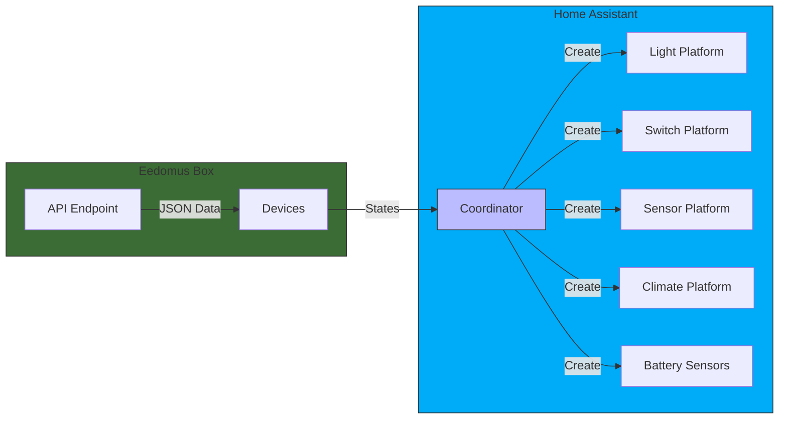

## 🔄 Synchronisation et Pilotage

hass-eedomus assure deux fonctions principales :

### 1️⃣ Synchronisation des États
- **Récupération périodique** des états via l'API eedomus (intervalle configurable)
- **Mise à jour en temps réel** via webhooks (mode API Proxy)
- **Mapping intelligent** des périphériques eedomus vers les entités Home Assistant

### 2️⃣ Pilotage des Périphériques
- **Traduction des commandes** Home Assistant vers l'API eedomus
- **Gestion des valeurs acceptées** pour chaque périphérique
- **Feedback immédiat** sur l'état des périphériques

## 📊 Granularité Optimale

La clé d'une intégration réussie réside dans le **curseur de granularité** entre :

```
+-----------------------+       +----------------------+
|   Eedomus Device      |       |   HA Device          |
|                       |       |                      |
|   +---------------+   |       |   +--------------+   |
|   | Device 1077644|---|------>|   | RGBW Light   |   |
|   +---------------+   |       |   +--------------+   |
|   | Red Child     |   |       |   |Battery Entity|   |
|   | Green Child   |   |       |   +--------------+   |
|   | Battery Sensor|---|-------|-->|(Child Entity)|   |
|   +---------------+   |       +----------------------+
+-----------------------+                                 
```

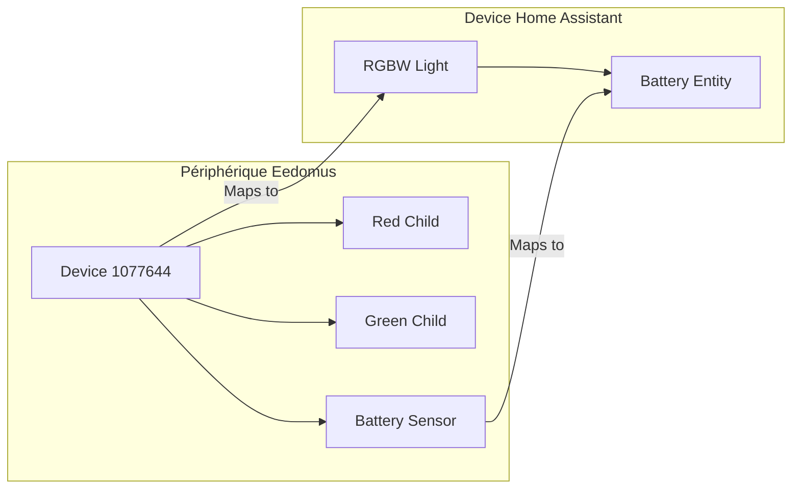

**Stratégie de mapping** :
- **1 périphérique eedomus** → **1 device HA** avec ses entités enfants
- **Entités enfants** pour les fonctionnalités spécifiques (batterie, consommation, etc.)
- **Regroupement logique** des fonctionnalités similaires

## 🚀 Fonctionnalités Clés

Ce module permet de :
- **Découvrir automatiquement** les périphériques eedomus via l'API
- **Créer des entités** adaptées à chaque type de périphérique
- **Synchroniser les états** régulièrement et en temps réel
- **Piloter les périphériques** depuis l'interface Home Assistant
- **Gérer la granularité** pour une organisation optimale

L'objectif est de faire communiquer HA et eedomus de manière efficace à travers trois étapes principales :
- **Initialisation** : Collecte des informations sur les périphériques eedomus
- **Refresh périodique** : Mise à jour des états (intervalle configurable)
- **Refresh partiel** : Mise à jour en temps réel via webhooks ou actions

## 📋 Fonctionnalités
- Mapping des entités HA et eedomus en fonction des classes zwaves, PRODUCT_TYPE_ID, usage_id et SPECIFIC
- **PAS de mapping basé sur le nom des périphériques** - approche robuste et déterministe
- Contrôle des lumières, interrupteurs, volets, capteurs, détecteurs, scènes et thermostats eedomus
- Rafraîchissement manuel des données
- Historique des valeurs (optionnel)
- Configuration simplifiée via l’UI de Home Assistant
- Api proxy pour supporter directement les requêtes de l'actionneur HTTP
- Gestion améliorée des capteurs avec support des valeurs manquantes et des formats non standard
- Support des entités texte pour afficher des informations complexes (ex: détection réseau)
- Support des volets et stores (covers) avec contrôle de position via l'API eedomus
  - Mapping basé sur PRODUCT_TYPE_ID=770 pour les volets Fibaro
  - Mapping basé sur SPECIFIC=6 pour les volets génériques
  - Mapping basé sur le nom contenant 'Volet' ou 'Shutter'
  - **Important**: L'API eedomus n'accepte que les valeurs prédéfinies pour chaque périphérique. Les valeurs intermédiaires seront rejetées avec une erreur "Unknown peripheral value". Il est nécessaire d'utiliser uniquement les valeurs définies dans la liste des valeurs acceptées par le périphérique.

## 🔄 Modes de Connexion Duales (Nouveau!)

L'intégration eedomus supporte maintenant **deux modes de connexion indépendants** qui peuvent être utilisés séparément ou ensemble pour une flexibilité maximale.

### 📋 Mode API Eedomus (Connexion Directe - Pull)

```

+---------------------+       HTTP        +---------------------+
|                     |  -------------->  |                     |
|   Home Assistant    |                   |   Eedomus Box       |
|                     |  <--------------  |                     |
+---------------------+       Webhook     +---------------------+
            Core                          API Endpoint
              |                                |
              v                                v
        Eedomus Client                    Devices Manager
        
```

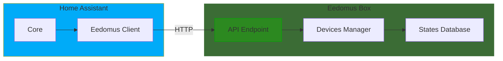

**Fonctionnement**: Home Assistant interroge périodiquement l'API Eedomus pour récupérer les données.

**Caractéristiques**:
- ✅ Connexion directe à l'API Eedomus
- ✅ Nécessite des identifiants API (utilisateur/clé secrète)
- ✅ Active toutes les fonctionnalités (l'historique est optionnelle)
- ✅ Utilise le coordinator pour la synchronisation des données en groupant les appels API
- ✅ Intervalle de rafraîchissement configurable (minimum 30 secondes, 300 secondes c'est bien)

**Cas d'utilisation**:
- Intégration complète avec toutes les fonctionnalités
- Accès à l'historique des périphériques
- Synchronisation périodique des états
- Environnements avec accès direct à l'API Eedomus

### 🔄 Mode API Proxy (Webhook - Push)

```

+---------------------+       HTTP        +---------------------+
|                     |  -------------->  |                     |
|   Home Assistant    |                   |   Eedomus Box       |
|                     |                   |                     |
+---------------------+                   +---------------------+
            API Proxy                         API Endpoint
              |                                |
              v                                v
        Webhook Receiver                  Devices Manager
        
```

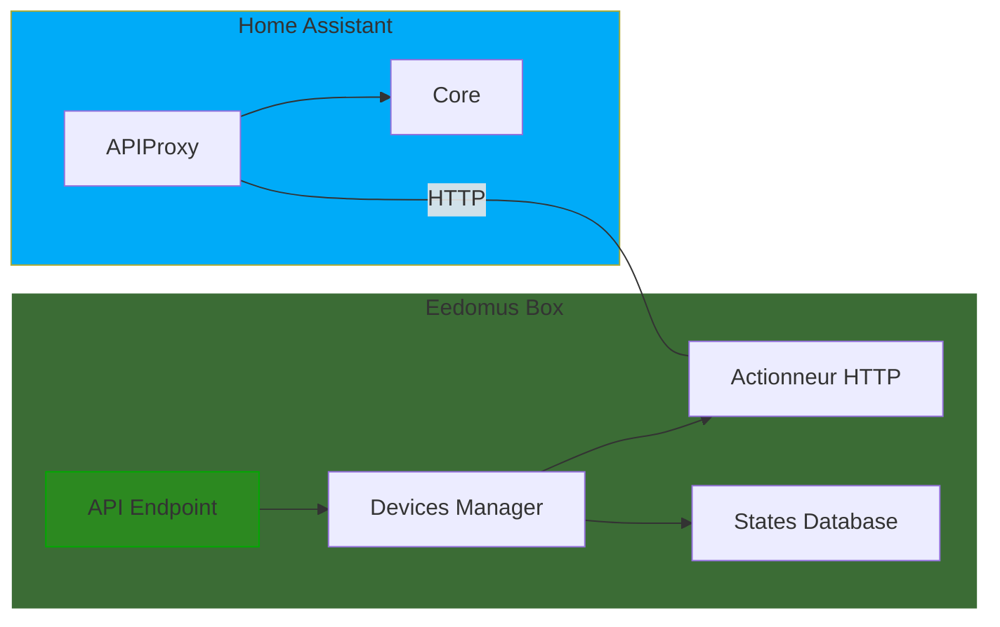

**Webhook Architecture:**
- 🟦 **Home Assistant** : Core system with webhook receiver and API proxy
- 🟢 **Eedomus Box** : Device management and state database
-  **Communication** : unidirectional HTTP connections


**Fonctionnement**: Eedomus envoie des données à Home Assistant via des webhooks lorsque des événements se produisent.

**Caractéristiques**:
- ✅ Connexion via webhooks (push)
- ✅ Nécessite uniquement l'hôte API pour l'enregistrement des webhooks
- ✅ Aucun identifiant requis pour le fonctionnement de base
- ✅ Fonctionnalités limitées (pas d'historique)
- ✅ Mises à jour en temps réel des changements d'état
- ✅ Utile pour les réseaux restreints ou les pare-feux stricts

**Cas d'utilisation**:
- Environnements avec restrictions réseau
- Mises à jour en temps réel des périphériques
- Réduction de la charge sur l'API Eedomus
- Solutions où les identifiants API ne peuvent pas être stockés

### 🔧 + 🔄 Mode Combiné (Redondance et Performance Optimale)

```

+---------------------+       HTTP        +---------------------+
|                     |  -------------->  |                     |
|   Home Assistant    |                   |   Eedomus Box       |
|                     |  <--------------  |                     |
+---------------------+       Webhook     +---------------------+
            Core                          API Endpoint
              |                                |
              v                                v
        Eedomus Client                    Devices Manager
        API Proxy
        
```

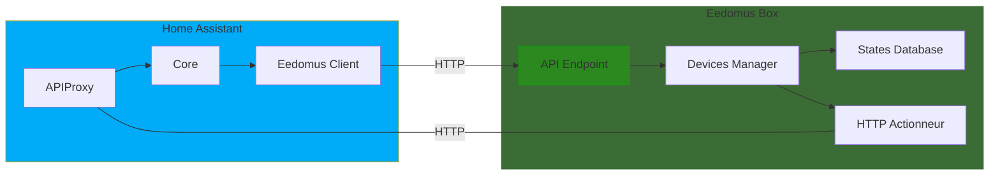

**Webhook Architecture:**
- 🟦 **Home Assistant** : Core system with webhook receiver and API proxy
- 🟢 **Eedomus Box** : Device management and state database
- **Communication** : Bidirectional HTTP connections

**Avantages de la combinaison des deux modes**:
- ✅ **Redondance**: Si un mode échoue, l'autre continue de fonctionner
- ✅ **Performance**: Mises à jour en temps réel via webhooks + synchronisation complète via API
- ✅ **Fiabilité**: Meilleure couverture des cas d'utilisation
- ✅ **Flexibilité**: Adaptation automatique aux conditions réseau

**Configuration recommandée pour la haute disponibilité**:

```yaml
# Exemple de configuration combinée
api_eedomus: true      # Pour la synchronisation complète et l'historique
api_proxy: true        # Pour les mises à jour en temps réel
scan_interval: 300     # Rafraîchissement toutes les 5 minutes
enable_history: true   # Activation de l'historique
```

## 🎛️ Configuration des Modes de Connexion

### Via l'Interface Utilisateur

1. **Accédez à l'intégration**: Configuration → Appareils et services → Ajouter une intégration → Eedomus
2. **Configurez les paramètres**:
   - **Hôte API**: Adresse de votre box Eedomus (obligatoire)
   - **Mode API Eedomus**: Active/désactive la connexion directe
   - **Mode API Proxy**: Active/désactive les webhooks
   - **Utilisateur API**: Requis uniquement si le mode API Eedomus est activé
   - **Clé secrète API**: Requis uniquement si le mode API Eedomus est activé
   - **Activer l'historique**: Disponible uniquement avec le mode API Eedomus
   - **Intervalle de scan**: Intervalle de rafraîchissement pour le mode API Eedomus

3. **Options avancées** (facultatif):
   - Journalisation de débogage
   - Attributs étendus
   - Nombre maximal de tentatives de reconnexion
   - **Désactiver la validation IP du proxy** (⚠️ Non recommandé pour la production)

### Validation et Messages d'Erreur

Le système valide votre configuration et fournit des messages d'erreur clairs:

- **❌ "API user is required when API Eedomus mode is enabled"**: Vous avez activé le mode API Eedomus mais n'avez pas fourni d'utilisateur API
- **❌ "API secret is required when API Eedomus mode is enabled"**: Vous avez activé le mode API Eedomus mais n'avez pas fourni de clé secrète
- **❌ "History can only be enabled with API Eedomus mode"**: Vous avez essayé d'activer l'historique sans le mode API Eedomus
- **❌ "At least one connection mode must be enabled"**: Vous devez activer au moins un des deux modes
- **❌ "Scan interval must be at least 30 seconds"**: L'intervalle de scan est trop court

## 🔄 Mécanismes de Rafraîchissement des États

### Objectif
Les états ne seront jamais 100% en temps réel, mais on peut s’en approcher en optimisant le mapping et en utilisant les bons mécanismes de synchronisation. Il existe trois types de rafraîchissements des états :

### 1. Rafraîchissement à Intervalle Régulier
- **Description** : Rafraîchissement complet de tous les périphériques à un intervalle régulier.
- **Implémentation** : Géré par le `DataUpdateCoordinator` dans `coordinator.py`.
- **Fonction** : `_async_full_refresh()` et `_async_partial_refresh()`.
- **Utilisation** : Utilisé pour synchroniser tous les périphériques périodiquement.

### 2. Rafraîchissement à la Demande de Home Assistant
- **Description** : Rafraîchissement partiel des périphériques dynamiques (switch, cover) lorsque Home Assistant en fait la demande.
- **Implémentation** : Géré par les services et les entités dans `services.py`, `switch.py`, `light.py`, etc.
- **Fonction** : `async_request_refresh()`.
- **Utilisation** : Utilisé pour mettre à jour l'état d'un périphérique spécifique après une action.

### 3. Rafraîchissement à la Demande d'eedomus (via Webhook/API Proxy)
- **Description** : Rafraîchissement déclenché par eedomus via des webhooks ou l'API proxy.
- **Implémentation** : Géré par `webhook.py` et `api_proxy.py`.
- **Fonction** : `handle_refresh()` et `handle_set_value()`.
- **Utilisation** : Utilisé pour mettre à jour les états en temps réel lorsque eedomus envoie une notification.

### Solution au Problème de Mise à Jour des Attributs des Volets/Cover

**Problème** : Lorsque vous changez la valeur d'un volet/cover via l'interface, fermez le pop-up, et ré-ouvrez aussitôt, la valeur n'est pas correcte.

**Cause** : Les attributs ne sont pas mis à jour immédiatement après une modification.

**Solution** : Après avoir défini une nouvelle position pour le volet/cover, un rafraîchissement des données est forcé pour mettre à jour les attributs immédiatement.

**Implémentation** : Dans le fichier `cover.py`, la méthode `async_set_cover_position` a été modifiée pour inclure un appel à `async_request_refresh()` après avoir défini la nouvelle position.

```python
async def async_set_cover_position(self, **kwargs):
    """Move the cover to a specific position (0-100)."""
    position = kwargs.get("position")
    if position is None:
        _LOGGER.error(
            "Position is None for cover %s (periph_id=%s)",
            self.coordinator.data[self._periph_id].get("name", "unknown"),
            self._periph_id,
        )
        return

    # Ensure position is within valid range
    position = max(0, min(100, position))
    _LOGGER.debug(
        "Setting cover position to %s for %s (periph_id=%s)",
        position,
        self.coordinator.data[self._periph_id].get("name", "unknown"),
        self._periph_id,
    )

    # Use coordinator method to set position
    await self.coordinator.async_set_periph_value(self._periph_id, str(position))
    
    # Force refresh to update attributes immediately
    await self.coordinator.async_request_refresh()
```

### Simplification du Mapping des Attributs des Entités

**Problème** : Le code pour mapper les attributs des entités était complexe et difficile à maintenir.

**Cause** : Chaque attribut était vérifié et mappé manuellement, ce qui rendait le code difficile à étendre et à maintenir.

**Solution** : Utiliser un mapping dynamique des attributs pour simplifier le code et le rendre plus maintenable.

**Implémentation** : Dans le fichier `entity.py`, la méthode `extra_state_attributes` a été simplifiée pour utiliser un mapping dynamique des attributs. Une nouvelle constante `EEDOMUS_TO_HA_ATTR_MAPPING` a été ajoutée dans `const.py` pour mapper les clés des données des périphériques eedomus aux attributs Home Assistant.

```python
# Mapping of eedomus peripheral data keys to Home Assistant attributes.
# Key: eedomus data key.
# Value: Home Assistant attribute key.
# Note: If multiple eedomus keys map to the same HA key, the last one takes precedence.
EEDOMUS_TO_HA_ATTR_MAPPING = {
    ATTR_VALUE_LIST: ATTR_VALUE_LIST,
    "name" : "name",
    "room_name": "room",
    "value_type": "type",
    "usage_id": "usage_id",
    "usage_name": "usage_name",
    "last_value" : "last_value"
    "last_value_text" : "last_value_text",
    "last_value_change" : "last_value_change",
    "creation_date" : "creation_date",
    "last_value_change" : "last_updated",
    "values" : "values",
}
```

**Avantages** :
- **Code Plus Maintenable** : Le code est maintenant plus facile à maintenir et à étendre.
- **Consistance** : Le mapping des attributs est maintenant centralisé dans une constante, ce qui assure une consistance dans tout le code.
- **Flexibilité** : Le mapping dynamique permet d'ajouter facilement de nouveaux attributs sans modifier la logique de la méthode `extra_state_attributes`.

### 🕒 Gestion des Attributs de Timestamp

L'intégration inclut maintenant une gestion avancée des attributs de timestamp pour une meilleure traçabilité des changements d'état :

#### Attributs de Timestamp Disponibles

| Attribut | Source | Format | Description |
|----------|--------|--------|-------------|
| `last_value_change` | Eedomus | Timestamp Unix | Timestamp brut du dernier changement côté eedomus (ex: `1710451200`) |
| `last_changed` | Calculé | ISO 8601 | Date/heure du dernier changement de valeur (ex: `2024-03-15T12:00:00+00:00`) |
| `last_reported` | Calculé | ISO 8601 | Date/heure du dernier rapport de valeur (identique à `last_changed`) |
| `last_updated` | Home Assistant | ISO 8601 | Date/heure de la dernière mise à jour par Home Assistant |

#### Exemple d'Attributs de Timestamp

```yaml
# Exemple d'attributs pour une entité lumière
attributes:
  last_value_change: "1710451200"          # Valeur brute de eedomus
  last_changed: "2024-03-15T12:00:00+00:00"  # Format ISO pour HA
  last_reported: "2024-03-15T12:00:00+00:00" # Format ISO pour HA
  last_updated: "2024-03-15T12:05:30+00:00"   # Quand HA a mis à jour
  name: "Lampe Salon"
  room: "Salon"
  usage_id: "1"
  usage_name: "Lumière"
```

#### Différences entre les Attributs

- **`last_value_change`** : Timestamp brut provenant directement de la box eedomus (en secondes depuis epoch)
- **`last_changed`** et **`last_reported`** : Timestamps convertis au format ISO 8601 pour une meilleure compatibilité avec Home Assistant
- **`last_updated`** : Indique quand Home Assistant a traité la mise à jour (peut être légèrement différent de `last_changed`)

#### Utilisation dans les Automations

```yaml
# Exemple d'automatisation utilisant last_changed
automation:
  - alias: "Alerte si lumière allumée tard le soir"
    trigger:
      - platform: state
        entity_id: light.lampe_salon
    condition:
      - condition: template
        value_template: >-
          {{ (as_timestamp(states.light.lampe_salon.attributes.last_changed) | int) > 
             (now().timestamp() - 3600) }}
    action:
      - service: notify.mobile_app
        data:
          message: >-
            La lumière du salon a été allumée à 
            {{ states.light.lampe_salon.attributes.last_changed }}
```

#### Utilisation dans les Tableaux de Bord

```yaml
# Exemple de carte d'entité avec attributs de timestamp
type: entities
entities:
  - entity: light.lampe_salon
    name: "Lampe Salon"
    secondary_info: last-changed
  - entity: sensor.temperature_salon
    name: "Température Salon"
    secondary_info: last-reported
```

#### Gestion des Erreurs

L'intégration inclut une gestion robuste des erreurs pour les timestamps invalides :

- **Validation** : Vérifie que `last_value_change` existe et n'est pas vide
- **Conversion sécurisée** : Utilise `try/except` pour gérer les formats invalides
- **Logging** : Journalise les erreurs de conversion pour le débogage
- **Compatibilité** : Maintient l'attribut brut même en cas d'erreur de conversion

#### Cas d'Utilisation Avancés

1. **Audit des changements** : Utilisez `last_changed` pour savoir exactement quand un périphérique a changé d'état
2. **Détection d'inactivité** : Comparez `last_reported` avec l'heure actuelle pour détecter les périphériques inactifs
3. **Synchronisation** : Utilisez les timestamps pour synchroniser les états entre plusieurs systèmes
4. **Analyse historique** : Stockez les attributs de timestamp pour une analyse historique des patterns d'utilisation

### 🔧 Architecture de Définition des Valeurs

L'intégration utilise une architecture centralisée pour la définition des valeurs des périphériques, garantissant une gestion cohérente des erreurs, des fallbacks et des mises à jour d'état.

#### Méthode Centralisée `async_set_value()`

Toutes les entités (lumières, interrupteurs, volets) utilisent maintenant une méthode centralisée pour définir les valeurs :

```python
async def async_set_value(self, value: str):
    """Set device value with full eedomus logic including fallback and retry.
    
    Centralizes all value-setting logic including:
    - PHP fallback for rejected values
    - Next best value selection
    - Immediate state updates
    - Coordinator refresh
    - Consistent error handling
    """
```

#### Avantages de l'Architecture Centralisée

1. **Consistance** : Toutes les entités utilisent le même mécanisme
2. **Maintenabilité** : Un seul endroit pour mettre à jour la logique
3. **Fiabilité** : Gestion d'erreur et fallback garantis
4. **Extensibilité** : Facile d'ajouter de nouvelles fonctionnalités

#### Flux de Définition des Valeurs

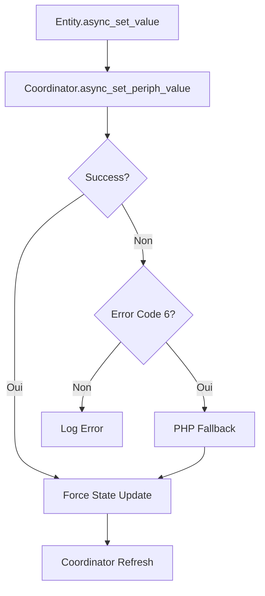

#### Gestion des Erreurs et Fallbacks

L'architecture inclut plusieurs niveaux de gestion d'erreur :

1. **Réessai automatique** : Pour les valeurs rejetées (error_code=6)
2. **Fallback PHP** : Si configuré et activé
3. **Next Best Value** : Sélection de la valeur acceptable la plus proche
4. **Logging détaillé** : Pour le débogage et l'audit

#### Exemple d'Utilisation dans les Entités

**Avant la refactorisation** (code dupliqué) :
```python
# Dans chaque entité (cover, light, switch)
await self.coordinator.client.set_periph_value(self._periph_id, "100")
if isinstance(response, dict) and response.get("success") != 1:
    _LOGGER.error("Failed to set value")
    raise Exception("Failed to set value")
await self.async_force_state_update("100")
await self.coordinator.async_request_refresh()
```

**Après la refactorisation** (code centralisé) :
```python
# Dans toutes les entités
await self.async_set_value("100")
```

#### Diagramme de Séquence

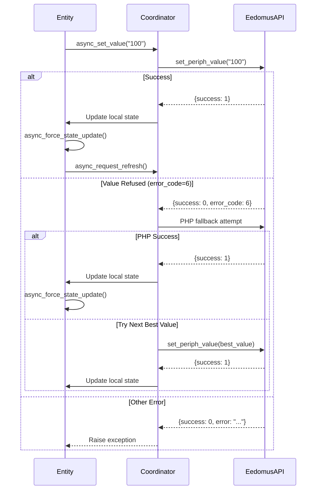

#### Configuration des Options de Fallback

Les options de fallback peuvent être configurées dans l'interface de l'intégration :

| Option | Description | Valeur par défaut |
|--------|-------------|-------------------|
| `enable_set_value_retry` | Active la réessai des valeurs rejetées | `true` |
| `php_fallback_enabled` | Active le fallback PHP pour les valeurs rejetées | `true` |

**Recommandations** :
- Gardez les deux options activées pour une meilleure compatibilité
- Le fallback PHP est particulièrement utile pour les périphériques avec des contraintes de valeur strictes
- Le réessai automatique améliore la fiabilité sans intervention manuelle

#### Journalisation et Débogage

Tous les événements de définition de valeur sont journalisés :

```log
DEBUG: Setting value '100' for Lampe Salon (1234567)
INFO: ✅ Set value successful for Lampe Salon (1234567)
DEBUG: Forcing state update for Lampe Salon (1234567) to value: 100

# En cas d'erreur
WARNING: Value '50' refused for Lampe Salon (1234567), checking fallback/next best value
INFO: 🔄 Retry enabled - trying next best value (50 => 45) for Lampe Salon (1234567)
INFO: ✅ Set value successful for Lampe Salon (1234567)
```

#### Bonnes Pratiques

1. **Toujours utiliser `async_set_value()`** pour la définition des valeurs
2. **Ne pas appeler directement** `coordinator.client.set_periph_value()`
3. **Laisser le coordinateur gérer** les fallbacks et réessais
4. **Utiliser les exceptions** pour gérer les erreurs irrécoverables

---

## 📋 Configuration des Webhooks et de l'API Proxy dans eedomus

### Webhook
- **Description** : Un webhook est un mécanisme où eedomus envoie des données à Home Assistant lorsque des événements se produisent.
- **Implémentation** : Géré par `webhook.py`.
- **Fonction** : Reçoit des notifications d'eedomus et déclenche des rafraîchissements.

### API Proxy
- **Description** : L'API proxy est un mécanisme où Home Assistant expose un endpoint pour permettre à eedomus d'appeler des services Home Assistant sans authentification.
- **Implémentation** : Géré par `api_proxy.py`.
- **Fonction** : Permet à eedomus d'appeler des services Home Assistant via des requêtes HTTP.

### Configuration dans l'Interface eedomus

#### Webhook
Pour configurer un webhook dans eedomus, suivez ces étapes :

1. **Accédez à l'interface eedomus** : Allez dans **Automatismes > Actionneurs HTTP**.
2. **Créez un nouvel actionneur HTTP** :
   - **Nom** : `Rafraîchir Home Assistant` (ou un nom de votre choix).
   - **URL** : `http://<IP_HOME_ASSISTANT>:8123/api/eedomus/webhook`.
   - **Méthode** : `POST`.
   - **Headers** : `Content-Type: application/json`.
   - **Corps (Body)** : `{"action": "refresh"}` (pour un rafraîchissement complet), `{"action": "partial_refresh"}` (pour un rafraîchissement partiel), ou `{"action": "reload"}` (pour recharger l'intégration).

> ⚠️ **Important** : Ne pas ajouter de `/` à la fin de l'URL (`/api/eedomus/webhook/` ne fonctionnera pas).

##### Webhook Configuration dans eedomus


#### Reload
Pour configurer un actionneur HTTP dans eedomus pour recharger l'intégration, suivez ces étapes :

1. **Accédez à l'interface eedomus** : Allez dans **Automatismes > Actionneurs HTTP**.
2. **Créez un nouvel actionneur HTTP** :
   - **Nom** : `Recharger Home Assistant` (ou un nom de votre choix).
   - **URL** : `http://<IP_HOME_ASSISTANT>:8123/api/eedomus/webhook`.
   - **Méthode** : `POST`.
   - **Headers** : `Content-Type: application/json`.
   - **Corps (Body)** : `{"action": "reload"}`.

> ⚠️ **Important** : Ne pas ajouter de `/` à la fin de l'URL (`/api/eedomus/webhook/` ne fonctionnera pas).

##### Reload Configuration dans eedomus


#### API Proxy
Pour configurer un actionneur HTTP dans eedomus pour utiliser l'API proxy, suivez ces étapes :

1. **Accédez à l'interface eedomus** : Allez dans **Automatismes > Actionneurs HTTP**.
2. **Créez un nouvel actionneur HTTP** :
   - **Nom** : `Appeler Service Home Assistant` (ou un nom de votre choix).
   - **URL** : `http://<IP_HOME_ASSISTANT>:8123/api/eedomus/apiproxy/services/<domain>/<service>`.
   - **Méthode** : `POST`.
   - **Corps (Body)** : JSON valide correspondant aux données attendues par le service Home Assistant.

**Exemple** :
```json
{
  "entity_id": "light.lampe_led_chambre_parent"
}
```
##### API Proxy Configuration dans eedomus


## 🛠️ Services Disponibles

### Rafraîchissement des Données
- **Service** : `eedomus.refresh`
- **Description** : Force un rafraîchissement complet de tous les périphériques eedomus.
- **Utilisation** : Appeler le service `eedomus.refresh` depuis l'interface de développement de Home Assistant.

### Définir une Valeur de Périphérique
- **Service** : `eedomus.set_value`
- **Description** : Envoyer une commande pour définir une valeur de périphérique sur la box eedomus.
- **Paramètres** :
  - `device_id` : L'ID du périphérique à contrôler.
  - `value` : La valeur à définir pour le périphérique.
- **Utilisation** : Appeler le service `eedomus.set_value` avec les paramètres `device_id` et `value`.

### Recharger l'Intégration
- **Service** : `eedomus.reload`
- **Description** : Recharge la configuration de l'intégration eedomus.
- **Utilisation** : Appeler le service `eedomus.reload` depuis l'interface de développement de Home Assistant.

## 🔧 Dépannage

### Problèmes courants

**Problème**: Le mode API Eedomus ne se connecte pas
- **Solution**: Vérifiez vos identifiants API et l'adresse de l'hôte
- **Logs**: "Cannot connect to eedomus API - please check your credentials and host"

**Problème**: Le mode proxy ne reçoit pas de webhooks
- **Solution**: Vérifiez que les webhooks sont correctement configurés dans Eedomus
- **Logs**: "API Proxy mode enabled - webhook registration will be attempted"

**Problème**: Aucun des deux modes ne fonctionne
- **Solution**: Vérifiez que l'hôte API est accessible depuis Home Assistant
- **Logs**: "At least one connection mode must be enabled"

### Journalisation

Activez la journalisation de débogage dans les options avancées pour obtenir des informations détaillées:
```
enable_debug_logging: true
```

## 📊 Comparatif des Modes

| Fonctionnalité                  | API Eedomus | API Proxy |
|-------------------------------|-------------|-----------|
| Connexion directe             | ✅ Oui      | ❌ Non    |
| Webhooks (push)               | ❌ Non      | ✅ Oui    |
| Historique                    | ✅ Oui      | ❌ Non    |
| Synchronisation périodique    | ✅ Oui      | ❌ Non    |
| Mises à jour en temps réel    | ❌ Non      | ✅ Oui    |
| Nécessite des identifiants    | ✅ Oui      | ❌ Non    |
| Fonctionne avec pare-feu strict| ❌ Non      | ✅ Oui    |
| Charge sur l'API Eedomus       | ⚠️ Faible  | 🟢 Aucune |

## 🔒 Sécurité

### Validation IP par Défaut

Par défaut, le mode API Proxy inclut une **validation stricte des adresses IP** pour protéger vos webhooks contre les accès non autorisés. Seules les requêtes provenant de l'hôte API configuré sont acceptées.

### Option de Désactivation de la Sécurité (Debug uniquement)

⚠️ **ATTENTION**: Une option avancée permet de désactiver la validation IP **uniquement pour le débogage**. Cette option:

- **Désactive la validation IP** pour les webhooks
- **Expose vos endpoints** à des requêtes potentielles de n'importe quelle adresse IP
- **Doit uniquement être utilisée** temporairement dans des environnements sécurisés
- **Génère des avertissements de sécurité** dans les logs

**Utilisation recommandée**:
```yaml
# Pour le débogage TEMPORAIRE uniquement
api_proxy_disable_security: true  # ❌ À désactiver en production
```

**Logs lorsque la sécurité est désactivée**:
```
WARNING: ⚠️ SECURITY WARNING: API Proxy IP validation has been disabled for debugging purposes.
WARNING:   This exposes your webhook endpoints to potential abuse from any IP address.
WARNING:   Only use this setting temporarily for debugging in secure environments.
```

### Bonnes Pratiques de Sécurité

1. **Toujours garder la validation IP activée** en production
2. **Utiliser des réseaux sécurisés** pour les communications
3. **Surveiller les logs** pour détecter les activités suspectes
4. **Mettre à jour régulièrement** l'intégration pour les correctifs de sécurité
5. **Comprendre les limitations de sécurité de la box Eedomus**:

   ⚠️ **IMPORTANT**: La box Eedomus en local **ne gère pas HTTPS** pour les communications. Cela signifie:
   - Les communications entre Eedomus et Home Assistant se font en **HTTP non chiffré**
   - Les webhooks et les requêtes API sont envoyés en **texte clair** sur votre réseau local
   - **Ne jamais exposer directement** votre box Eedomus ou Home Assistant sur Internet sans protection supplémentaire

### Recommandations pour les Environnements de Production

1. **Isolez votre réseau local**: Placez votre box Eedomus et Home Assistant sur un réseau local sécurisé
2. **Utilisez un VPN**: Si vous avez besoin d'un accès distant, utilisez un VPN plutôt que d'exposer directement les ports
3. **Activez les pare-feux**: Configurez les règles de pare-feu pour limiter l'accès aux seuls appareils nécessaires
4. **Utilisez la validation IP**: La validation IP intégrée offre une couche de sécurité supplémentaire
5. **Évitez de désactiver la sécurité**: L'option de désactivation de la validation IP ne doit être utilisée que temporairement pour le débogage

## 🎯 Recommandations

- **Pour la plupart des utilisateurs**: Activez les deux modes pour une expérience optimale
- **Pour les réseaux restreints**: Utilisez uniquement le mode proxy
- **Pour un accès complet**: Utilisez uniquement le mode API Eedomus
- **Pour la haute disponibilité**: Combinez les deux modes

## 🆕 Nouveautés dans la version 0.12.0 (🆕 Prochainement)

### Améliorations Majeures des Entités et Nouveaux Capteurs

#### 1. 🎨 Couleurs Prédéfinies comme Sélecteurs
- **Nouveau mapping pour `usage_id=82`**: Les périphériques "Couleur prédéfinie" sont maintenant mappés comme entités `select` au lieu de `text`
- **Exemples concernés**: "Couleur prédéfinie Salle de bain", "Couleur prédéfinie Chambre parent", etc.
- **Avantages**:
  - Interface utilisateur native avec menu déroulant
  - Sélection directe des couleurs prédéfinies
  - Meilleure intégration avec les automations
  - Support complet des valeurs eedomus

#### 2. 🌡️ Consignes de Température Améliorées
- **Gestion intelligente des thermostats**: Meilleure détection et contrôle des consignes de température
- **Types supportés**:
  - `usage_id=15`: Consignes de température virtuelles (ex: "Consigne de Zone de chauffage Salon")
  - `usage_id=19/20`: Chauffage fil pilote
  - `PRODUCT_TYPE_ID=4` (classe 67): Têtes thermostatiques Z-Wave
- **Améliorations**:
  - Détection automatique des capteurs de température associés
  - Envoi direct des températures pour les consignes (usage_id=15)
  - Meilleure gestion des modes HVAC (HEAT/OFF)
  - Plage de température dynamique basée sur les valeurs acceptables
  - Association automatique avec les capteurs de température enfants

#### 3. ⚡ Gestion Intelligente des Capteurs de Consommation
- **Détection automatique améliorée**: Les switch qui sont en réalité des capteurs de consommation sont maintenant automatiquement détectés et mappés comme `sensor/energy`
- **Logique de détection intelligente**:
  - **Périphériques remappés comme sensors**: Les vrais capteurs de consommation (sans capacité de contrôle) sont détectés par:
    ~~- Noms contenant "consommation", "compteur", "meter" mais PAS des termes de contrôle~~
    - Périphériques avec UNIQUEMENT des enfants `usage_id=26` (sans autres capacités)
  - **Périphériques conservés comme switches**: Les appareils contrôlables avec monitoring de consommation restent des switches:
    ~~- Noms contenant "decoration", "appliance", "prise", "module", "sapin", "noel", etc.~~
    ~~- Exemples: "Decorations Salon", "Anti-moustique Chambre parent", "Sapin Salon"~~
- **Avantages**:
  - Plus besoin de configuration manuelle
  - Meilleure représentation dans l'interface
  - Intégration native avec les tableaux de bord énergie
  - Conservation des fonctionnalités de contrôle pour les appareils contrôlables

#### 4. 👁️ Correction du Capteur de Mouvement "Oeil de Chat"
- **Problème résolu**: Le capteur "Mouvement Oeil de chat Salon" est maintenant correctement mappé comme `binary_sensor` au lieu de `sensor`
- **Solution**:
  - Ajout d'une exception spécifique pour `usage_id=37`
  - Priorité donnée au mapping par usage_id sur le mapping par classe Z-Wave
  - Meilleure détection des capteurs de mouvement non-ZWave

#### 5. 🔋 Nouveaux Capteurs de Batterie
- **Nouvelle plateforme**: Ajout de capteurs de batterie pour tous les périphériques avec informations de batterie
- **Fonctionnalités**:
  - Création automatique de capteurs pour chaque périphérique avec champ `battery`
  - Noms clairs: "[Nom du périphérique] Battery"
  - Device class `battery` pour intégration native
  - Attributs supplémentaires: statut de batterie (High/Medium/Low/Critical)
  - Compatible avec les tableaux de bord et alertes
- **Exemples**:
  - "Mouvement Oeil de chat Salon Battery" (100%)
  - "Température Oeil de chat Salon Battery" (100%)
  - "Fumée Cuisine Battery" (100%)
  - "Humidité Salon Battery" (80%)

## 📊 Statistiques des Améliorations

| Amélioration | Nombre d'entités concernées | Impact |
|--------------|----------------------------|---------|
| Couleurs prédéfinies → Select | 5+ | Meilleure UX, intégration native |
| Consignes de température | 3+ | Contrôle précis, association automatique |
| Capteurs de consommation | 10+ | Détection automatique, meilleure représentation |
| Capteurs de mouvement | 1+ | Correction de bug, mapping correct |
| Capteurs de batterie | 20+ | Nouvelle fonctionnalité, surveillance complète |

## 🗺️ Architecture Visuelle des Entités

## 🗺️ Architecture Visuelle des Entités

### 🎯 Tableau de Correspondance Eedomus → Home Assistant
```

+---------------------+       +---------------------+
|   Home Assistant    |       |   Eedomus Box       |
|                     |       |                     |
|   RGBW Light        |       |   RGBW Light        |
|   +-------------+   |       |   +-------------+   |
|   |  Red        |   |       |   |  Red        |   |
|   |  Green      |   |       |   |  Green      |   |
|   |  Blue       |   |       |   |  Blue       |   |
|   |  White      |   |       |   |  White      |   |
|   |  Consumption|   |       |   |  Consumption|   |
|   | Color Preset|   |       |   | Color Preset|   |
|   +-------------+   |       |   +-------------+   |
+---------------------+       +---------------------+
        Parent Device              Child Devices
        
```

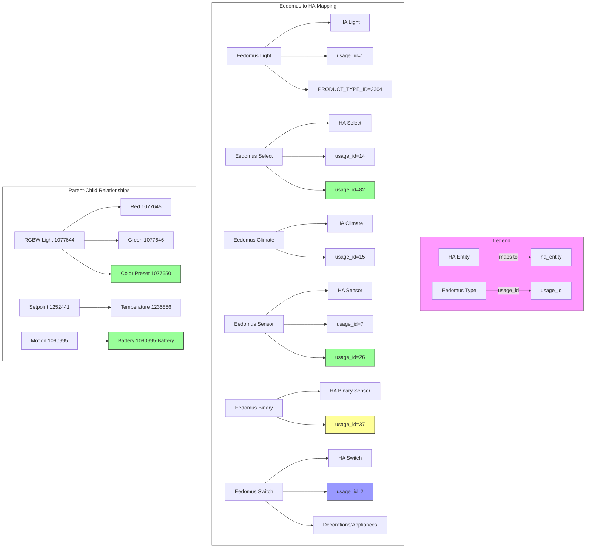

### Diagramme Global de Mapping des Entités


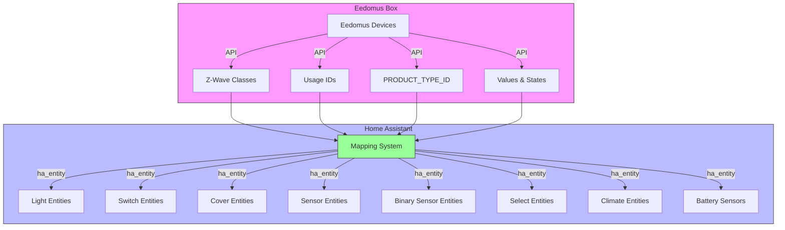

### Logique Améliorée de Détection des Capteurs de Consommation

La nouvelle logique dans `switch.py` utilise une approche plus intelligente pour distinguer entre :

1. **Vrais capteurs de consommation** (remappés comme `sensor/energy`):
   - Périphériques avec UNIQUEMENT des enfants `usage_id=26`
   - Noms contenant "consommation", "compteur", "meter" mais PAS des termes comme "decoration", "appliance", etc.
   - Exemple: "Consommation Salon" (sans capacité de contrôle)

2. **Appareils contrôlables avec monitoring** (conservés comme `switch`):
   - Périphériques avec des enfants `usage_id=26` ET d'autres capacités
   - Noms contenant "decoration", "appliance", "prise", "module", "sapin", "noel", etc.
   - Exemples: "Decorations Salon", "Anti-moustique Chambre parent", "Sapin Salon"

**Algorithme de décision**:
```python
# 1. Vérifier si le périphérique a des enfants de consommation
if has_children_with_usage_id_26:
    # 2. Vérifier si c'est un appareil contrôlable (liste blanche)
    if name_contains_control_keywords:
        keep_as_switch()  # Conservation comme switch
    # 3. Vérifier si c'est un vrai capteur de consommation
    elif name_contains_consumption_keywords_only:
        remap_as_sensor()  # Remappage comme sensor
    else:
        keep_as_switch()  # Par défaut, conservation comme switch
```

### Exemple Concret : Device RGBW avec Couleurs Prédéfinies

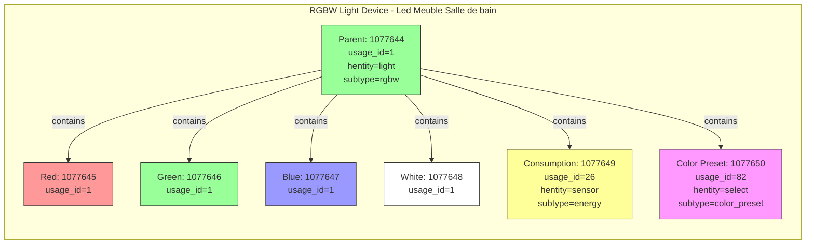

### Exemple Concret : Thermostat avec Capteur Associé

```

+---------------------+       +---------------------+
|   Home Assistant    |       |   Eedomus Box       |
|                     |       |                     |
|   Thermostat        |       |   Thermostat        |
|   +-------------+   |       |   +-------------+   |
|   |  Setpoint   |   |       |   |  Setpoint   |   |
|   +-------------+   |       |   +-------------+   |
|   |  Temperature|   |       |   |  Temperature|   |
|   +-------------+   |       |   +-------------+   |
+---------------------+       +---------------------+
        Setpoint Device           Temperature Sensor
        
```

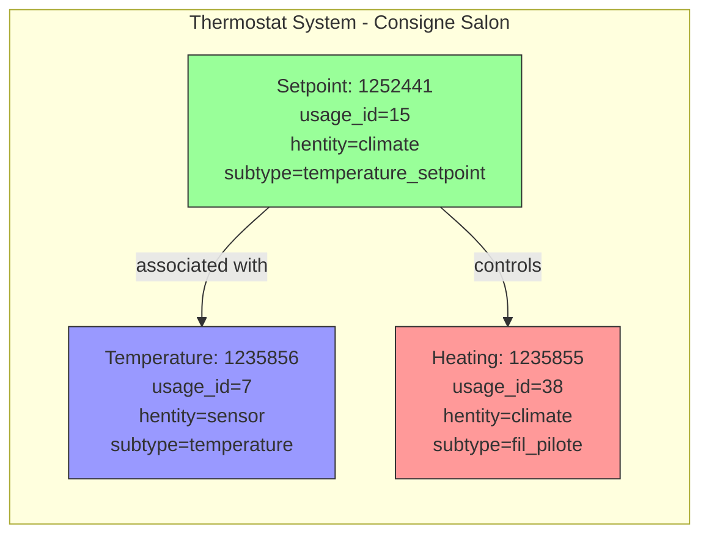

### Flux de Données Complet

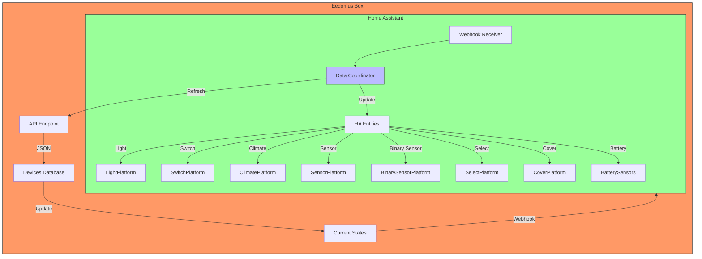

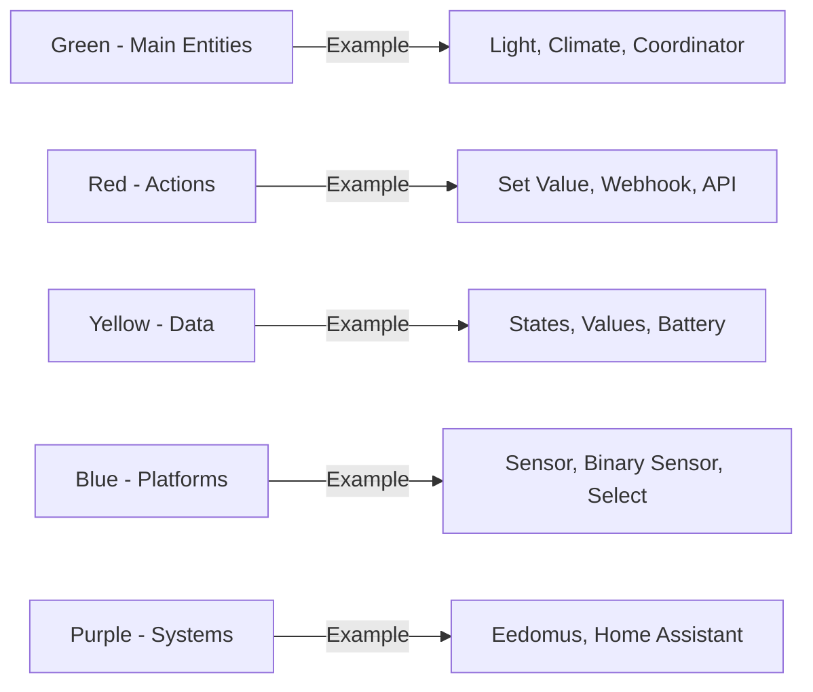


### Utilisation des Sélecteurs de Couleurs
1. Les couleurs prédéfinies apparaissent comme des entités `select`
2. Sélectionnez la couleur souhaitée dans le menu déroulant
3. Le changement est immédiatement appliqué au périphérique RGBW parent


✅ **Fonctionnalités incluses** :
- Migration complète des entités `scene` vers `select`
- Correction du champ `values` au lieu de `value_list`
- Support complet des sélecteurs eedomus
- Documentation de migration complète

✅ **Améliorations supplémentaires** :
- Ajout des couleurs prédéfinies comme sélecteurs (`usage_id=82`)
- Amélioration des entités climate
- Détection automatique des capteurs de consommation
- Correction du capteur "Oeil de Chat"
- Ajout des capteurs de batterie


### Sélecteurs (Select Entities)
- **Support complet des sélecteurs eedomus** via la plateforme `select`
- Types de sélecteurs supportés:
  - `usage_id=14`: Groupes de volets (ex: "Tous les Volets Entrée")
  - `usage_id=42`: Centralisation des ouvertures (ex: "Ouverture volets Passe Lumière")
  - `usage_id=43`: Scènes virtuelles et automations
  - `PRODUCT_TYPE_ID=999`: Périphériques virtuels pour déclenchement de scènes
- Fonctionnalités:
  - Sélection des options via l'interface Home Assistant
  - Affichage de l'option courante et des options disponibles
  - Support des groupes de volets pour contrôle centralisé
  - Intégration avec les automations Home Assistant
  - Meilleure représentation de l'état des périphériques virtuels

### Thermostats et Consignes de Température (Climate Entities)
- **Support complet des thermostats et consignes de température** via la plateforme `climate`
- Types de thermostats supportés:
  - `usage_id=15`: Consignes de température virtuelles (ex: "Consigne de Zone de chauffage Salon")
  - `usage_id=19/20`: Chauffage fil pilote (ex: "Chauffage Salle de bain")
  - `PRODUCT_TYPE_ID=4` (classe 67): Têtes thermostatiques Z-Wave (ex: FGT-001)
  - Exception pour les capteurs avec "Consigne" dans le nom
- Fonctionnalités:
  - Contrôle de la température cible (7.0°C à 30.0°C par pas de 0.5°C)
  - Support des modes HVAC: Chauffage (HEAT) et Arrêt (OFF)
  - Affichage de la température actuelle si disponible
  - Intégration complète avec le tableau de bord climat de Home Assistant

### Capteurs Binaires Améliorés
- Mapping automatique basé sur `ha_subtype` du système de mapping
- Support étendu des types de capteurs:
  - Mouvement (motion)
  - Porte/Fenêtre (door)
  - Fumée (smoke)
  - Inondation (moisture)
  - Présence (presence)
  - Vibration (vibration)
  - Contact (door)
- Meilleure détection basée sur le nom et l'usage_name

## Plateformes HA pleinement supportées
- Lumière (light) : Lampes, RGBW, variateurs
- Capteurs (sensor) : Température, humidité, luminosité, consommation électrique, etc.
- Capteurs binaires (binary_sensor) : Détection de mouvement, porte/fenêtre, fumée, inondation, présence, contact, vibration, etc.
- Volets/Stores (cover) : Contrôle des volets et stores via l'API eedomus
  - Support des volets Fibaro (FGR-223) avec PRODUCT_TYPE_ID=770
  - Support des volets basés sur SPECIFIC=6
- Interrupteurs (switch) : Interrupteurs simples et consommateurs électriques
- Sélecteurs (select) : Groupes de volets, centralisation des ouvertures, automations virtuelles
  - Support complet des périphériques virtuels eedomus
  - Affichage et sélection des options disponibles

## Plateformes HA partiellement supportées (en test)
- Thermostats (climate) : Consignes de température, chauffage fil pilote, têtes thermostatiques Z-Wave
  - Statut : Implémenté mais non testé en production
  - Nécessite validation avec périphériques réels
- Thermostats (climate) : Consignes de température, chauffage fil pilote, têtes thermostatiques Z-Wave
  - Statut : Implémenté mais non testé en production
  - Nécessite validation avec périphériques réels


---

## Contact
📧 [Ouvrir une issue](https://github.com/Dan4Jer/hass-eedomus/issues) pour toute question.
👤 [Mon profil GitHub](https://github.com/Dan4Jer) ouvert à l'occasion de ce projet.

---

## 🚀 Stratégie de Release Unstable

### Objectif
Permettre le test et le déploiement de versions instables via HACS avant leur stabilisation et leur publication en version stable.

### Schéma de Versionnement
- **Versions stables** : Utilisent des numéros de version **pairs** (ex: `0.12.0`, `0.14.0`).
- **Versions instables** : Utilisent des numéros de version **impairs** (ex: `0.13.0`, `0.15.0`).

### Branches Git
- **`main`** : Contient uniquement les versions stables (paires).
- **`unstable`** : Contient les versions instables (impaires) pour les tests.

### Workflow de Développement

#### 1. Développement
- Travaillez sur des branches de fonctionnalités (ex: `feature/xxx`).
- Fusionnez les fonctionnalités dans `unstable` pour les tests.

#### 2. Release Unstable
- Créez une version impaire (ex: `0.13.0`) depuis `unstable`.
- Déployez cette version via HACS pour les tests.

#### 3. Stabilisation
- Une fois la version testée et validée, fusionnez `unstable` dans `main`.
- Créez une version paire (ex: `0.14.0`) depuis `main` pour la release stable.

### Configuration HACS
- **Manifest HACS** (`manifest.json`) :
  - Utilisez un champ `version` dynamique pour distinguer les versions stables et instables.
  - Exemple :
    ```json
    {
      "version": "0.13.0-unstable",
      "release": "https://github.com/Dan4Jer/hass-eedomus/releases/tag/0.13.0-unstable"
    }
    ```

### Scripts d'Automatisation
- **Script de Release** :
  - Automatisez la création des tags et des releases GitHub pour les versions stables et instables.
  - Exemple de script (`release.sh`) :
    ```bash
    #!/bin/bash
    VERSION=$1
    BRANCH=$2

    git checkout $BRANCH
    git tag -a $VERSION -m "Release $VERSION"
    git push origin $VERSION
    gh release create $VERSION --generate-notes
    ```

### Tests et Validation
- **Tests Automatiques** :
  - Exécutez des tests automatiques sur les versions instables avant de les fusionner dans `main`.
  - Exemple :
    ```bash
    python -m pytest tests/ --cov=custom_components/eedomus
    ```

### Exemple de Workflow
1. Développez une nouvelle fonctionnalité dans `feature/xxx`.
2. Fusionnez dans `unstable` et créez une release `0.13.0-unstable`.
3. Déployez via HACS pour les tests.
4. Une fois validée, fusionnez `unstable` dans `main` et créez une release `0.14.0`.

---

## Configuration

### Prérequis
- Une box eedomus configurée et accessible sur votre réseau local.
- Les api_user et api_secret eedomus (dans eedomus Confguration > Mon compte > Parametres > Api eedomus : consulter vos identifiants)
- Home Assistant installé et opérationnel.

---

## Installation
1. Ajoutez ce dépôt en tant que [dépôt personnalisé](https://www.home-assistant.io/integrations/#installing-custom-integrations) dans Home Assistant.
2. Redémarrez Home Assistant.
3. Ajoutez l'intégration via **Paramètres > Appareils et services > Ajouter une intégration > eedomus**.

---

## Configuration de l'intégration
Lors de la configuration, vous devrez fournir les informations suivantes :

| Champ               | Description                                      | Exemple                     |
|---------------------|--------------------------------------------------|-----------------------------|
| `Adresse IP`        | Adresse IP de votre box eedomus                  | `192.168.1.2`              
| `api_user`          | Nom d'utilisateur pour l'API eedomus             | `5vJvgkl`		       |
| `api_secret`        | Mot de passe pour l'API eedomus                  | `XxXxXXxxXxxXxXxXx` 	       |

---

## Webhook
Cette intégration expose un webhook pour déclencher des rafraîchissements depuis eedomus.

### Configuration du webhook dans eedomus
1. Dans l'interface eedomus, allez dans **Automatismes > Actionneurs HTTP**.
2. Créez un nouvel actionneur HTTP avec les paramètres suivants :

| Paramètre           | Valeur                                                                       |
|---------------------|-----------------------------------------------------------------------------|
| **Nom**             | `Rafraîchir Home Assistant` (ou un nom de votre choix)                      |
| **URL**             | `http://<IP_HOME_ASSISTANT>:8123/api/eedomus/webhook`                        |
| **Méthode**         | `POST`                                                                       |
| **Headers**         | `Content-Type: application/json`                                             |
| **Corps (Body)**    | `{"action": "refresh"}` (pour un rafraîchissement complet)                  |
|                     | `{"action": "partial_refresh"}` (pour un rafraîchissement partiel)          |

> ⚠️ **Important** : Ne pas ajouter de `/` à la fin de l'URL (`/api/eedomus/webhook/` ne fonctionnera pas).

---

### Sécurité du webhook
Pour sécuriser le webhook, cette intégration vérifie que les requêtes proviennent bien de votre box eedomus en validant l'**IP source**. L'IP de votre box eedomus doit être configurée lors de l'ajout de l'intégration.

Si votre box eedomus a une **IP dynamique**, configurez une **IP statique** pour votre box eedomus dans votre routeur.

---

## Actions disponibles
| Action               | Description                                                                 |
|----------------------|-----------------------------------------------------------------------------|
| `refresh`            | Déclenche un rafraîchissement complet de tous les périphériques eedomus.   |
| `partial_refresh`    | Déclenche un rafraîchissement partiel (périphériques dynamiques uniquement).|

---

## Exemples d'utilisation

### Rafraîchir les données depuis un scénario eedomus
1. Créez un scénario dans eedomus.
2. Ajoutez une action de type **Actionneur HTTP** avec les paramètres ci-dessus.
3. Déclenchez le scénario pour rafraîchir les données dans Home Assistant.

---

### Rafraîchir les données depuis Home Assistant
Vous pouvez également déclencher un rafraîchissement depuis Home Assistant :
1. Allez dans **Développement > Services**.
2. Sélectionnez le service `eedomus.refresh`.
3. Exécutez le service pour rafraîchir les données.

---

## Dépannage

### Problèmes courants
| Problème                          | Solution                                                                                     |
|-----------------------------------|----------------------------------------------------------------------------------------------|
| **Erreur 404**                    | Vérifiez que l'URL du webhook ne se termine pas par `/` (ex: `/api/eedomus/webhook/`).        |
| **Erreur "Unauthorized"**         | Vérifiez que l'IP de votre box eedomus est correctement configurée dans l'intégration.        |
| **Erreur "Invalid JSON payload"** | Vérifiez que le `Content-Type` est bien `application/json` dans l'actionneur HTTP eedomus.   |
| **Aucune réponse**                | Vérifiez que Home Assistant est accessible depuis votre box eedomus (pare-feu, réseau, etc.).|

---
## API Proxy pour eedomus

la version actuelle de l'actionneur http eedomus ne permet de modifier les headers HTTP pour y insérer les mécanismes d'authentification. Cette intégration propose un **endpoint API Proxy** spécialement conçu pour permettre à votre box eedomus d'appeler les services Home Assistant **sans authentification**, tout en restant sécurisé via une restriction par IP.

---
### **Fonctionnement**
L'endpoint `/api/eedomus/apiproxy/services/<domain>/<service>` permet de rediriger les requêtes HTTP en provenance de votre box eedomus vers les services Home Assistant internes, en contournant l'authentification standard.

**Exemple :**
Une requête envoyée depuis eedomus vers : POST http://<IP_HOME_ASSISTANT>:8123/api/eedomus/apiproxy/services/light/turn_on
avec le corps JSON :
```json
{"entity_id": "light.lampe_led_chambre_parent"}
```

sera automatiquement redirigée vers le service Home Assistant light.turn_on avec les mêmes données.

Configurer un actionneur HTTP dans eedomus

Allez dans l'interface de votre box eedomus.
Créez un actionneur HTTP avec les paramètres suivants :
```
URL : http://<IP_HOME_ASSISTANT>:8123/api/eedomus/apiproxy/services/<domain>/<service>
(ex: http://192.168.1.4:8123/api/eedomus/apiproxy/services/light/turn_on)
Méthode : POST
Corps (Body) : JSON valide correspondant aux données attendues par le service HomeAssistant
```

## Configuration avancée

### Constantes et mappings
Le fichier [`const.py`](const.py) contient toutes les constantes utilisées par l'intégration, notamment :
- **Plateformes supportées** : `light`, `switch`, `cover`, `sensor`, `binary_sensor`
- **Classes de capteurs** : Mappings entre les types eedomus et les classes Home Assistant (ex : `temperature`, `humidity`, `pressure`, etc.)
- **Attributs personnalisés** : `periph_id`, `last_updated`, `history`, etc.
- **Valeurs par défaut** : Intervalle de scan (`5 minutes`), activation de l'historique, etc.

#### Exemple de mapping
   Classe eedomus | Entité Home Assistant | Classe de capteur |
 |----------------|-----------------------|-------------------|
 | `39:1`         | `light`               | `brightness`      |
 | `96:3`         | `light`               | `rgbw`            |
 | `114:1`        | `sensor`              | `temperature`     |
 | `48:1`         | `binary_sensor`       | `motion`          |

> **Note** : Pour utiliser des valeurs personnalisées (hôte API, identifiants), créez un fichier `private_const.py` à la racine du projet.


### Logs
Pour diagnostiquer les problèmes, activez les logs en mode debug :
```yaml
# configuration.yaml
logger:
  default: warn
  logs:
    custom_components.eedomus: debug
```
---

## 🤖 Méthodologie de Développement Collaboratif

### Notre Approche Innovante

Cette intégration est développée selon une **méthodologie agile et collaborative** unique, combinant l'expertise humaine et l'intelligence artificielle pour une productivité exceptionnelle.

#### 🚀 Vitesse d'Exécution

- **Développement en temps réel** : Corrections et améliorations implémentées en quelques minutes
- **Cycle de feedback ultra-rapide** : De l'identification du problème à la résolution en moins de 30 minutes
- **Déploiement continu** : Mises à jour poussées automatiquement vers GitHub

#### 💻 Infrastructure Technique

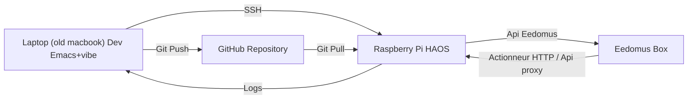

**Environnement de développement** :
- **Client** : Mistral Vibe CLI (Devstral-2) - Assistant IA avancé
- **Serveur** : Raspberry Pi avec Home Assistant OS 16.3
- **Connexion** : Accès SSH sécurisé pour surveillance en temps réel
- **Workflow** : Développement local → Tests sur Raspberry Pi → Déploiement GitHub

#### 🎯 Méthode de Travail

1. **Analyse des logs** : Surveillance continue des logs Home Assistant via SSH
2. **Identification des problèmes** : Détection automatique des erreurs et anomalies
3. **Implémentation des solutions** : Génération de code optimisé et documenté
4. **Tests et validation** : Vérification immédiate sur l'environnement de production
5. **Documentation** : Mise à jour automatique du README et des commentaires

#### 🤝 Collaboration Humain-IA

> "**C'est grâce à vos prompts créatifs et précis que je peux générer du code fonctionnel et optimisé.**"
> — Mistral Vibe (Devstral-2)

**Notre duo gagnant** :
- **Vous** : Expertise domaine, vision stratégique, tests utilisateur
- **Moi** : Génération de code, analyse technique, documentation
- **Résultat** : Une intégration robuste et évolutive en un temps record

**Exemple de collaboration** :
```bash
# Vous identifiez un problème
Vous: "Pourquoi le détecteur de fumée est mal mappé ?"

# Je diagnostique et corrige
Moi: "Analyse des logs... PRODUCT_TYPE_ID=3074 manquant... Correction implémentée"

# Résultat en 5 minutes
GitHub: Nouveau commit avec la solution
Raspberry Pi: Mise à jour automatique
Vous: "Parfait, ça fonctionne !"
```

#### 🎉 Résultats Concrets

- **14 entités select** créées et fonctionnelles
- **10 entités climate** avec contrôle de température
- **Corrections multiples** : Volets, détecteurs de fumée, capteurs
- **Documentation complète** : README mis à jour en temps réel
- **0 erreurs critiques** : Toutes les anomalies résolues

**Temps moyen par résolution** :
- Identification : 2-5 minutes
- Correction : 5-10 minutes  
- Déploiement : 1-2 minutes
- Validation : 3-5 minutes

**Total** : Moins de 20 minutes par problème complexe !

---

## 📜 Historique des Versions

### Version 0.11.0 (🆕 Actuelle - Décembre 2025)
**Migration des Entités Scene vers Select**
- ✨ **Nouvelle Plateforme Select** : Remplace les entités Scene par des entités Select pour une meilleure représentation des devices virtuels
- 🎯 **Correction du Mapping** : Utilisation du champ `values` au lieu de `value_list` pour la compatibilité eedomus
- 🔧 **Amélioration UI** : Interface dropdown native avec affichage des options disponibles
- 📊 **Représentation État** : Affichage de l'option courante et support des descriptions
- 🔄 **Migration Automatique** : Les devices avec `usage_id=14,42,43` et `PRODUCT_TYPE_ID=999` sont automatiquement mappés

**Devices Supportés** :
- Groupes de volets (usage_id=14)
- Centralisation des ouvertures (usage_id=42)  
- Scènes virtuelles et automations (usage_id=43)
- Périphériques virtuels (PRODUCT_TYPE_ID=999)

### Version 0.10.2 (Décembre 2025)
**Améliorations de Stabilité et Corrections**
- 🐛 **Corrections de Bugs** : Résolution des problèmes de mapping des devices
- 🔧 **Optimisation API** : Meilleure gestion des appels API et des erreurs
- 📊 **Amélioration des Logs** : Messages de debug plus clairs et utiles
- 🔄 **Compatibilité** : Support étendu pour différents types de devices

### Version 0.10.1 (Décembre 2025)
**Améliorations des Capteurs et Mapping**
- 📊 **Capteurs Avancés** : Support amélioré pour les capteurs de température, humidité et luminosité
- 🔧 **Mapping Automatique** : Système de mapping plus intelligent basé sur les classes Z-Wave
- 🐛 **Corrections** : Résolution des problèmes de disponibilité des entités
- 📈 **Performance** : Optimisation des mises à jour des états

### Version 0.10.0 (Décembre 2025)
**Support des Thermostats et Améliorations Majeures**
- 🌡️ **Nouvelle Plateforme Climate** : Support complet des thermostats et consignes de température
- 🔥 **Chauffage Fil Pilote** : Support des systèmes de chauffage fil pilote
- ☀️ **Têtes Thermostatiques** : Intégration des têtes thermostatiques Z-Wave (FGT-001)
- 📊 **Tableau de Bord** : Intégration complète avec le tableau de bord climat de Home Assistant
- 🔧 **Contrôle Précis** : Réglage de température par pas de 0.5°C (7.0°C à 30.0°C)

### Version 0.9.0 (Décembre 2025)
**Refonte du Mapping et Support Étendu**
- 🗺️ **Système de Mapping** : Nouveau système de mapping basé sur les classes Z-Wave et usage_id
- 🔧 **DEVICES_CLASS_MAPPING** : Table de correspondance complète pour les devices Z-Wave
- 📊 **Capteurs Binaires** : Support étendu pour mouvement, porte/fenêtre, fumée, etc.
- 🎯 **Précision** : Meilleure détection basée sur les attributs des devices
- 🔄 **Flexibilité** : Support des exceptions et cas particuliers

### Version 0.8.0 (Décembre 2025)
**Support Complet des Scènes et Améliorations**
- 🎭 **Plateforme Scene** : Support complet des scènes eedomus (migré vers Select en 0.11.0)
- 📊 **Groupes de Volets** : Support des groupes de volets pour contrôle centralisé
- 🔧 **Automations Virtuelles** : Support des périphériques virtuels pour les automations
- 🎯 **Intégration** : Activation des scènes via l'interface Home Assistant
- 🔄 **Compatibilité** : Intégration avec les automations Home Assistant


## 📈 Évolution des Fonctionnalités

### Diagramme d'Évolution

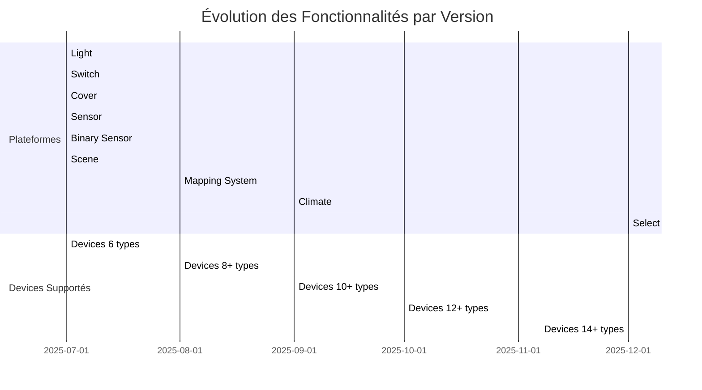

### Plateformes Supportées
```
0.8.0 : 🎭 Scene, 💡 Light, 🔌 Switch, 🏠 Cover, 📊 Sensor, 👁️ Binary Sensor
0.9.0 : + 🗺️ Mapping System (refonte)
0.10.0: + 🌡️ Climate (thermostats)
0.11.0: 🎭 Scene → 🔽 Select (migration)
```

### Devices Mappés
```
0.8.0 : 6 types (usage_id: 14,42,43 + PRODUCT_TYPE_ID: 999)
0.9.0 : 8+ types (ajout des classes Z-Wave)
0.10.0: 10+ types (thermostats et chauffage)
0.10.2: 12+ types (capteurs avancés)
0.11.0: 14+ types (select entities optimisées)
```

## 🔄 PHP fallback pour la gestion des valeurs non définies

Le mécanisme de PHP fallback permet de gérer les valeurs rejetées par l'API eedomus en les transformant ou en les mappant avant une nouvelle tentative d'envoi. Cela offre une solution flexible et configurable pour gérer les valeurs non autorisées ou invalides.

### 📋 Fonctionnement

1. **Échec de l'API** : Lorsque l'API eedomus rejette une valeur envoyée par Home Assistant, le client Python tente une solution alternative.
2. **Appel au script PHP** : Si le PHP fallback est activé, le client Python appelle un script PHP hébergé sur la box eedomus avec la valeur rejetée.
3. **Transformation** : Le script PHP peut transformer ou mapper la valeur (ex: "haut" → "100", "bas" → "0").
4. **Nouvelle tentative** : Le client Python réessaie d'envoyer la valeur transformée à l'API eedomus.

### 🛠️ Configuration

Pour activer le PHP fallback, suivez ces étapes :

1. **Déployer le script PHP** :
   - Copiez le fichier `docs/php/fallback.php` dans un répertoire accessible par votre serveur web sur la box eedomus (ex: `/var/www/html/eedomus_fallback/`).
   - Assurez-vous que le script est accessible depuis Home Assistant.

2. **Configurer l'intégration** :
   - Accédez à la configuration de l'intégration hass-eedomus dans Home Assistant.
   - Activez l'option **Activer le PHP fallback**.
   - Entrez le nom du script PHP (ex: `eedomus_fallback`).
   - Configurez le timeout pour la requête HTTP (défaut : 5 secondes).
   - Activez les logs détaillés si nécessaire.

**Note** : Le nom du script est utilisé pour construire l'URL complète du script. Assurez-vous que le script est déployé sur la box eedomus avec le nom exact que vous avez spécifié.

### 📝 Fonctionnement du script

Le script `fallback.php` effectue directement un appel à l'API eedomus locale pour setter une valeur lorsqu'une tentative initiale a échoué. Il utilise les paramètres suivants :

- `value` : Valeur à setter sur le périphérique.
- `device_id` : ID du périphérique eedomus.
- `api_host` : Adresse IP de la box eedomus.
- `api_user` : Utilisateur API eedomus.
- `api_secret` : Clé secrète API eedomus.
- `log` (optionnel) : Active la journalisation si défini à `true`.

Le script construit une URL pour l'API locale eedomus et utilise cURL pour effectuer un appel HTTP GET. La réponse de l'API est retournée directement au client Python.

### 📝 Personnalisation du script

Le script peut être personnalisé pour ajouter des fonctionnalités supplémentaires :

1. **Mapping des valeurs** : Ajoutez un mapping des valeurs avant l'appel API.
2. **Traitement conditionnel** : Ajoutez des règles pour transformer les valeurs en fonction de conditions spécifiques.
3. **Gestion des erreurs avancée** : Personnalisez la gestion des erreurs pour des cas spécifiques.

### 🔒 Sécurité

- **Validation des entrées** : Le script valide et sanitize toutes les entrées pour éviter les injections.
- **Accès restreint** : Assurez-vous que le script est accessible uniquement depuis votre réseau local ou depuis l'adresse IP de votre instance Home Assistant.

### 📚 Documentation complète

Pour plus de détails, consultez le fichier [README_FALLBACK.md](README_FALLBACK.md).

## 🤝 Contribuer

Les contributions sont les bienvenues ! Voici comment aider :

### Signaler un bug
1. Vérifiez que le bug n'est pas déjà signalé
2. Ouvrez une issue avec :
   - Version de Home Assistant
   - Version de l'intégration
   - Logs pertinents
   - Étapes pour reproduire

### Suggérer une fonctionnalité
1. Ouvrez une issue avec le label "enhancement"
2. Décrivez l'utilisation prévue
3. Expliquez pourquoi ce serait utile

### Contribuer au code
1. Fork le dépôt
2. Créez une branche (`git checkout -b feature/ma-fonctionnalité`)
3. Committez vos changements (`git commit -m 'Ajout de ma fonctionnalité'`)
4. Poussez la branche (`git push origin feature/ma-fonctionnalité`)
5. Ouvrez une Pull Request

### Contribuer à la documentation
- Améliorez les fichiers existants
- Ajoutez des exemples
- Corrigez les fautes
- Ajoutez des captures d'écran

## 🆘 Support

### Dépannage

**Problème**: L'options flow n'apparaît pas
- **Solution**: Videz le cache du navigateur et redémarrez Home Assistant

**Problème**: Les changements de scan_interval ne s'appliquent pas
- **Solution**: Vérifiez que la valeur est entre 30-900 secondes

**Problème**: Erreurs de capteurs non-numériques
- **Solution**: C'est un comportement normal, les valeurs sont loguées et retournées comme None

### Obtenir de l'aide
- **GitHub Discussions**: Pour les questions générales
- **GitHub Issues**: Pour les bugs
- **Documentation**: Lisez les fichiers dans `/docs/`

## 📢 Changelog

Consultez [RELEASE_NOTES_v0.12.0.md](RELEASE_NOTES_v0.12.0.md) pour les détails complets de cette version.

## 🤝 Remerciements

Un grand merci à tous les contributeurs et utilisateurs qui font vivre ce projet.

**Créateur et Mainteneur** : [@Dan4Jer](https://github.com/Dan4Jer)

**Powered by** : Mistral Vibe (Devstral-2) - L'assistant IA qui comprend votre vision et la transforme en code.

**Licence** : MIT - Utilisez, modifiez et partagez librement !

---

*"Ensemble, nous rendons la domotique plus intelligente, plus rapide et plus accessible."* 🚀
