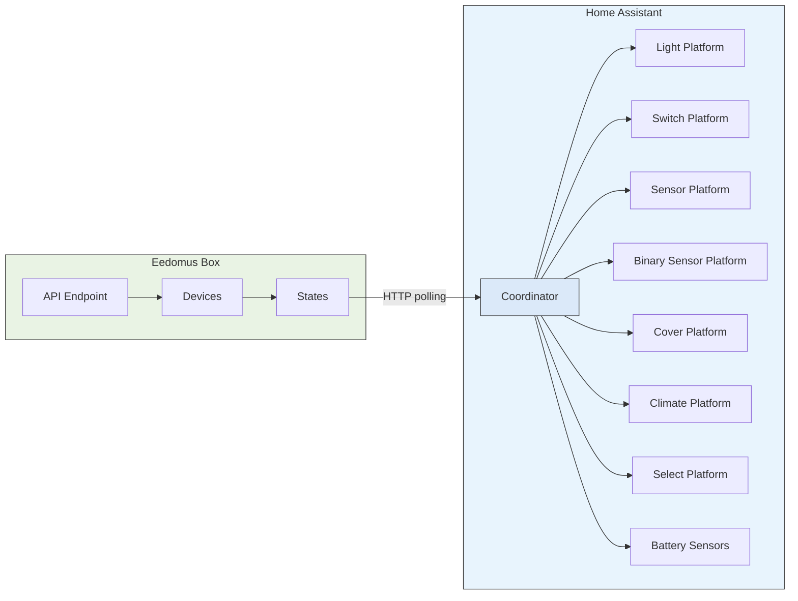
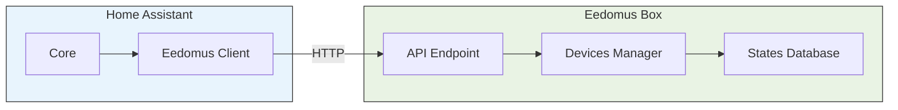
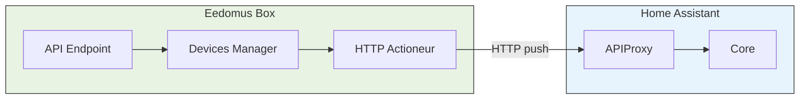
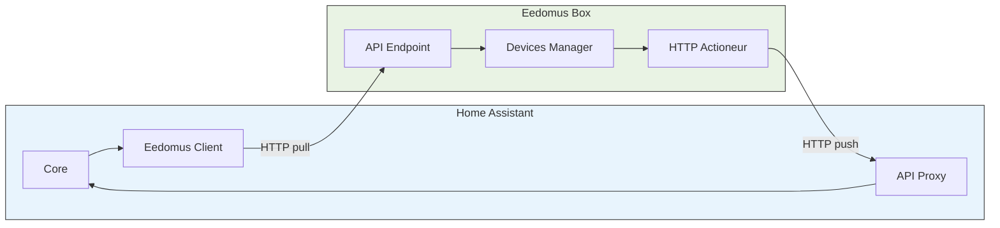
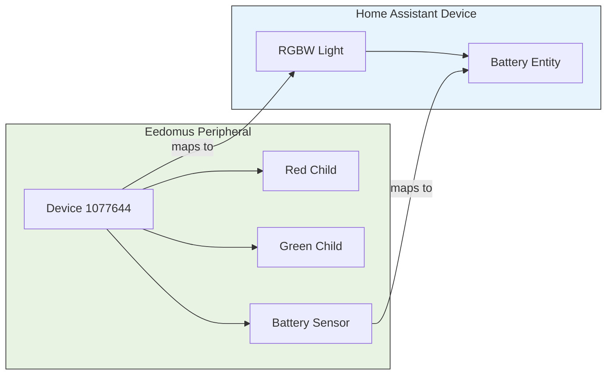

# Eedomus integration for Home Assistant

[](https://github.com/hacs/integration)
[](https://github.com/Dan4Jer/hass-eedomus/releases)
[](https://github.com/Dan4Jer/hass-eedomus/blob/main/LICENSE)
[](https://github.com/Dan4Jer/hass-eedomus/releases/latest)

**hass-eedomus** synchronizes your **eedomus** box with **Home Assistant**: eedomus peripherals (Z-Wave, Zigbee...) appear as native Home Assistant entities (sensors, lights, covers, climate...), without replacing the box. States and commands are synchronized through the eedomus API, with a YAML mapping system to adapt each peripheral to your needs.

[Version française](README.fr.md)

## Features

- **Native entities**: sensors, binary sensors, lights, covers, climate, selects, scenes
- **Multi-box support**: install the integration once per eedomus box (each instance is prefixed and routed independently)
- **Dual connection modes**: pull (eedomus API) and/or push (webhook proxy) - can be combined
- **YAML device mapping**: override default device mappings without touching code
- **History retrieval**: import historical values from the eedomus cloud (optional, rate-limited)
- **PHP fallback**: automatic retry mechanism for values rejected by the box
- **Diagnostic sensors**: API timing, data volume per endpoint, processing time
- **Services**: refresh, set_value, reload, climate temperature, entity cleanup
- **Full configuration from the UI**: config flow and options flow, no YAML required

## Architecture

```
+--------------------------+                    +----------------------+
|     Home Assistant       |                    |      Eedomus Box     |
|                          |                    |                      |
|   +-------------------+  |                    |   +--------------+   |
|   | Coordinator       |<-|----- HTTP ------>  |   | API Endpoint |   |
|   +-------------------+  |                    |   +--------------+   |
|   | Light Platform    |  |                    |   |  Devices     |   |
|   | Switch Platform   |  |                    |   |  States      |   |
|   | Sensor Platform   |  |                    |   +--------------+   |
|   | Binary Sensor     |  |                    +----------------------+
|   | Cover Platform    |  |
|   | Climate Platform  |  |
|   | Select Platform   |  |
|   | Battery Sensors   |  |
|   +-------------------+  |
+--------------------------+
```


```mermaid
flowchart LR
    subgraph HomeAssistant[Home Assistant]
        direction TB
        Coordinator[Coordinator] --> Light[Light Platform]
        Coordinator --> Switch[Switch Platform]
        Coordinator --> Sensor[Sensor Platform]
        Coordinator --> Binary[Binary Sensor Platform]
        Coordinator --> Cover[Cover Platform]
        Coordinator --> Climate[Climate Platform]
        Coordinator --> Select[Select Platform]
        Coordinator --> Battery[Battery Sensors]
    end

    subgraph Eedomus[Eedomus Box]
        direction TB
        API[API Endpoint] --> Devices[Devices]
        Devices --> States[States]
    end

    States -->|HTTP polling| Coordinator

    style HomeAssistant fill:#e8f4fd,stroke:#333
    style Eedomus fill:#e9f3e4,stroke:#333
    style Coordinator fill:#dbe9f9,stroke:#333
```

The coordinator groups API calls, applies the YAML mapping, and feeds
one platform per entity type; the box keeps owning its devices and
states.

## Installation

### Via HACS (recommended)

1. Install [HACS](https://hacs.xyz/docs/setup/download) if not already done, restart Home Assistant
2. In HACS, add a custom repository: `https://github.com/Dan4Jer/hass-eedomus`
3. Search "Eedomus" in **HACS** > **Integrations**, install, restart Home Assistant

### Manual

1. Download the latest [release](https://github.com/Dan4Jer/hass-eedomus/releases)
2. Extract into `custom_components/eedomus/`
3. Restart Home Assistant

## Configuration

**Settings** > **Devices & Services** > **Add Integration** > search "Eedomus":

| Field | Required | Description |
|-------|----------|-------------|
| `api_host` | yes | IP address of your eedomus box (e.g. `192.168.1.2`) |
| `api_user` | for API mode | eedomus API user (see eedomus box settings) |
| `api_secret` | for API mode | eedomus API secret |
| `api_eedomus` | yes | Enable pull mode (API) |
| `enable_api_proxy` | yes | Enable push mode (webhook) |

At least one of `api_eedomus` / `enable_api_proxy` must be enabled.

### Connection modes

#### API Eedomus (pull)

```
+---------------------+       HTTP        +---------------------+
|                     |  -------------->  |                     |
|   Home Assistant    |                   |   Eedomus Box       |
|                     |  <--------------  |                     |
+---------------------+                   +---------------------+
            Core                          API Endpoint
              |                                |
              v                                v
        Eedomus Client                    Devices Manager
                                             |
                                             v
                                        States Database
```


```mermaid
flowchart LR
    subgraph HomeAssistant[Home Assistant]
        direction TB
        HA[Core] --> Eedomus_client[Eedomus Client]
    end

    subgraph Eedomus[Eedomus Box]
        direction TB
        EedomusAPI[API Endpoint] --> Devices[Devices Manager]
        Devices --> States[States Database]
    end

    Eedomus_client -->|HTTP| EedomusAPI

    style HomeAssistant fill:#e8f4fd,stroke:#333
    style Eedomus fill:#e9f3e4,stroke:#333
```

Home Assistant polls the box periodically. Requires API credentials.
Full functionality, including history retrieval.

#### API Proxy (webhook, push)

```
+---------------------+       HTTP        +---------------------+
|                     |  <--------------  |                     |
|   Home Assistant    |                   |   Eedomus Box       |
|                     |                   |                     |
+---------------------+                   +---------------------+
        API Proxy                          API Endpoint
            |                                  |
            v                                  v
     Webhook Receiver                   Devices Manager
                                             |
                                             v
                                    HTTP Actioneur(s)
```


```mermaid
flowchart LR
    subgraph HomeAssistant[Home Assistant]
        direction TB
        APIProxy --> HA[Core]
    end

    subgraph Eedomus[Eedomus Box]
        direction TB
        EedomusAPI[API Endpoint] --> Devices[Devices Manager]
        Devices --> Act[HTTP Actioneur]
    end

    Act -->|HTTP push| APIProxy

    style HomeAssistant fill:#e8f4fd,stroke:#333
    style Eedomus fill:#e9f3e4,stroke:#333
```

The box pushes state changes to Home Assistant via webhooks in near
real time. No credentials needed for basic operation; no history.

#### Combined (recommended)

```
+---------------------+   HTTP pull       +---------------------+
|                     |  -------------->  |                     |
|   Home Assistant    |                   |   Eedomus Box       |
|                     |  <--------------  |                     |
+---------------------+   HTTP push       +---------------------+
            Core                          API Endpoint
              |                                |
              v                                v
        Eedomus Client                    Devices Manager
        Webhook Receiver                       |
                                             v
                                    HTTP Actioneur(s)
```


```mermaid
flowchart LR
    subgraph HomeAssistant[Home Assistant]
        direction TB
        HA[Core] --> Eedomus_client[Eedomus Client]
        APIProxy[API Proxy] --> HA
    end

    subgraph Eedomus[Eedomus Box]
        direction TB
        EedomusAPI[API Endpoint] --> Devices[Devices Manager]
        Devices --> Act[HTTP Actioneur]
    end

    Eedomus_client -->|HTTP pull| EedomusAPI
    Act -->|HTTP push| APIProxy

    style HomeAssistant fill:#e8f4fd,stroke:#333
    style Eedomus fill:#e9f3e4,stroke:#333
```

Both modes together: periodic polling for completeness, webhooks for
responsiveness, and redundancy if one path fails.

## Options

**Settings** > **Devices & Services** > Eedomus > **Configure**:

| Option | Type | Default | Description |
|--------|------|---------|-------------|
| `api_eedomus` | boolean | `true` | Pull mode via eedomus API |
| `enable_api_proxy` | boolean | `false` | Push mode via webhook |
| `enable_webhook` | boolean | `true` | Register the webhook endpoint (needed by proxy mode) |
| `enable_history` | boolean | `false` | Import historical values from the eedomus cloud |
| `history_peripherals_per_scan` | integer | `5` | Peripherals processed per history scan (rate limiting) |
| `scan_interval` | integer | `300` | Polling interval in seconds |
| `enable_set_value_retry` | boolean | `true` | Retry values rejected by the box |
| `api_proxy_disable_security` | boolean | `false` | Disable IP validation of webhook calls (debug only, not recommended) |
| `php_fallback_enabled` | boolean | `false` | PHP script fallback for rejected values |
| `php_fallback_script_name` | string | `fallback.php` | Fallback script name on the box |
| `php_fallback_timeout` | integer | `5` | Fallback request timeout (seconds) |
| `http_request_timeout` | integer | `10` | Timeout for eedomus API requests (seconds) |

Recommended `scan_interval`: 30-60s for testing, 300s (default) for production, 600-900s for large installations.

## Multi-box

You can install several instances of the integration, one per eedomus box (e.g. a house and a secondary residence). Each instance:

- gets its own config entry and its own API credentials
- prefixes its entities and unique IDs to avoid collisions
- has its own options (connection modes, scan interval, etc.)
- routes services (`set_value`, `refresh`...) to its own box

Services accept a target: pass the entity or config entry to select which box receives the command.

## YAML device mapping

### Mapping granularity

One eedomus peripheral maps to one Home Assistant device, with child
entities for its specific capabilities:

```
+-----------------------+       +----------------------+
|   Eedomus Device      |       |   HA Device          |
|                       |       |                      |
|   +---------------+   |       |   +--------------+   |
|   | Device 1077644|---|------>|   | RGBW Light   |   |
|   +---------------+   |       |   +--------------+   |
|   | Red Child     |   |       |   |Battery Entity|   |
|   | Green Child   |   |       |   +--------------+   |
|   | Battery Sensor|---|-------|-->|(Child Entity)|   |
|   +---------------+   |       +----------------------+
+-----------------------+
```


```mermaid
flowchart LR
    subgraph EedomusDevice[Eedomus Peripheral]
        A[Device 1077644] --> B[Red Child]
        A --> C[Green Child]
        A --> D[Battery Sensor]
    end

    subgraph HADevice[Home Assistant Device]
        E[RGBW Light] --> F[Battery Entity]
    end

    A -->|maps to| E
    D -->|maps to| F

    style EedomusDevice fill:#e9f3e4,stroke:#333
    style HADevice fill:#e8f4fd,stroke:#333
```

RGBW parents are detected by their children (a peripheral with 4+
children of usage `1`), and capabilities like battery become child
entities of the same device - see the rule grammar below.

Device mappings are defined in YAML and loaded at startup:

- `custom_components/eedomus/config/device_mapping.yaml` - default mapping (do not edit, updated by releases)
- `custom_components/eedomus/config/custom_mapping.yaml` - your overrides (preserved on updates)

Mapping priority: advanced rules (conditions on parent/children, usage IDs, names) > `usage_id_mappings` > `name_patterns` > `default_mapping`.

```yaml
# custom_mapping.yaml
custom_usage_id_mappings:
  99:
    ha_entity: sensor
    ha_subtype: custom
    icon: mdi:custom-icon
```

Custom rules override default rules with the same name; new rules are added. See [YAML_UI_MAPPING_GUIDE.md](docs/YAML_UI_MAPPING_GUIDE.md) for the complete rule grammar.

## Services

| Service | Description |
|---------|-------------|
| `eedomus.refresh` | Force a full refresh of all peripherals |
| `eedomus.set_value` | Set a peripheral value (`device_id`, `value`) |
| `eedomus.reload` | Reload the integration |
| `eedomus.set_climate_temperature` | Set a climate entity temperature |
| `eedomus.cleanup_unused_entities` | Remove disabled/orphaned eedomus entities |
| `eedomus.cleanup_unused_devices` | Remove orphaned eedomus devices |

## Tests

The test suite runs locally without a Home Assistant installation:

```bash
pip install -r requirements-test.txt

# Unit tests (56): mapping rules, API client, options flow, YAML merging
python3 -m pytest tests/unit/ -v

# E2E tests (12): live instance via REST API - connectivity, refresh,
# set_value, options flow. Requires HA_TOKEN in .env and a reachable HA instance
python3 -m pytest tests/e2e/ -v
```

The E2E suite is non-destructive: it toggles the test peripheral and restores its initial state.

## Troubleshooting

- **Integration fails to load**: check API credentials and box IP, then look at the logs (filter `custom_components.eedomus`)
- **Values not applied**: for dimmable peripherals, the box expects numeric values (`0` = off, `100` = on)
- **Entities missing**: run `eedomus.cleanup_unused_entities`, then reload; check the mapping table in the logs
- **History sensors unavailable**: enable the `enable_history` option and wait for the first scan cycle

## Documentation

- [README.fr.md](README.fr.md) - French documentation
- [CHANGELOG.md](docs/CHANGELOG.md) - Version history
- [configuration_documentation.md](docs/configuration_documentation.md) - Detailed configuration (EN)
- [configuration_documentation_fr.md](docs/configuration_documentation_fr.md) - Detailed configuration (FR)
- [OPTIONS_DOCUMENTATION.md](docs/OPTIONS_DOCUMENTATION.md) - Options reference
- [YAML_UI_MAPPING_GUIDE.md](docs/YAML_UI_MAPPING_GUIDE.md) - Mapping rule grammar

## License

MIT - see [LICENSE](LICENSE)

---

Created and maintained by [@Dan4Jer](https://github.com/Dan4Jer)
