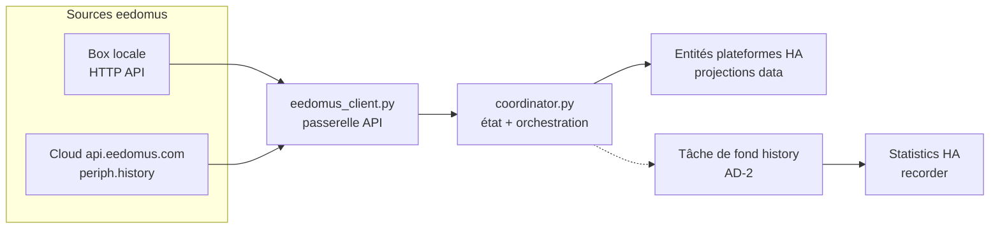
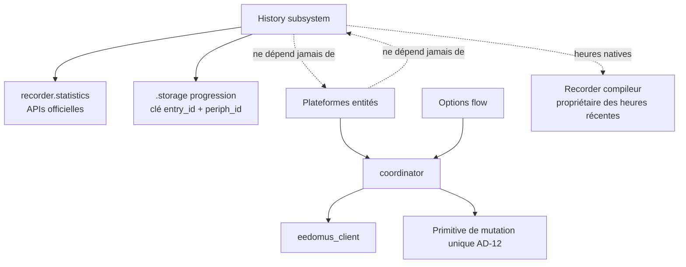
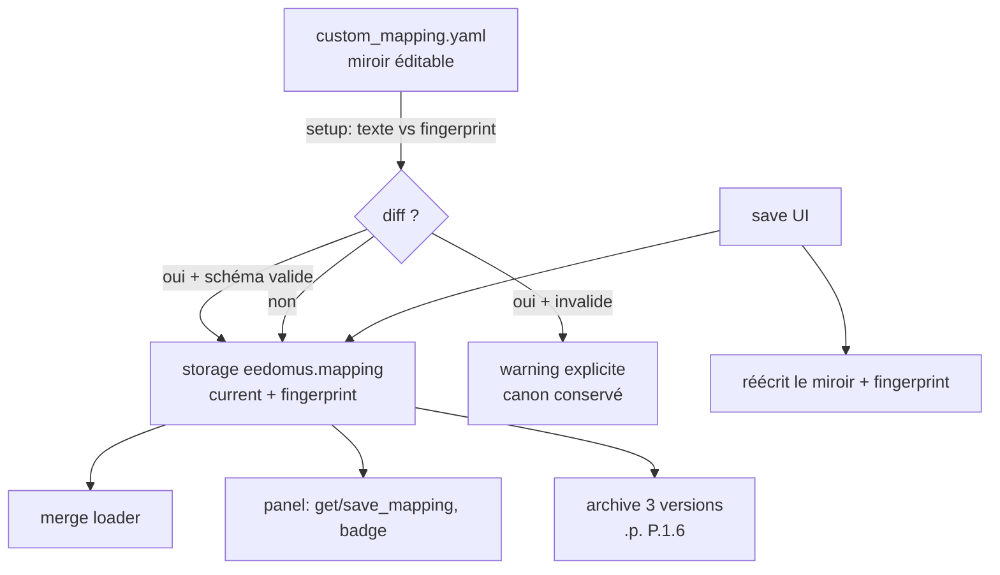

# Architecture Spine — hass-eedomus

## Design Paradigm

**Hub coordinator-centric** — le patron canonique Home Assistant pour intégrations hub, étendu d'un producteur de fond pour l'historique :

- `EedomusDataUpdateCoordinator` est le **propriétaire unique** de l'état eedomus (`coordinator.data`) et l'**orchestrateur unique** des appels API.
- Les entités de plateforme (light, switch, cover, climate, sensor, select…) sont des **projections** de `coordinator.data` — elles ne parlent jamais à l'API.
- Le sous-système history est un **producteur de fond découplé** du cycle de polling : il consomme l'API cloud à son propre rythme et écrit dans les statistics HA ; il ne participe jamais au chemin critique du temps réel.



## État actuel vs cible

**AD-1 à AD-5 sont des décisions cibles, non encore implémentées.** L'implémentation actuelle (`unstable`) fait encore : le fetch+import **dans le cycle** de partial refresh (195 s d'history mesurés sur un cycle de 196 s), l'import via le **service Spook** `recorder.import_statistics` (payload limité 32 Ko), un fallback `async_set` **doublé** (une écriture dans `async_fetch_history_chunk`, une dans le fallback d'import) vers des entités fantômes `sensor.eedomus_<periph_id>`, et une progression persistée **via la state machine** (amnésique au redémarrage). La mise en conformité est le chantier piloté par ce spine. **AD-6 à AD-12 sont en vigueur dans le code actuel** (sauf mention contraire dans l'AD). **AD-13 est une décision cible** : le mapping custom est encore porté par le fichier config-dir (option B du ticket P.1.4, `f5f0e43`) ; le rework vers le canon storage est le prochain ticket de l'épic panel, avant P.1.5.

## Invariants & Rules

### AD-1 — Le backfill history cible les statistics horaires officielles, jamais les états bruts [CIBLE]

- **Binds :** sous-système history (fetch, import), tests le couvrant
- **Prevents :** réintroduction des hacks `async_set` (entités fantômes, double-import, tempêtes recorder) ; dépendance au service Spook (payload limité 32 Ko, présence non garantie)
- **Rule :** l'import écrit exclusivement via les APIs Python officielles `async_import_statistics` (sur le `statistic_id` de l'entité réelle, dans la limite d'AD-11) du module `recorder.statistics`. Aucune écriture dans la state machine pour du passé ; aucun appel de service HTTP/websocket pour l'import. Les états bruts (panel History) ne sont pas backfillés — la timeline détaillée reste dans l'app eedomus.

### AD-2 — L'import history s'exécute dans une tâche de fond dédiée, hors du cycle de refresh [CIBLE]

- **Binds :** orchestration (coordinator), cycle de vie (setup/unload/reload)
- **Prevents :** le polling temps réel (~1 s) bloqué par le backfill cloud lent (mesuré : 195 s d'history sur un cycle de 196 s) ; deux importers concurrents sur une même entry
- **Rule :** la boucle de partial refresh ne contient aucun appel `fetch/import history`. La tâche de fond est cadencée par `history_peripherals_per_scan`. Sa progression et son état de retry sont persistés dans `.storage` sous la clé **`<config_entry_id>_<periph_id>`** (multi-box safe) ; la progression d'un périph est invalidée à sa disparition ou à son remapping. À l'unload : `await` de la tâche en vol puis flush final de la progression ; au plus un importer actif par config entry (slot runtime data).

### AD-3 — Le périmètre statistics est limité aux capteurs numériques résolus [CIBLE]

- **Binds :** couche import, mapping
- **Prevents :** statistics hors conventions HA (sur des `light.*`/`climate.*`), population d'ids externes `eedomus:*`
- **Rule :** seuls les périphs mappés en entité `sensor` avec valeur numérique résoluble (AD-6) produisent des statistics. Le périmètre est **réévalué à chaque activation** de l'option : les progressions des périphs sortis du périmètre sont invalidées ; la documentation (AD-5) mentionne les statistics résiduelles. Les états discrets ne sont pas backfillés ; le besoin « temps d'allumage » se sert en temps réel via `history_stats` HA.

### AD-4 — Fenêtre de backfill intégrale, reprise, idempotence bornée [CIBLE]

- **Binds :** couche import, stockage progression
- **Prevents :** import partiel incohérent, doublons au re-import
- **Rule :** backfill de tout l'historique cloud disponible (pas d'option de fenêtre), par pagination de 10 000 points (limite documentée de l'API `periph.history`), progression par périph persistée. L'écriture statistics horaire est un upsert par heure : le re-import est sûr **à résolution de valeur constante près** — toute variation de `value_list` (AD-6bis) invalide la progression du périph.

### AD-5 — L'activation de l'option history est documentée, y compris la première fois [CIBLE]

- **Binds :** options flow, documentation utilisateur
- **Prevents :** activation à l'aveugle d'un backfill potentiellement long
- **Rule :** la doc de l'option décrit : ce qui se passe à l'activation (backfill intégral en tâche de fond), la durée attendue de la première activation (~90 périphs × pagination cloud, rate-limit), la reprise après redémarrage (effective uniquement une fois la progression en `.storage`, cf. AD-2), ce qui est visible dans HA (statistics/graphes long terme, pas le panel History) et ce qui ne l'est pas.

### AD-6 — Résolution de valeur : float direct, puis value_list figée, sinon exclusion [ADOPTED, à resserrer]

- **Binds :** toute consommation de valeur d'historique
- **Prevents :** perte silencieuse de l'historique des périphs de type Liste (libellés `'Confort'`/`'Arrêt'`) ; réécriture silencieuse de l'historique importé
- **Rule :** `float(value)` d'abord ; en échec, lookup de la `description` dans `data[periph_id]["values"]` (API `periph.value_list` fusionnée à l'init) et retour de son `value` numérique. Non résolu → point exclu avec warning par point. **Resserrage cible :** la `value_list` de résolution est figée au fetch du chunk et persistée avec la progression ; une variation de `value_list` invalide la progression du périph.

### AD-7 — Le coordinator est l'unique point d'accès API [ADOPTED]

- **Binds :** toutes les unités consommant l'API
- **Prevents :** double source de vérité, rate-limit non coordonné
- **Rule :** aucun module hors `eedomus_client` (appelé par le coordinator) n'émet de requête eedomus.

### AD-8 — Identification : `unique_id = <config_entry_id>_<periph_id>` [ADOPTED, à resserrer]

- **Binds :** toutes les entités, résolution periph → entité
- **Prevents :** collisions entre boxes (multi-box), ids fantômes
- **Rule :** préfixe par `config_entry_id` ; l'entity registry est l'unique source de résolution periph → `entity_id`. **Resserrage cible :** l'import statistics d'un périph ne démarre qu'après résolution **exacte** dans le registry (attente de fin de setup des plateformes) ; le repli sur variante suffixée est interdit comme cible statistics, et la cible legacy `sensor.eedomus_<periph_id>` est supprimée.

### AD-9 — Résolution de config : options > data > défaut, `False` explicite honoré [ADOPTED]

- **Binds :** toute lecture d'option
- **Prevents :** options ignorées selon le chemin de persistance HA
- **Rule :** `_get_config_value(entry, key, default)` ; jamais de falsy-check (`if not value`).

### AD-10 — Enveloppe de déploiement : git-only sur le RPi, validation par tests [ADOPTED]

- **Binds :** processus de livraison
- **Prevents :** dérive entre production et repo, modifications non annulables
- **Rule :** déploiement exclusivement via git (jamais scp ni édition directe sur le Pi), restart via le script de déploiement ; validation par tests unitaires (stubs HA, sans instance) et suite E2E live non destructive après chaque déploiement. Les scripts legacy à base de scp (`scripts/deploy_history_fix.sh`, `scripts/deploy_and_analyze.py`) sont à supprimer. L'écart E2E actuel (aucune couverture history/statistics) est un manque à combler à l'implémentation de AD-1.

### AD-11 — Un seul propriétaire par ligne horaire [CIBLE]

- **Binds :** couche import statistics
- **Prevents :** collision entre le backfill et le compileur statistics natif du recorder (moyennes divergentes, `sum` doublé sur l'heure de recouvrement)
- **Rule :** le backfill n'écrit que des heures **strictement antérieures à la première statistique native** du capteur (c'est-à-dire avant la première donnée recorder de l'entité) ; l'heure courante et toutes les suivantes appartiennent exclusivement au recorder.

### AD-12 — Primitive unique de mutation de `coordinator.data` [ADOPTED, à implémenter]

- **Binds :** coordinator (set_value optimiste, cycles de refresh)
- **Prevents :** le refresh écrase la valeur optimiste d'un `set_value` et régresse le symptôme corrigé par 9abc03f
- **Rule :** toute mutation de `data` passe par une primitive unique de merge (`last_value` par horodatage, la plus récente gagne) ; la valeur optimiste survit au premier refresh postérieur au set.



### AD-13 — Le mapping custom vit dans le HA storage ; le fichier YAML est la surface d'édition [CIBLE]

- **Binds :** pipeline de mapping custom (merge loader, badge « modifié », `eedomus/get_mapping`/`save_mapping`) + config_manager
- **Prevents :** deux sources de vérité divergentes (fichier vs storage) tout en gardant un fichier manipulable par l'utilisateur, et le checkout git d'un déploiement git-only sali (AD-10)
- **Rule :**
  - Le canon est le HA storage (`Store eedomus.mapping`, clés `current` + `file_fingerprint`) ; **tout le runtime lit le storage uniquement** — jamais le fichier directement.
  - Le fichier `<config_dir>/eedomus/custom_mapping.yaml` est un **miroir éditable** : au setup, son **texte brut** est comparé au `file_fingerprint` ; différent → parse + validation de schéma → devient `current` (archive de la version remplacée, cap 3, la 4e purge la plus ancienne) ; YAML invalide → le canon est conservé, warning explicite ; identique → rien. Un changement de commentaire est une version (comparaison texte). **L'ingestion appartient à l'init du ConfigManager (niveau domaine, instance unique)** — jamais au setup par entry, qui s'exécuterait plusieurs fois en multi-box.
  - Le save UI écrit `current` **et** régénère le miroir + fingerprint, puis archive la version remplacée — au rechargement suivant le diff est nul : pas de double version.
  - Fichier absent ou corrompu au chargement → miroir régénéré depuis le canon (surface d'édition toujours présente).



## Consistency Conventions

| Concern | Convention |
| --- | --- |
| Nommage | `periph_id` (str) = clé universelle ; fichiers = plateformes HA ; entités `eedomus_*` suffixées par box |
| Données | timestamps eedomus naïfs heure locale → `dt_util.as_local` avant tout usage HA ; valeurs API = strings, résolution via AD-6 ; statistiques horaires alignées top-of-hour, tz-aware |
| Erreurs | retry queue par périph + `history_retry_delay` (persisté, cf. AD-2) ; jamais d'except silencieux ; un point non résolu = un warning contextué (valeur + periph) |
| Logging | cycles de refresh chronométrés et décomposés (`API / History / Processing / Endpoints`) — la lisibilité des temps est une exigence, pas une option |
| Config | toutes les options passent par le options flow ; lecture exclusive via AD-9 |

## Stack

| Name | Version |
| --- | --- |
| Python | 3.11+ (runtime HA ; tests locaux sous 3.14) |
| Home Assistant | 2026.9.3 (vérifié sur l'instance ; cible compat ≥ 2026.3, schema recorder 53) |
| API eedomus box locale | HTTP `api/get`, `api/set` |
| API eedomus cloud | `api.eedomus.com/get` — `periph.history` (10 000 pts/appel, limite documentée), `periph.value_list` |
| pytest | 9.x (unitaires avec stubs HA, E2E live via REST) |

## Structural Seed

```text
custom_components/eedomus/
  eedomus_client.py      # passerelle API (box locale + cloud)
  coordinator.py         # état, cycles de refresh, sous-système history
  entity.py              # base EedomusEntity, _get_config_value, préfixe unique_id
  device_mapping.py, mapping_rules.py, mapping_registry.py   # projection périph → entité
  light.py, switch.py, cover.py, climate.py, sensor.py, binary_sensor.py, select.py, scene.py, text_sensor.py
  history_sensor.py      # sensors de progression history
  config_flow.py, options_flow.py, config_manager.py
  services.py, schema_service.py, data_service.py
  webhook.py, api_proxy.py, panel.py, ui_service.py, www/
tests/unit/              # stubs HA, aucune instance requise
tests/e2e/               # suite live non destructive (HA_TOKEN)
```

**Enveloppe opérationnelle** : cible de production = Raspberry Pi (HAOS 18.2) déployé git-only depuis ce repo ; le déploiement redémarre HA (downtime ~2-4 min) ; `purge_keep_days: 30` sur les states (les statistics long-terme ne sont pas purgées) ; Spook 5.5.1 est présent sur l'instance mais n'est **pas** une dépendance (AD-1).

## Deferred

- **Panel frontend (réactivation, discussion #28, v0.15.0)** — l'architecture du panel est en cours dans l'épic `epic-mapping-panel-editor` (P.1.1–P.1.4 en vigueur) ; le spine la contraint via AD-7/AD-9 et AD-13 (persistance du mapping).
- **Ordonnancement fin de la tâche de fond** (intervalle, priorisation des périphs) — à l'implémentation de AD-2, dans les limites de AD-4/AD-11.
- **Politique d'agrégation des warnings** (un par point vs résumé par chunk) — décision d'ergonomie de log, à trancher quand le volume de libellés non résolubles sera connu.
- **Webhook / api_proxy** — rôle futur non décidé ; aucune croissance prévue sans nouvelle décision.
- **Fusion multi-box au-delà du préfixage** (AD-8) — aucune consolidation d'état inter-box prévue.
- **Nettoyage des statistics fantômes existantes** (`sensor.eedomus_*` issues de l'ère async_set) — à traiter avec la migration AD-1, conjointement à l'incident recorder en cours.
