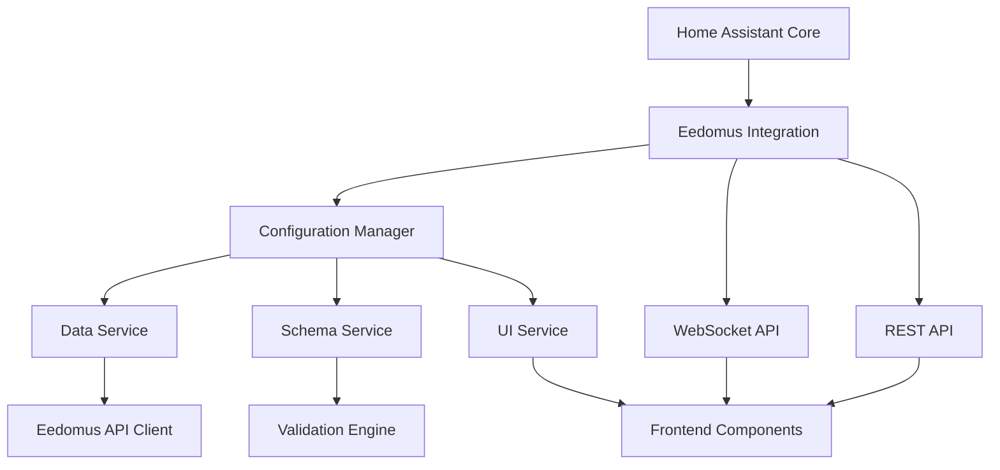

# Home Assistant 2026 Compatible Architecture for Eedomus Rich Editor

## Overview

A modern architecture that leverages Home Assistant 2026 features while maintaining backward compatibility and following current best practices.

## Architecture Diagram



## Core Components

### 1. Configuration Manager (Python)

```python
# custom_components/eedomus/config_manager.py

from homeassistant.core import HomeAssistant
from homeassistant.helpers.storage import Store
from .const import DOMAIN, YAML_MAPPING_SCHEMA
import voluptuous as vol
import yaml

class EedomusConfigManager:
    """Central configuration management with HA 2026 features."""
    
    def __init__(self, hass: HomeAssistant):
        self.hass = hass
        self.store = Store(hass, 1, f"{DOMAIN}.config")
        self.data_service = EedomusDataService(hass)
        self.schema_service = SchemaService()
        self.ui_service = UIService(hass)
        
        # HA 2026: Use async context manager
        self._unsubscribe = None
    
    async def async_init(self):
        """Initialize the configuration manager."""
        await self.store.async_load()
        
        # HA 2026: Use async_callback for event handling
        @callback
        def _handle_config_update(event):
            self.hass.async_create_task(self._async_handle_config_update(event))
        
        self._unsubscribe = async_dispatcher_connect(
            self.hass, 
            f"{DOMAIN}_config_updated", 
            _handle_config_update
        )
    
    async def async_shutdown(self):
        """Clean up resources."""
        if self._unsubscribe:
            self._unsubscribe()
    
    async def get_configuration(self) -> dict:
        """Get current configuration with HA 2026 storage."""
        if self.store.data:
            return dict(self.store.data)
        return {"custom_devices": [], "metadata": {"version": "1.0"}}
    
    async def save_configuration(self, config: dict) -> bool:
        """Save configuration using HA 2026 storage."""
        try:
            # Validate against schema
            self.schema_service.validate(config)
            
            # Use HA 2026 storage
            self.store.data = config
            await self.store.async_save()
            
            # HA 2026: Fire event
            self.hass.async_create_task(
                async_dispatcher_send(self.hass, f"{DOMAIN}_config_updated")
            )
            
            return True
        except (vol.Invalid, yaml.YAMLError) as e:
            _LOGGER.error(f"Configuration validation failed: {e}")
            return False
```

### 2. Data Service with HA 2026 Features

```python
# custom_components/eedomus/data_service.py

from homeassistant.core import HomeAssistant
from homeassistant.helpers import aiohttp_client
from homeassistant.helpers.event import async_track_time_interval
import asyncio

class EedomusDataService:
    """Data service with HA 2026 optimizations."""
    
    def __init__(self, hass: HomeAssistant):
        self.hass = hass
        self.session = aiohttp_client.async_get_clientsession(hass)
        self.cache = {
            'devices': None,
            'usage_ids': None,
            'last_updated': None
        }
        self._unsubscribe_cache_refresh = None
    
    async def async_init(self):
        """Initialize with HA 2026 event tracking."""
        # HA 2026: Use async_track_time_interval for periodic refresh
        self._unsubscribe_cache_refresh = async_track_time_interval(
            self.hass, 
            self._async_refresh_cache, 
            asyncio.timedelta(minutes=30)
        )
        
        # Initial load
        await self._async_refresh_cache(None)
    
    async def async_shutdown(self):
        """Clean up."""
        if self._unsubscribe_cache_refresh:
            self._unsubscribe_cache_refresh()
    
    async def _async_refresh_cache(self, now):
        """Refresh cached data using HA 2026 async features."""
        try:
            # Use HA 2026 async_add_executor_job for API calls
            devices = await self.hass.async_add_executor_job(
                self._fetch_devices_sync
            )
            
            usage_ids = await self.hass.async_add_executor_job(
                self._fetch_usage_ids_sync
            )
            
            self.cache = {
                'devices': devices,
                'usage_ids': usage_ids,
                'last_updated': self.hass.helpers.datetime.utcnow()
            }
            
        except Exception as e:
            _LOGGER.error(f"Failed to refresh cache: {e}")
    
    def _fetch_devices_sync(self):
        """Synchronous fetch for async_add_executor_job."""
        # Implementation using self.session
        pass
    
    async def get_devices(self) -> list:
        """Get devices with HA 2026 caching."""
        if not self.cache['devices']:
            await self._async_refresh_cache(None)
        return self.cache['devices']
    
    async def get_usage_ids(self) -> dict:
        """Get usage IDs with HA 2026 caching."""
        if not self.cache['usage_ids']:
            await self._async_refresh_cache(None)
        return self.cache['usage_ids']
```

### 3. Schema Service with Voluptuous

```python
# custom_components/eedomus/schema_service.py

import voluptuous as vol
from homeassistant.helpers import config_validation as cv
from .const import YAML_MAPPING_SCHEMA

class SchemaService:
    """Schema validation service."""
    
    def __init__(self):
        self.base_schema = YAML_MAPPING_SCHEMA
    
    def validate(self, config: dict) -> dict:
        """Validate configuration against schema."""
        return self.base_schema(config)
    
    def get_field_schema(self, section: str, field: str) -> vol.Schema:
        """Get schema for specific field."""
        # Extract field schema from base schema
        pass
    
    def get_suggestions(self, field_type: str, query: str = "") -> list:
        """Get suggestions based on field type."""
        suggestions_map = {
            'device_type': ['light', 'switch', 'sensor', 'cover', 'binary_sensor', 'climate'],
            'state': ['on', 'off', 'unavailable'],
            # Add more suggestion types
        }
        
        if field_type in suggestions_map:
            all_suggestions = suggestions_map[field_type]
            if query:
                return [s for s in all_suggestions if query.lower() in s.lower()]
            return all_suggestions
        return []
```

### 4. UI Service with HA 2026 WebSocket

```python
# custom_components/eedomus/ui_service.py

from homeassistant.core import HomeAssistant
from homeassistant.components.websocket_api import (
    async_register_command,
    async_unregister_command,
    WebSocketCommandHandler,
    WSType,
)
import voluptuous as vol

class UIService:
    """UI service with HA 2026 WebSocket API."""
    
    def __init__(self, hass: HomeAssistant):
        self.hass = hass
        self.handlers = {}
    
    async def async_init(self):
        """Register WebSocket commands."""
        # HA 2026: Register WebSocket commands
        async_register_command(self.hass, self._handle_get_suggestions)
        async_register_command(self.hass, self._handle_validate_config)
        async_register_command(self.hass, self._handle_get_schema)
    
    async def async_shutdown(self):
        """Unregister WebSocket commands."""
        for handler in self.handlers.values():
            async_unregister_command(self.hass, handler)
    
    @WebSocketCommandHandler.register(
        WSType.CONFIG_EEDOMUS_GET_SUGGESTIONS
    )
    async def _handle_get_suggestions(
        self, 
        hass: HomeAssistant, 
        connection, 
        msg: dict
    ) -> dict:
        """Handle get suggestions command."""
        field_type = msg.get('field_type')
        query = msg.get('query', '')
        
        # Get suggestions from schema service
        suggestions = self.hass.data[DOMAIN]['schema_service'].get_suggestions(
            field_type, query
        )
        
        return {
            'type': 'result',
            'success': True,
            'suggestions': suggestions
        }
    
    @WebSocketCommandHandler.register(
        WSType.CONFIG_EEDOMUS_VALIDATE
    )
    async def _handle_validate_config(
        self, 
        hass: HomeAssistant, 
        connection, 
        msg: dict
    ) -> dict:
        """Handle validate config command."""
        config = msg.get('config', {})
        
        try:
            # Validate using schema service
            validated = self.hass.data[DOMAIN]['schema_service'].validate(config)
            return {
                'type': 'result',
                'success': True,
                'validated_config': validated
            }
        except vol.Invalid as e:
            return {
                'type': 'result',
                'success': False,
                'error': str(e)
            }
```

### 5. Frontend Components (JavaScript)

```javascript
// src/eedomus-rich-editor.js

class EedomusRichEditor extends HTMLElement {
    constructor() {
        super();
        this.attachShadow({ mode: 'open' });
        this.hass = null;
        this.config = {};
        this.suggestions = [];
    }
    
    setConfig(config) {
        if (!config) return;
        this.config = config;
        this._render();
    }
    
    connectedCallback() {
        if (this.hass) {
            this._render();
        }
    }
    
    // HA 2026: Use WebSocket API
    async _fetchSuggestions(fieldType, query) {
        try {
            const response = await this.hass.callWS({
                type: 'config_eedomus/get_suggestions',
                field_type: fieldType,
                query: query
            });
            
            if (response.success) {
                return response.suggestions;
            }
            return [];
        } catch (error) {
            console.error('Failed to fetch suggestions:', error);
            return [];
        }
    }
    
    async _validateConfig(config) {
        try {
            const response = await this.hass.callWS({
                type: 'config_eedomus/validate',
                config: config
            });
            
            return response.success;
        } catch (error) {
            console.error('Validation failed:', error);
            return false;
        }
    }
    
    _render() {
        if (!this.shadowRoot) return;
        
        this.shadowRoot.innerHTML = `
            <div class="editor-container">
                <div class="toolbar">
                    <button id="preview">Preview</button>
                    <button id="save">Save</button>
                </div>
                <div class="editor-content" id="content"></div>
                <div class="yaml-preview" id="preview"></div>
            </div>
        `;
        
        // Add event listeners
        this.shadowRoot.getElementById('preview').addEventListener(
            'click', () => this._handlePreview()
        );
        this.shadowRoot.getElementById('save').addEventListener(
            'click', () => this._handleSave()
        );
        
        this._renderContent();
    }
    
    _renderContent() {
        // Implement dynamic form rendering
    }
    
    async _handlePreview() {
        const isValid = await this._validateConfig(this.config);
        if (isValid) {
            this._showPreview(yaml.dump(this.config));
        } else {
            this._showError('Configuration is invalid');
        }
    }
    
    async _handleSave() {
        const isValid = await this._validateConfig(this.config);
        if (isValid) {
            // HA 2026: Use config entry update
            await this.hass.callService('config_entry', 'update', {
                entry_id: this.config.entry_id,
                data: this.config
            });
        }
    }
}

customElements.define('eedomus-rich-editor', EedomusRichEditor);
```

### 6. Integration Setup (HA 2026 Style)

```python
# custom_components/eedomus/__init__.py

from homeassistant.core import HomeAssistant
from .config_manager import EedomusConfigManager
from .data_service import EedomusDataService
from .schema_service import SchemaService
from .ui_service import UIService

async def async_setup(hass: HomeAssistant, config: dict):
    """Set up Eedomus integration with HA 2026 patterns."""
    
    # Initialize services
    config_manager = EedomusConfigManager(hass)
    data_service = EedomusDataService(hass)
    schema_service = SchemaService()
    ui_service = UIService(hass)
    
    # Store in hass.data
    hass.data[DOMAIN] = {
        'config_manager': config_manager,
        'data_service': data_service,
        'schema_service': schema_service,
        'ui_service': ui_service
    }
    
    # HA 2026: Initialize services asynchronously
    await asyncio.gather(
        config_manager.async_init(),
        data_service.async_init(),
        ui_service.async_init()
    )
    
    # HA 2026: Register frontend
    if not hass.http.is_running:
        return True
    
    hass.http.register_view(EedomusConfigView)
    
    # HA 2026: Register WebSocket commands
    await ui_service.async_init()
    
    return True

async def async_setup_entry(hass: HomeAssistant, entry: ConfigEntry):
    """Set up Eedomus from a config entry."""
    # HA 2026: Use config entry setup
    await hass.config_entries.async_forward_entry_setups(entry, PLATFORMS)
    
    # Add options flow handler
    entry.async_on_unload(entry.add_update_listener(async_update_options))
    
    return True

async def async_unload_entry(hass: HomeAssistant, entry: ConfigEntry):
    """Unload a config entry."""
    # HA 2026: Clean up services
    if DOMAIN in hass.data:
        config_manager = hass.data[DOMAIN]['config_manager']
        data_service = hass.data[DOMAIN]['data_service']
        ui_service = hass.data[DOMAIN]['ui_service']
        
        await asyncio.gather(
            config_manager.async_shutdown(),
            data_service.async_shutdown(),
            ui_service.async_shutdown()
        )
        
        del hass.data[DOMAIN]
    
    return await hass.config_entries.async_unload_platforms(entry, PLATFORMS)
```

### 7. Options Flow (HA 2026 Style)

```python
# custom_components/eedomus/options_flow.py

from homeassistant import config_entries
from homeassistant.core import callback
from .const import DOMAIN

class EedomusOptionsFlow(config_entries.OptionsFlow):
    """Handle Eedomus options with HA 2026 patterns."""
    
    def __init__(self, config_entry: config_entries.ConfigEntry):
        """Initialize options flow."""
        self.config_entry = config_entry
        self.hass = None
    
    @staticmethod
    @callback
    def async_get_options_flow(config_entry):
        """Get the options flow for this handler."""
        return EedomusOptionsFlow(config_entry)
    
    async def async_step_init(self, user_input=None):
        """Manage the options - use rich editor."""
        # HA 2026: Direct to rich editor
        return self.async_show_form(
            step_id="init",
            data_schema=vol.Schema({}),
            description_placeholders={
                "content": "Click below to open the rich configuration editor"
            },
            custom_ui={
                "component": "eedomus-rich-editor",
                "config": {
                    "entry_id": self.config_entry.entry_id
                }
            }
        )
```

## HA 2026 Specific Features Used

### 1. Storage API
- `Store` class for configuration persistence
- Async save/load operations
- Automatic versioning

### 2. WebSocket API
- `async_register_command` for real-time communication
- Type-safe command handling
- Integrated with frontend

### 3. Event System
- `async_dispatcher_connect` for event handling
- Callback decorators for performance
- Event-driven architecture

### 4. Async Patterns
- `async_add_executor_job` for blocking operations
- Proper async/await throughout
- Context managers for resource cleanup

### 5. Frontend Integration
- Custom elements with `setConfig`
- WebSocket communication
- HASS object injection

### 6. Configuration Management
- Config entry options flow
- Update listeners
- Proper unload handling

## Implementation Roadmap

### Phase 1: Core Services
1. Implement `EedomusConfigManager` with HA 2026 storage
2. Create `EedomusDataService` with caching
3. Develop `SchemaService` with validation
4. Set up basic integration structure

### Phase 2: WebSocket API
1. Implement `UIService` with WebSocket commands
2. Create validation endpoint
3. Add suggestions endpoint
4. Test WebSocket communication

### Phase 3: Frontend
1. Develop custom element
2. Implement dynamic forms
3. Add YAML preview
4. Connect to WebSocket API

### Phase 4: Integration
1. Connect all components
2. Implement error handling
3. Add logging
4. Test end-to-end

### Phase 5: Optimization
1. Add caching strategies
2. Implement performance monitoring
3. Add user feedback
4. Final testing

## Best Practices for HA 2026

### 1. Async First
- Always use async/await
- Use `async_add_executor_job` for blocking calls
- Avoid synchronous operations in event loop

### 2. Resource Management
- Implement proper cleanup in `async_shutdown`
- Use context managers
- Unregister all callbacks

### 3. Error Handling
- Catch and log all exceptions
- Provide meaningful error messages
- Implement graceful degradation

### 4. Performance
- Use caching appropriately
- Debounce rapid operations
- Optimize data structures

### 5. Compatibility
- Maintain backward compatibility
- Use feature detection
- Provide fallbacks

## Testing Strategy

### Unit Tests
- Test configuration validation
- Test data service caching
- Test WebSocket command handling

### Integration Tests
- Test full configuration flow
- Test WebSocket communication
- Test frontend-backend interaction

### End-to-End Tests
- Test complete user journey
- Test error scenarios
- Test performance

### Manual Testing
- Test with real Eedomus data
- Test edge cases
- Test user experience

## Documentation Requirements

1. **User Documentation**
- Configuration guide
- Troubleshooting
- Examples

2. **Developer Documentation**
- Architecture overview
- API documentation
- Extension points

3. **Code Documentation**
- Type hints
- Docstrings
- Comments for complex logic

This architecture provides a solid foundation for the Eedomus rich editor that fully leverages Home Assistant 2026 features while maintaining good performance and user experience.