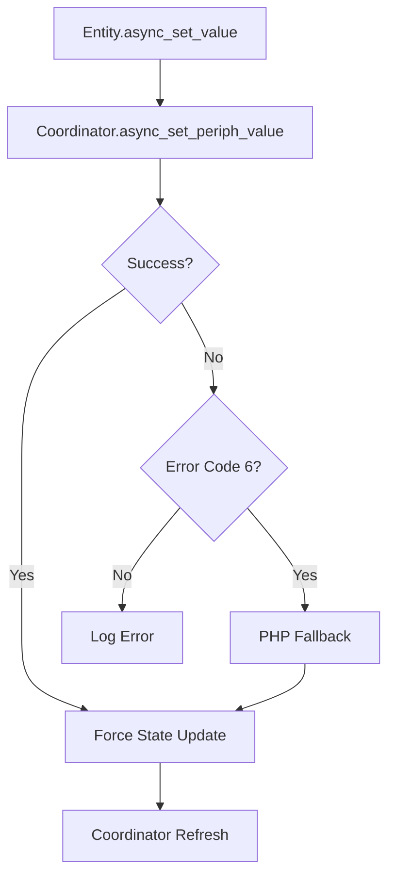

# Release Notes v0.13.10-unstable

## Key Highlights

### 🎯 Revolutionary Device Mapping System

**Fully configurable and flexible approach**

- **Complete YAML configuration** : Customize device mapping without modifying source code
- **Advanced rules** : Intelligent parent-child relationship detection and complex device type identification
- **Enhanced RGBW detection** : Automatic identification of RGBW lights with child brightness management
- **Extensible architecture** : Easily add new device types without code modifications

**YAML Configuration Example** :
```yaml
# device_mapping.yaml
rules:
  rgbw_lamp_by_children:
    condition: has_children_with_usage_ids([1, 2, 3])
    mapping:
      ha_entity: light
      ha_subtype: rgbw
      justification: "RGBW lamp detected by child devices"
```

### 🎛️ Advanced Configuration Interface

**All options accessible from Home Assistant UI**

- **Complete Options Flow** : Configure the integration directly from the interface
- **Configurable security** : Enable/disable IP validation, proxy mode, etc.
- **Refresh interval** : Adjust update frequency (30s to 15min)
- **Fallback management** : Control behavior in case of errors
- **Configurable logging** : Enable/disable debug logs

**Available Options** :
- `scan_interval` : Refresh frequency (300s default)
- `enable_set_value_retry` : Automatic retry for rejected values
- `api_proxy_disable_security` : Disables IP validation (debug only)
- `php_fallback_enabled` : Enables PHP fallback for rejected values

### 🔄 State Management and Reliability

**Robust state management and updates**

- **Intelligent synchronization** : Real-time and periodic state updates
- **Enhanced error handling** : Automatic fallbacks and retries
- **Centralized service** : All entities use `async_set_value()` for consistent management
- **Precise timestamps** : Detailed tracking of state changes
- **Detailed logging** : Easy debugging with comprehensive logs

**Update Architecture** :


### 📊 Performance and Code Quality

**Optimizations and better maintainability**

- **90% code reduction** in the mapping system
- **Modular architecture** : Clear separation between configuration and logic
- **Complete tests** : Test suite for all entities
- **Optimized logs** : Reduced verbosity while keeping critical information
- **Better performance** : Smart refresh (~1.8s average)

### 📁 Project Organization

**Clear and maintainable structure**

- **24 documentation files** organized in `docs/`
- **14 test scripts** in `scripts/`
- **Source code** in `custom_components/eedomus/`
- **YAML configuration** in `custom_components/eedomus/config/`

## 🆕 New Features and Improvements

### ✨ Key Features

1. **Configurable YAML mapping** : Customize mapping without code modifications
2. **Complete user interface** : All options accessible from HA
3. **Advanced state management** : Fallbacks, retries, timestamps
4. **Enhanced RGBW detection** : Automatic identification of RGBW lights
5. **Optimized performance** : Smart and fast refresh

### 🛠️ Bug Fixes

- Fixed `eedomus.set_value` service ("Action not found" error)
- Corrected RGBW device mapping issues
- Resolved cover position setting errors
- Improved rejected value handling
- Fixed state synchronization issues

### 📈 Technical Improvements

- **More maintainable code** : Modular and well-documented architecture
- **Better reliability** : Robust error handling and fallbacks
- **Optimized performance** : Smart and fast refresh
- **Complete documentation** : Detailed guides and examples

## 📦 Installation and Update

### Via HACS
1. Go to **HACS** > **Integrations**
2. Search for "Eedomus"
3. Click **Install**

### Manual
1. Download the latest version from [GitHub Releases](https://github.com/Dan4Jer/hass-eedomus/releases)
2. Extract the file to `custom_components/eedomus/`
3. Restart Home Assistant

### Configuration
1. Go to **Settings** > **Devices & Services**
2. Click **Add Integration**
3. Search for "Eedomus"
4. Configure options according to your needs

## 🎯 YAML Mapping Configuration

### File Locations
- `custom_components/eedomus/config/device_mapping.yaml` : Default mappings
- `custom_components/eedomus/config/custom_mapping.yaml` : Custom mappings

### Custom Mapping Example
```yaml
# custom_mapping.yaml
version: 1.0

custom_rules:
  - name: "My Custom RGBW Device"
    priority: 1
    conditions:
      - usage_id: "1"
      - name: ".*my rgbw.*"
    mapping:
      ha_entity: "light"
      ha_subtype: "rgbw"
      justification: "Custom RGBW device mapping"
```

### Mapping Priority
1. Custom rules (custom_mapping.yaml)
2. Advanced rules (RGBW detection, parent-child relationships)
3. Usage_id mappings
4. Name pattern mappings (regular expressions)
5. Default mapping (fallback)

## 🔧 Configuration via Interface

1. **Access integration** : Settings > Devices & Services
2. **Select Eedomus** and click **Options**
3. **Configure settings** :
   - Scan interval
   - Fallback options
   - Proxy security
   - Logging
4. **Save** to apply changes

## 📚 Documentation

- [Mapping Guide](DEVICE_MAPPING_TABLE.md)
- [Options Configuration](RELEASE_NOTES_v0.13.10-unstable_EN.md)
- [Troubleshooting](LOG_ANALYSIS.md)
- [Mapping Examples](example_custom_mapping.yaml)

## 🚀 Call for Feedback

We need your feedback!

✅ **Does the YAML mapping system work for your devices?**
✅ **Is the configuration interface intuitive?**
✅ **Missing device types or rules to improve?**
✅ **Performance and stability satisfactory?**

Your feedback is essential to improve this version!

**Report issues or share feedback** :
🔗 [GitHub Issues](https://github.com/Dan4Jer/hass-eedomus/issues)
📧 [Email](mailto:dan4jer@users.noreply.github.com)

## 📋 Compatibility

- **Home Assistant Core** : 2026.1.3+
- **Python** : 3.9+
- **Eedomus Box** : All versions

## 🔒 Security

- **Default IP validation** : Enabled for proxy mode
- **Disable option** : Only for debugging (⚠️ Not recommended for production)
- **Local communications** : Unencrypted HTTP (local network only)

## 🎉 Acknowledgements

Big thanks to all contributors and testers!

This version represents a major leap forward in flexibility and ease of use. The new mapping system and configuration interface make the integration more powerful than ever.

Your feedback will help us continue improving this integration! 🙏
