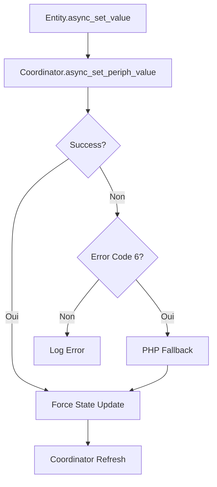

# Notes de Version v0.13.10-unstable

## Points Forts de la Version

### 🎯 Système de Mapping Révolutionnaire

**Une approche entièrement configurable et flexible**

- **Configuration YAML complète** : Personnalisez le mapping des devices sans modifier le code source
- **Règles avancées** : Détection intelligente des relations parent-enfant et des types de devices complexes
- **Détection RGBW améliorée** : Identification automatique des lampes RGBW avec gestion des enfants (brightness)
- **Architecture extensible** : Ajoutez facilement de nouveaux types de devices sans modifier le code

**Exemple de configuration YAML** :
```yaml
# device_mapping.yaml
rules:
  rgbw_lamp_by_children:
    condition: has_children_with_usage_ids([1, 2, 3])
    mapping:
      ha_entity: light
      ha_subtype: rgbw
      justification: "RGBW lamp detected by child devices"
```

### 🎛️ Interface de Configuration Avancée

**Toutes les options accessibles depuis l'interface Home Assistant**

- **Options Flow complet** : Configurez l'intégration directement depuis l'interface
- **Sécurité configurable** : Activez/désactivez la validation IP, le mode proxy, etc.
- **Intervalle de rafraîchissement** : Ajustez la fréquence de mise à jour (30s à 15min)
- **Gestion des fallbacks** : Contrôlez le comportement en cas d'erreur
- **Logging configurable** : Activez/désactivez les logs de débogage

**Options disponibles** :
- `scan_interval` : Fréquence de rafraîchissement (300s par défaut)
- `enable_set_value_retry` : Réessai automatique des valeurs rejetées
- `api_proxy_disable_security` : Désactive la validation IP (debug uniquement)
- `php_fallback_enabled` : Active le fallback PHP pour les valeurs rejetées

### 🔄 Gestion des États et Fiabilité

**Une gestion robuste des états et des mises à jour**

- **Synchronisation intelligente** : Mise à jour des états en temps réel et périodique
- **Gestion des erreurs améliorée** : Fallbacks automatiques et réessais
- **Service centralisé** : Toutes les entités utilisent `async_set_value()` pour une gestion cohérente
- **Timestamps précis** : Suivi détaillé des changements d'état
- **Logging détaillé** : Débogage facilité avec des logs complets

**Architecture de mise à jour** :


### 📊 Performance et Code Quality

**Optimisations et meilleure maintenabilité**

- **Réduction de 90% du code** dans le système de mapping
- **Architecture modulaire** : Séparation claire entre configuration et logique
- **Tests complets** : Suite de tests pour toutes les entités
- **Logs optimisés** : Réduction de la verbosité tout en conservant les informations critiques
- **Meilleure performance** : Rafraîchissement intelligent (~1.8s en moyenne)

### 📁 Organisation du Projet

**Structure claire et maintenable**

- **24 fichiers de documentation** organisés dans `docs/`
- **14 scripts de test** dans `scripts/`
- **Code source** dans `custom_components/eedomus/`
- **Configuration YAML** dans `custom_components/eedomus/config/`

## 🆕 Nouveautés et Améliorations

### ✨ Fonctionnalités Clés

1. **Mapping YAML configurable** : Personnalisez le mapping sans modifier le code
2. **Interface utilisateur complète** : Toutes les options accessibles depuis HA
3. **Gestion avancée des états** : Fallbacks, réessais, timestamps
4. **Détection RGBW améliorée** : Identification automatique des lampes RGBW
5. **Performance optimisée** : Rafraîchissement intelligent et rapide

### 🛠️ Corrections de Bugs

- Fix du service `eedomus.set_value` (erreur "Action not found")
- Correction des problèmes de mapping pour les devices RGBW
- Résolution des erreurs de positionnement des covers
- Amélioration de la gestion des valeurs rejetées
- Correction des problèmes de synchronisation des états

### 📈 Améliorations Techniques

- **Code plus maintenable** : Architecture modulaire et bien documentée
- **Meilleure fiabilité** : Gestion robuste des erreurs et fallbacks
- **Performance optimisée** : Rafraîchissement intelligent et rapide
- **Documentation complète** : Guides et exemples détaillés

## 📦 Installation et Mise à Jour

### Via HACS
1. Allez dans **HACS** > **Intégrations**
2. Cherchez "Eedomus"
3. Cliquez sur **Installer**

### Manuel
1. Téléchargez la dernière version depuis [GitHub Releases](https://github.com/Dan4Jer/hass-eedomus/releases)
2. Extrayez le fichier dans `custom_components/eedomus/`
3. Redémarrez Home Assistant

### Configuration
1. Allez dans **Paramètres** > **Appareils et services**
2. Cliquez sur **Ajouter une intégration**
3. Cherchez "Eedomus"
4. Configurez les options selon vos besoins

## 🎯 Configuration YAML des Mappings

### Emplacement des fichiers
- `custom_components/eedomus/config/device_mapping.yaml` : Mappings par défaut
- `custom_components/eedomus/config/custom_mapping.yaml` : Mappings personnalisés

### Exemple de mapping personnalisé
```yaml
# custom_mapping.yaml
version: 1.0

custom_rules:
  - name: "My Custom RGBW Device"
    priority: 1
    conditions:
      - usage_id: "1"
      - name: ".*my rgbw.*"
    mapping:
      ha_entity: "light"
      ha_subtype: "rgbw"
      justification: "Custom RGBW device mapping"
```

### Priorité des mappings
1. Règles personnalisées (custom_mapping.yaml)
2. Règles avancées (détection RGBW, relations parent-enfant)
3. Mappings par usage_id
4. Mappings par nom (expressions régulières)
5. Mapping par défaut (fallback)

## 🔧 Configuration via l'Interface

1. **Accédez à l'intégration** : Paramètres > Appareils et services
2. **Sélectionnez Eedomus** et cliquez sur **Options**
3. **Configurez les paramètres** :
   - Intervalle de scan
   - Options de fallback
   - Sécurité du proxy
   - Logging
4. **Sauvegardez** pour appliquer les modifications

## 📚 Documentation

- [Guide de Mapping](DEVICE_MAPPING_TABLE.md)
- [Configuration des Options](RELEASE_NOTES_v0.13.10-unstable_FR.md)
- [Dépannage](LOG_ANALYSIS.md)
- [Exemples de Mappings](example_custom_mapping.yaml)

## 🚀 Call for Feedback

Nous avons besoin de vos retours !

✅ **Le système de mapping YAML fonctionne-t-il pour vos devices ?**
✅ **L'interface de configuration est-elle intuitive ?**
✅ **Des types de devices manquants ou des règles à améliorer ?**
✅ **Performance et stabilité satisfaisantes ?**

Votre feedback est essentiel pour améliorer cette version !

**Signalez les problèmes ou partagez vos retours** :
🔗 [GitHub Issues](https://github.com/Dan4Jer/hass-eedomus/issues)
📧 [Email](mailto:dan4jer@users.noreply.github.com)

## 📋 Compatibilité

- **Home Assistant Core** : 2026.1.3+
- **Python** : 3.9+
- **Eedomus Box** : Toutes versions

## 🔒 Sécurité

- **Validation IP par défaut** : Active pour le mode proxy
- **Option de désactivation** : Uniquement pour le débogage (⚠️ Non recommandé en production)
- **Communications locales** : HTTP non chiffré (réseau local uniquement)

## 🎉 Remerciements

Un grand merci à tous les contributeurs et testeurs !

Cette version représente une avancée majeure en termes de flexibilité et de facilité d'utilisation. Le nouveau système de mapping et l'interface de configuration rendent l'intégration plus puissante que jamais.

Votre feedback nous aidera à continuer d'améliorer cette intégration ! 🙏
