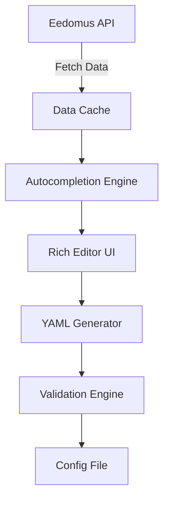
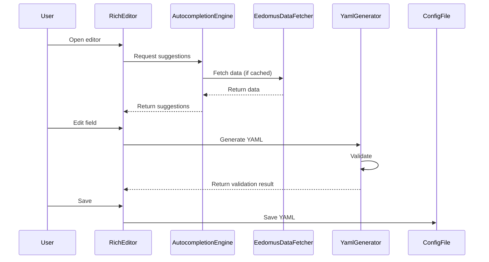

# Rich Configuration Editor Design for Eedomus Integration

## Overview

A dynamic configuration editor that provides intelligent autocompletion and validation based on Eedomus API data, while maintaining YAML structure compatibility.

## Architecture



## Core Components

### 1. Data Fetching Layer

```python
class EedomusDataFetcher:
    """Fetch and cache Eedomus API data for autocompletion."""
    
    async def fetch_devices(self, hass: HomeAssistant) -> List[Dict]:
        """Fetch all devices from Eedomus API."""
        # Implementation using Eedomus API client
        pass
    
    async def fetch_usage_ids(self, hass: HomeAssistant) -> Dict[str, Dict]:
        """Fetch usage ID mappings."""
        pass
    
    async def fetch_peripheral_types(self, hass: HomeAssistant) -> Dict[str, str]:
        """Fetch peripheral type information."""
        pass
```

### 2. Autocompletion Engine

```python
class AutocompletionEngine:
    """Provide intelligent suggestions based on Eedomus data."""
    
    def __init__(self, data_fetcher: EedomusDataFetcher):
        self.data_fetcher = data_fetcher
        self.cache = {}
    
    async def get_device_suggestions(self, query: str) -> List[Dict]:
        """Get device suggestions matching query."""
        if not self.cache.get('devices'):
            self.cache['devices'] = await self.data_fetcher.fetch_devices()
        
        return [
            {
                'value': device['id'],
                'label': f"{device['name']} ({device['id']}) - {device['type']}",
                'icon': device.get('icon', 'mdi:device-unknown')
            }
            for device in self.cache['devices']
            if query.lower() in device['name'].lower() or query in device['id']
        ]
    
    async def get_usage_id_suggestions(self, query: str) -> List[Dict]:
        """Get usage ID suggestions."""
        if not self.cache.get('usage_ids'):
            self.cache['usage_ids'] = await self.data_fetcher.fetch_usage_ids()
        
        return [
            {
                'value': usage_id,
                'label': f"{usage_id} - {data.get('name', 'Unknown')}",
                'description': data.get('description', '')
            }
            for usage_id, data in self.cache['usage_ids'].items()
            if query.lower() in usage_id.lower() or query.lower() in data.get('name', '').lower()
        ]
```

### 3. Dynamic Form Generator

```python
class DynamicFormGenerator:
    """Generate form fields based on YAML schema and Eedomus data."""
    
    def __init__(self, autocompletion: AutocompletionEngine):
        self.autocompletion = autocompletion
    
    async def generate_device_form(self, device_data: Dict = None) -> Dict:
        """Generate form for custom device configuration."""
        
        # Get suggestions for autocompletion
        devices = await self.autocompletion.get_device_suggestions("")
        usage_ids = await self.autocompletion.get_usage_id_suggestions("")
        
        return {
            'type': 'form',
            'fields': [
                {
                    'name': 'eedomus_id',
                    'label': 'Eedomus Device ID',
                    'type': 'autocomplete',
                    'suggestions': devices,
                    'required': True,
                    'validation': {'type': 'string', 'pattern': '^[a-zA-Z0-9_]+$'}
                },
                {
                    'name': 'ha_entity',
                    'label': 'Home Assistant Entity',
                    'type': 'text',
                    'required': True,
                    'validation': {'type': 'string', 'pattern': '^[a-z0-9_]+\\.[a-z0-9_]+$'}
                },
                {
                    'name': 'type',
                    'label': 'Device Type',
                    'type': 'select',
                    'options': [
                        {'value': 'light', 'label': 'Light'},
                        {'value': 'switch', 'label': 'Switch'},
                        {'value': 'sensor', 'label': 'Sensor'},
                        {'value': 'cover', 'label': 'Cover'},
                        {'value': 'binary_sensor', 'label': 'Binary Sensor'},
                        {'value': 'climate', 'label': 'Climate'},
                        {'value': 'select', 'label': 'Select'}
                    ],
                    'required': True
                },
                {
                    'name': 'usage_id',
                    'label': 'Usage ID',
                    'type': 'autocomplete',
                    'suggestions': usage_ids,
                    'required': False
                }
            ]
        }
```

### 4. YAML Structure Mapping

```python
YAML_STRUCTURE_MAP = {
    'metadata': {
        'fields': ['version', 'last_modified', 'changes'],
        'type': 'object'
    },
    'custom_devices': {
        'fields': ['eedomus_id', 'ha_entity', 'type', 'ha_subtype', 'icon', 'room'],
        'type': 'array',
        'item_type': 'object'
    },
    'custom_rules': {
        'fields': ['name', 'condition', 'actions'],
        'type': 'array',
        'item_type': 'object'
    }
}
```

### 5. Rich Editor Interface

```javascript
// Frontend component structure
class RichEditor extends React.Component {
    state = {
        activeSection: 'custom_devices',
        currentItem: null,
        searchQuery: '',
        suggestions: []
    }
    
    handleAutocomplete = async (field, query) => {
        const suggestions = await this.props.getSuggestions(field, query);
        this.setState({ suggestions, currentField: field });
    }
    
    renderField = (fieldConfig, value) => {
        switch (fieldConfig.type) {
            case 'autocomplete':
                return (
                    <AutocompleteField
                        value={value}
                        suggestions={this.state.suggestions}
                        onChange={(val) => this.handleChange(fieldConfig.name, val)}
                        onSearch={(query) => this.handleAutocomplete(fieldConfig.name, query)}
                    />
                );
            case 'select':
                return (
                    <SelectField
                        value={value}
                        options={fieldConfig.options}
                        onChange={(val) => this.handleChange(fieldConfig.name, val)}
                    />
                );
            default:
                return (
                    <TextField
                        value={value}
                        onChange={(val) => this.handleChange(fieldConfig.name, val)}
                    />
                );
        }
    }
    
    render() {
        return (
            <div className="rich-editor">
                <div className="sidebar">
                    <SectionNavigator
                        sections={Object.keys(YAML_STRUCTURE_MAP)}
                        activeSection={this.state.activeSection}
                        onSelect={this.handleSectionSelect}
                    />
                </div>
                <div className="main-content">
                    <div className="toolbar">
                        <button onClick={this.handlePreview}>Preview</button>
                        <button onClick={this.handleSave}>Save</button>
                        <button onClick={this.handleAddItem}>Add Item</button>
                    </div>
                    <div className="editor-content">
                        {this.renderCurrentSection()}
                    </div>
                </div>
                <div className="yaml-preview">
                    <YamlPreview content={this.state.yamlContent} />
                </div>
            </div>
        );
    }
}
```

### 6. YAML Generation and Validation

```python
class YamlGenerator:
    """Convert form data to YAML and validate."""
    
    def __init__(self, schema: vol.Schema):
        self.schema = schema
    
    def generate_yaml(self, form_data: Dict) -> str:
        """Convert form data to YAML string."""
        return yaml.dump(form_data, default_flow_style=False, sort_keys=False)
    
    def validate_yaml(self, yaml_content: str) -> Tuple[bool, Dict]:
        """Validate YAML content against schema."""
        try:
            parsed = yaml.safe_load(yaml_content)
            validated = self.schema(parsed)
            return True, validated
        except (yaml.YAMLError, vol.Invalid) as e:
            return False, {'error': str(e)}
```

## Implementation Plan

### Phase 1: Backend Services
1. Implement `EedomusDataFetcher` to fetch API data
2. Create `AutocompletionEngine` with caching
3. Develop `YamlGenerator` with validation
4. Add API endpoints for suggestions

### Phase 2: Frontend Components
1. Create React components for dynamic forms
2. Implement autocompletion UI
3. Build YAML preview panel
4. Add validation feedback

### Phase 3: Integration
1. Connect frontend to backend services
2. Implement real-time validation
3. Add error handling
4. Test with sample data

### Phase 4: Enhancements
1. Add keyboard navigation
2. Implement bulk editing
3. Add import/export functionality
4. Create documentation

## Data Flow



## Technical Requirements

### Backend
- Python 3.14+
- Home Assistant 2026+
- Eedomus API client
- Voluptuous for validation
- PyYAML for YAML processing

### Frontend
- React 18+
- Material-UI or similar component library
- Monaco Editor for YAML preview
- Axios for API calls

### Performance
- Implement caching for API responses
- Use debouncing for search queries
- Optimize YAML generation
- Implement lazy loading for large datasets

## Error Handling

### Common Scenarios
1. **API Unavailable**: Show cached data with warning
2. **Invalid YAML**: Highlight errors in UI
3. **Validation Errors**: Show inline error messages
4. **Network Errors**: Retry with exponential backoff

### Error Recovery
- Automatic retry for transient errors
- Fallback to cached data
- Graceful degradation of features
- Clear error messages for users

## Future Enhancements

1. **AI-Assisted Configuration**: Suggest mappings based on device types
2. **Visual Mapping Editor**: Drag-and-drop interface
3. **Change History**: Track and revert configuration changes
4. **Collaboration Features**: Share and import configurations
5. **Advanced Validation**: Cross-field validation rules

## Implementation Notes

1. Maintain backward compatibility with existing YAML files
2. Ensure all changes are validated before saving
3. Provide clear feedback for all user actions
4. Optimize for both desktop and mobile use
5. Follow Home Assistant design guidelines
