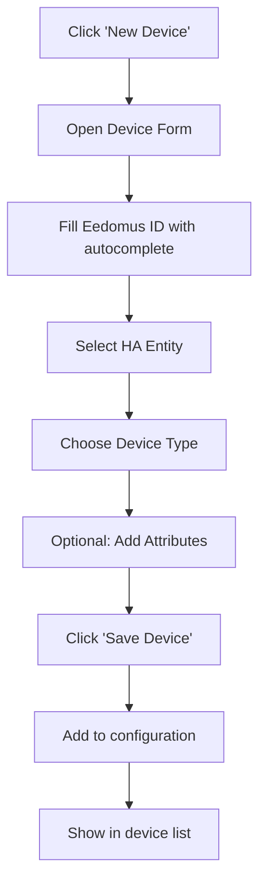
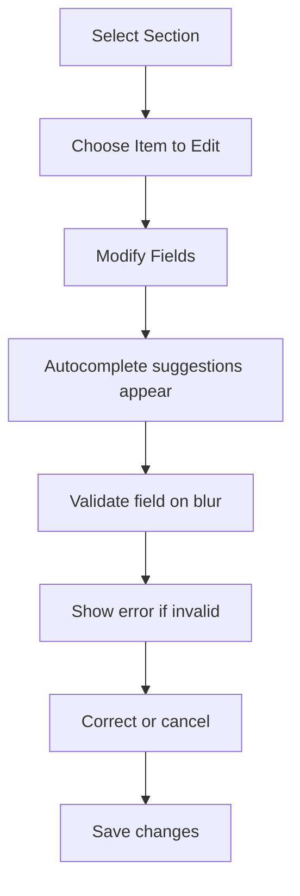
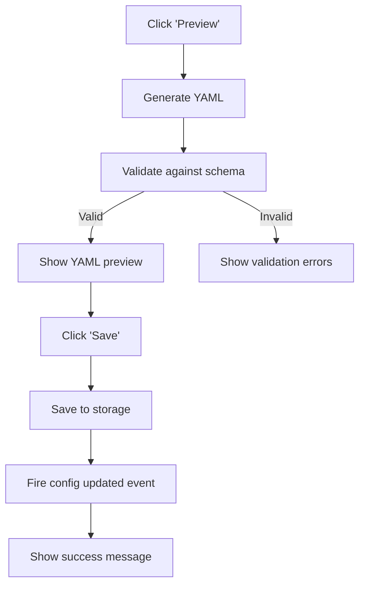

# Eedomus Rich Editor Wireframe Design

## Overview

Visual design for the rich configuration editor with dynamic fields and autocompletion.

## Main Editor Layout

```
+---------------------------------------------------------------+
| HEADER (60px)                                                  |
| +-----------------------------------------------------------+ |
| | Eedomus Configuration Editor                            | |
| | [Save] [Preview] [Help] [Close]                        | |
| +-----------------------------------------------------------+ |
+---------------------------------------------------------------+
|                                                               |
| +-------------------+  +---------------------------------+  |
| |                   |  |                                 |  |
| |   SIDEBAR         |  |                                 |  |
| |   (250px)         |  |   MAIN EDITOR AREA             |  |
| |                   |  |                                 |  |
| | +---------------+ |  | +-----------------------------+ |  |
| | | Sections    | |  | | |                             | |  |
| | |-------------| |  | | |   Dynamic Form Fields      | |  |
| | | Metadata   | |  | | |                             | |  |
| | | Custom     | |  | | |   [Field 1] [Autocomplete]  | |  |
| | | Devices   | |  | | |                             | |  |
| | | Custom     | |  | | |   [Field 2] [Dropdown]      | |  |
| | | Rules     | |  | | |                             | |  |
| | | Usage ID  | |  | | |   [Field 3] [Text Input]    | |  |
| | | Mappings  | |  | | |                             | |  |
| | | Temp. Set-| |  | | |   [Add Item] [Remove]       | |  |
| | | points    | |  | | |                             | |  |
| | | Name      | |  | | +-----------------------------+ |  |
| | | Patterns  | |  | |                                 |  |
| | +---------------+ |  |                                 |  |
| |                   |  |                                 |  |
| | [Add Section]    |  |                                 |  |
| |                   |  |                                 |  |
| +-------------------+  |                                 |  |
|                       +---------------------------------+  |
+---------------------------------------------------------------+
|                                                               |
| YAML PREVIEW PANEL (200px)                                      |
| +-----------------------------------------------------------+ |
| | ```yaml                                                   | |
| | # Current Configuration                                    | |
| | metadata:                                                 | |
| |   version: "1.0"                                         | |
| | custom_devices:                                           | |
| |   - eedomus_id: "12345"                                  | |
| |     ha_entity: "light.living_room"                       | |
| |     type: "light"                                        | |
| | ```                                                       | |
| +-----------------------------------------------------------+ |
| [Copy to Clipboard] [Download YAML] [Validate]            |
+---------------------------------------------------------------+
```

## Detailed Component Designs

### 1. Header Section

```
+---------------------------------------------------------------+
| Eedomus Configuration Editor                                |
|                                                               |
| [Save] [Preview] [Help] [Close]                              |
+---------------------------------------------------------------+
| Status: Ready  |  Last Saved: 2026-01-01 14:30  |  Auto-save: On |
+---------------------------------------------------------------+
```

### 2. Sidebar Navigation

```
+-------------------+
| SECTIONS          |
+-------------------+
|                   |
| +---------------+ |
| | 📋 Metadata   | |
| +---------------+ |
| | 🎛️  Custom     | |
| |     Devices   | |
| +---------------+ |
| | 📜 Custom     | |
| |     Rules     | |
| +---------------+ |
| | 🔗 Usage ID   | |
| |     Mappings  | |
| +---------------+ |
| | 🌡️  Temp. Set-| |
| | |     points    | |
| +---------------+ |
| | 📝 Name       | |
| |     Patterns  | |
| +---------------+ |
|                   |
| [+ Add Section]  |
|                   |
| [Import Config]  |
| [Export Config]  |
+-------------------+
```

### 3. Dynamic Form Fields

#### Autocomplete Field

```
+---------------------------------------------------+
| Device ID *                                      |
+---------------------------------------------------+
| [ 12345 | Living Room Light (12345) - Light  ▼ ] |
|                                                   |
| Suggestions:                                      |
|   ✓ 12345 - Living Room Light (Light)           |
|   ✓ 12346 - Kitchen Switch (Switch)             |
|   ✓ 12347 - Bedroom Sensor (Sensor)              |
+---------------------------------------------------+
```

#### Device Configuration Form

```
+---------------------------------------------------+
| Custom Device Configuration                      |
+---------------------------------------------------+
| Eedomus ID *                                      |
| [ 12345 | Living Room Light ▼ ]                   |
|                                                   |
| Home Assistant Entity *                          |
| [ light.living_room_main ]                       |
|                                                   |
| Device Type *                                     |
| [ Light ▼ ]                                       |
|                                                   |
| Usage ID                                          |
| [ temp_living ▼ ]                                 |
|                                                   |
| Room                                              |
| [ Living Room ]                                   |
|                                                   |
| Icon                                              |
| [ mdi:lightbulb ▼ ]                               |
|                                                   |
| Attributes (YAML)                                |
| +-------------------------------+                 |
| | color_mode: "rgbw"          |                 |
| | brightness: true            |                 |
| +-------------------------------+                 |
|                                                   |
| [Add Attribute] [Remove]                          |
|                                                   |
| [Save Device] [Cancel]                           |
+---------------------------------------------------+
```

### 4. YAML Preview Panel

```
+---------------------------------------------------+
| YAML PREVIEW                                      |
+---------------------------------------------------+
| [Refresh] [Copy] [Download] [Validate]           |
|                                                   |
| ```yaml                                           |
| metadata:                                         |
|   version: "1.0"                                 |
|   last_modified: "2026-01-01"                   |
|   changes:                                        |
|     - "Added living room light"                  |
|                                                   |
| custom_devices:                                   |
|   - eedomus_id: "12345"                          |
|     ha_entity: "light.living_room_main"         |
|     type: "light"                                |
|     ha_subtype: "rgbw"                           |
|     icon: "mdi:lightbulb"                        |
|     room: "Living Room"                          |
|     attributes:                                    |
|       color_mode: "rgbw"                        |
|       brightness: true                            |
| ```                                               |
|                                                   |
| Status: ✅ Valid YAML                             |
+---------------------------------------------------+
```

### 5. Modal Dialogs

#### Validation Error Modal

```
+---------------------------------------------------+
| ⚠️  Configuration Error                         |
+---------------------------------------------------+
|                                                   |
| Invalid configuration detected:                   |
|                                                   |
| • Missing required field: eedomus_id             |
| • Invalid device type: "invalid_type"           |
| • Duplicate device ID: 12345                     |
|                                                   |
| [Show Details] [Fix Automatically] [Cancel]       |
+---------------------------------------------------+
```

#### Save Confirmation

```
+---------------------------------------------------+
| Save Configuration?                               |
+---------------------------------------------------+
|                                                   |
| You have unsaved changes:                         |
| • 1 device added                                  |
| • 2 devices modified                             |
| • 1 rule added                                    |
|                                                   |
| [Save] [Save & Reload] [Discard] [Cancel]         |
+---------------------------------------------------+
```

### 6. Toolbar and Actions

```
+---------------------------------------------------+
| TOOLBAR                                           |
+---------------------------------------------------+
| [New Device] [New Rule] [Import] [Export]        |
| [Undo] [Redo] [Search] [Settings]                |
|                                                   |
| Filter: [All] ▼  |  Search: [_________]         |
+---------------------------------------------------+
```

## Interaction Flow

### Adding a New Device



### Editing Configuration



### Preview and Save



## Visual Style Guide

### Colors
```
Primary: #435D7D (Eedomus Blue)
Secondary: #5C85D6
Accent: #FFD700 (Gold)
Success: #4CAF50
Warning: #FFC107
Error: #F44336
Background: #F5F5F5
Text: #333333
```

### Typography
```
Font Family: Roboto, sans-serif
Headings: 700 (Bold)
Body: 400 (Regular)
Code: 'Roboto Mono', monospace
```

### Spacing
```
Base Unit: 8px
Small: 8px
Medium: 16px
Large: 24px
XLarge: 32px
```

### Icons
```
Use Material Design Icons (mdi:)
Size: 24px for standard icons
Size: 18px for input icons
```

## Responsive Design

### Desktop (>1200px)
```
+-------------------+---------------------------------+----------------+
|                   |                                 |                |
|   Sidebar (25%)   |   Main Editor (55%)            | YAML Preview   |
|                   |                                 |   (20%)        |
+-------------------+---------------------------------+----------------+
```

### Tablet (768-1200px)
```
+-------------------+---------------------------------+
|                   |                                 |
|   Sidebar (30%)   |   Main Editor (70%)            |
|                   |                                 |
+-------------------+---------------------------------+
|   YAML Preview (100%)                            |
+-------------------------------------------------+
```

### Mobile (<768px)
```
+-------------------+
|   Toggle Sidebar  |
+-------------------+
|   Main Editor     |
+-------------------+
|   YAML Preview    |
+-------------------+
```

## Accessibility Features

### Keyboard Navigation
- Tab through form fields
- Arrow keys for autocomplete
- Enter to select suggestions
- Esc to close modals

### Screen Reader Support
- ARIA labels for all interactive elements
- Live regions for status messages
- Semantic HTML structure

### Color Contrast
- Minimum 4.5:1 for text
- Minimum 3:1 for UI components
- Tested with WCAG AA standards

## Animation and Transitions

### Field Transitions
- Smooth 0.2s transitions for focus states
- Fade in/out for suggestions (0.15s)
- Slide down for error messages (0.2s)

### Loading States
- Skeleton loaders for async data
- Spinner for save operations
- Progress bar for large imports

## Implementation Notes

### Frontend Framework
- Use HASS frontend components where possible
- Custom elements for editor-specific UI
- Monaco editor for YAML preview

### State Management
- Local state for form editing
- Redux pattern for complex state
- Optimistic updates for better UX

### Performance
- Virtual scrolling for large lists
- Debounced search inputs
- Lazy loading for sections

### Internationalization
- Support for multiple languages
- RTL language support
- Dynamic text sizing

This wireframe provides a comprehensive visual guide for implementing the rich configuration editor with all necessary UI components and interaction patterns.