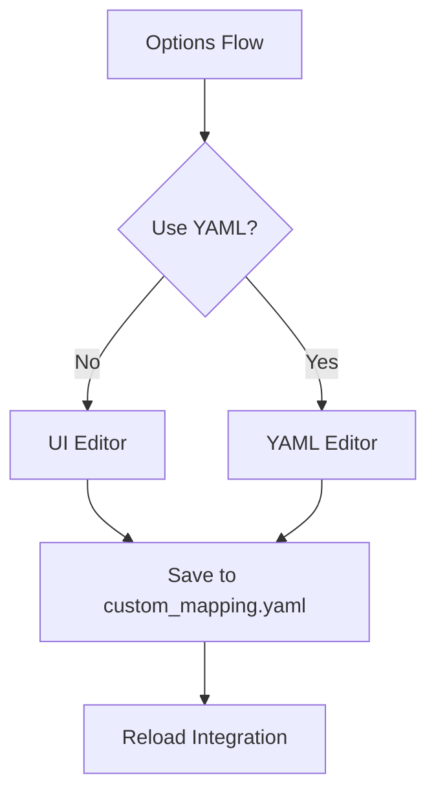
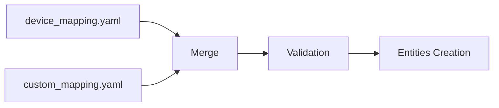
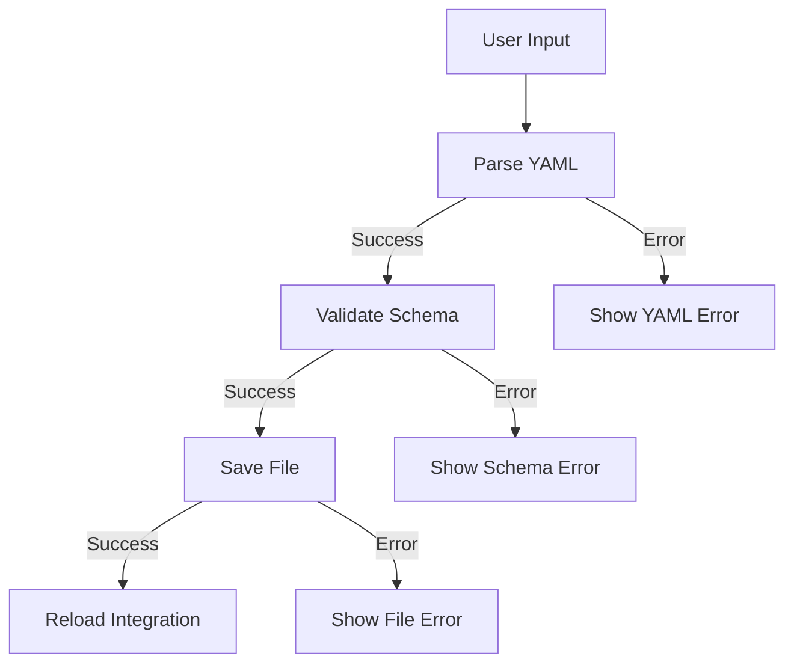

# Guide: YAML⇄UI Mapping System for hass-eedomus

## Overview

This guide explains the YAML⇄UI mapping system implemented in hass-eedomus, which allows users to configure device mappings using either a graphical UI or YAML files, with seamless switching between the two methods.

## Key Features

### 1. Dual Configuration Methods

**UI Mode:**
- Graphical interface with rich selectors
- Real-time validation
- Easy for beginners
- Pre-filled with existing mappings

**YAML Mode:**
- Direct YAML editing for advanced users
- Full control over configuration
- Template provided for new users
- Validation before saving

### 2. Seamless Toggle

Users can switch between UI and YAML modes at any time:
- Mode preference is saved in config entry options
- Changes are preserved when switching modes
- No data loss during mode changes

### 3. File Structure

```
config/
├── device_mapping.yaml      # Default mappings (provided with integration)
└── custom_mapping.yaml     # User mappings (overrides defaults)
```

## Implementation Details

### 1. Configuration Flow



### 2. Data Flow



## Usage Guide

### Accessing the Options Flow

1. Go to **Settings > Devices & Services**
2. Find **eedomus** integration
3. Click **Options**
4. Select your preferred configuration method

### UI Mode

**Step 1:** Select "UI Mode" in the options

**Step 2:** Add or modify devices using the form:
- **eedomus_id**: Device ID from eedomus
- **ha_entity**: Home Assistant entity ID (e.g., `light.living_room`)
- **type**: Entity type (light, switch, sensor, etc.)
- **name**: Friendly name
- **ha_subtype**: Optional subtype (dimmable, rgbw, etc.)
- **icon**: Optional Material Design icon
- **room**: Optional room assignment

**Step 3:** Save changes

**Step 4:** Call `eedomus.reload` service or restart HA

### YAML Mode

**Step 1:** Select "YAML Mode" in the options

**Step 2:** Edit the YAML content:
```yaml
custom_devices:
  - eedomus_id: "12345"
    ha_entity: "light.living_room"
    type: "light"
    name: "Living Room Light"
    ha_subtype: "dimmable"
    icon: "mdi:ceiling-light"
    room: "Living Room"
```

**Step 3:** Save changes (automatic validation)

**Step 4:** Call `eedomus.reload` service or restart HA

## Schema Validation

### Device Schema

```python
DEVICE_SCHEMA = vol.Schema({
    vol.Required("eedomus_id"): str,
    vol.Required("ha_entity"): str,
    vol.Required("type"): vol.In(["light", "switch", "sensor", "cover", "binary_sensor", "climate", "select"]),
    vol.Required("name"): str,
    vol.Optional("ha_subtype", default=""): str,
    vol.Optional("icon"): cv.icon,
    vol.Optional("room", default=""): str,
    vol.Optional("justification", default=""): str,
})
```

### YAML Mapping Schema

```python
YAML_MAPPING_SCHEMA = vol.Schema({
    vol.Optional("custom_devices"): vol.All(cv.ensure_list, [DEVICE_SCHEMA]),
})
```

## Advanced Features

### 1. Priority System

- **custom_mapping.yaml** overrides **device_mapping.yaml**
- User mappings always take precedence
- No data loss when updating integration

### 2. Reload Service

```yaml
# Call the reload service after changes
service: eedomus.reload
```

### 3. Error Handling

- Invalid YAML: Syntax error messages
- Invalid schema: Field-specific validation errors
- File errors: Permission and I/O error handling
- Logging: Detailed error logging for debugging

## Examples

### Example 1: Simple Light

**UI:**
- eedomus_id: `12345`
- ha_entity: `light.living_room`
- type: `light`
- name: `Living Room Light`
- ha_subtype: `dimmable`

**YAML:**
```yaml
custom_devices:
  - eedomus_id: "12345"
    ha_entity: "light.living_room"
    type: "light"
    name: "Living Room Light"
    ha_subtype: "dimmable"
```

### Example 2: RGBW Light

**UI:**
- eedomus_id: `67890`
- ha_entity: `light.bedroom_rgbw`
- type: `light`
- name: `Bedroom RGBW Strip`
- ha_subtype: `rgbw`
- icon: `mdi:led-strip-variant`

**YAML:**
```yaml
custom_devices:
  - eedomus_id: "67890"
    ha_entity: "light.bedroom_rgbw"
    type: "light"
    name: "Bedroom RGBW Strip"
    ha_subtype: "rgbw"
    icon: "mdi:led-strip-variant"
```

### Example 3: Temperature Sensor

**UI:**
- eedomus_id: `54321`
- ha_entity: `sensor.garage_temp`
- type: `sensor`
- name: `Garage Temperature`
- ha_subtype: `temperature`
- icon: `mdi:thermometer`

**YAML:**
```yaml
custom_devices:
  - eedomus_id: "54321"
    ha_entity: "sensor.garage_temp"
    type: "sensor"
    name: "Garage Temperature"
    ha_subtype: "temperature"
    icon: "mdi:thermometer"
```

## Troubleshooting

### Common Issues

**Issue: Changes not applied**
- Solution: Call `eedomus.reload` service or restart Home Assistant
- Check: Verify YAML syntax and schema validation

**Issue: Device not appearing**
- Solution: Check eedomus_id is correct
- Check: Verify device exists in eedomus

**Issue: Invalid YAML error**
- Solution: Use YAML validator
- Check: Indentation and quotes

**Issue: Schema validation error**
- Solution: Check required fields
- Check: Valid entity types and subtypes

### Debugging

```bash
# Check logs for errors
tail -f /config/home-assistant.log | grep eedomus

# Validate YAML syntax
python3 -c "import yaml; yaml.safe_load(open('custom_mapping.yaml'))"

# Test schema validation
# (Requires Python environment with voluptuous)
```

## Best Practices

### 1. Backup Before Changes

```bash
cp config/custom_mapping.yaml config/custom_mapping.yaml.backup
```

### 2. Use Descriptive Names

```yaml
# Good
- eedomus_id: "12345"
  ha_entity: "light.living_room_main"
  name: "Living Room Main Light"

# Avoid
- eedomus_id: "12345"
  ha_entity: "light.light1"
  name: "Light 1"
```

### 3. Organize by Room

```yaml
custom_devices:
  # Living Room
  - eedomus_id: "12345"
    ha_entity: "light.living_room_main"
    name: "Living Room Main Light"
    room: "Living Room"

  # Kitchen
  - eedomus_id: "67890"
    ha_entity: "light.kitchen_spots"
    name: "Kitchen Spots"
    room: "Kitchen"
```

### 4. Use Icons Consistently

```yaml
# Good: Consistent icon style
- icon: "mdi:lightbulb"
- icon: "mdi:ceiling-light"
- icon: "mdi:led-strip-variant"

# Avoid: Mixed styles
- icon: "mdi:lightbulb"
- icon: "light:ceiling"  # Not Material Design
```

## Migration Guide

### From Previous Versions

If you're upgrading from a version without this feature:

1. **Backup** your existing configuration
2. **Review** the new YAML format
3. **Test** with a few devices first
4. **Gradually** migrate all devices

### From Manual Configuration

If you've been manually configuring devices:

1. **Export** your current configuration
2. **Convert** to the new YAML format
3. **Validate** using the schema
4. **Import** using the new system

## Technical Details

### File Merge Logic

```python
# Merge strategy: custom overrides default
merged = {**default_mapping, **custom_mapping}
```

### Validation Process

1. Parse YAML → Python dict
2. Validate schema → Raised errors
3. Merge mappings → Final config
4. Create entities → HA integration

### Error Handling Flow



## Future Enhancements

### Planned Features

- **Import from eedomus API**: Auto-detect devices
- **Bulk edit**: Edit multiple devices at once
- **Export/Import**: Backup and restore mappings
- **Visual preview**: See entity cards before saving

### Potential Improvements

- **Room-based organization**: Group by room in UI
- **Device templates**: Pre-configured device types
- **Validation warnings**: Non-critical suggestions
- **History tracking**: Changes over time

## Support

For issues with the YAML⇄UI mapping system:

1. **Check logs**: `/config/home-assistant.log`
2. **Validate YAML**: Use online YAML validator
3. **Review schema**: Check required fields
4. **Report issues**: GitHub issue tracker

## License

This feature is part of hass-eedomus and is licensed under the MIT License.

---

**Last Updated**: 2026-01-19
**Version**: YAML⇄UI Mapping v1.0
**Compatibility**: Home Assistant 2026.0+
**Maintainer**: Dan4Jer