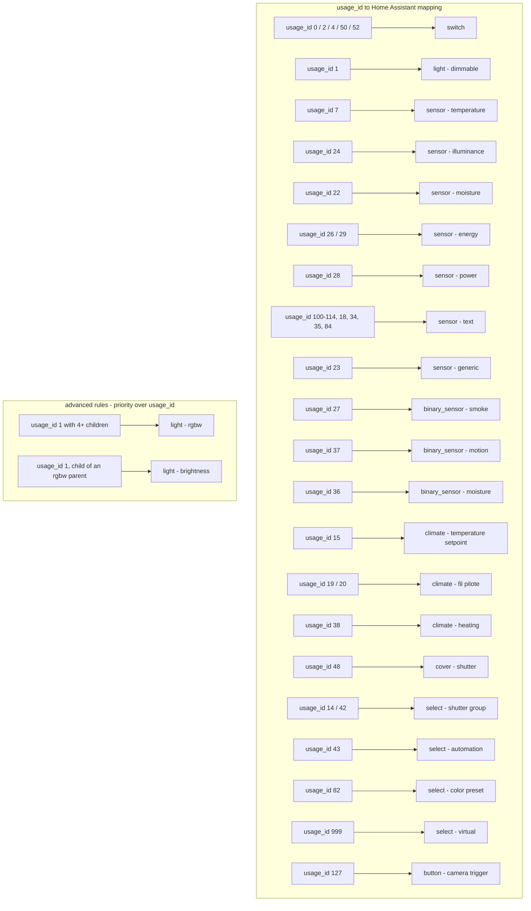

# The custom mapping format

This page documents the custom mapping document of the hass-eedomus
integration - the YAML the Rules tab edits and the options flow can
load. The grammar below mirrors the validation schema
(`custom_components/eedomus/const.py`): what the schema accepts is the
format.

## The default mapping at a glance

The shipped `config/device_mapping.yaml` decides the entity shape of
every peripheral. The diagram below summarizes it: `usage_id` (the
device category the box reports) drives the platform, and a few
advanced rules detect multi-child devices.



Everything in the diagram is overridable: `custom_usage_id_mappings`
replaces a usage row, `custom_rules` adds state-conditional rules, and
both win over the default document (priority: advanced rules >
`usage_id_mappings` > `name_patterns` > `default_mapping`).

## Top-level sections

```yaml
custom_usage_id_mappings:   # mapping by eedomus usage_id
custom_rules:               # state-conditional rules
temperature_setpoint_mappings:  # thermostat setpoint handling
custom_name_patterns:      # name / entity_id rewrites
custom_devices:            # mapping by eedomus_id
versions:                  # the editor's saved history
```

## custom_usage_id_mappings

Maps an eedomus `usage_id` (the device category the box reports) to a
Home Assistant entity shape. This is what the Rules tab's usage_id
rules produce.

```yaml
custom_usage_id_mappings:
  "7":                       # the eedomus usage_id
    ha_entity: sensor        # required: HA platform (sensor, light, ...)
    ha_subtype: temperature  # optional: refines the platform handling
    device_class: temperature  # optional: the HA device_class
    justification: Temperature sensor - the box reports usage 7
```

- `ha_entity` (required): the Home Assistant platform - `sensor`,
  `light`, `switch`, `binary_sensor`, `cover`, `climate`, `select`,
  `number`, ...
- `ha_subtype` (optional): the specialized handling inside the
  platform (`temperature`, `rgbw`, `brightness`, `energy`, ...).
- `device_class` (optional): the HA device class - it drives units and
  icons in HA.
- `justification` (optional, shown in the Coherence tab): why this
  mapping exists.

## custom_rules

State-conditional rules: when a peripheral with a given `usage_id`
rests in a given state, apply actions. The `custom_rules` list is
historic; the Rules tab edits `custom_usage_id_mappings`, both live
in the same document.

```yaml
custom_rules:
  - name: My rule
    condition:
      usage_id: "7"
      state: "on"           # one of: on, off, unavailable
    actions:
      - type: override      # override | ignore | transform
        ha_entity: sensor    # optional: the platform to force
        attributes:         # optional: arbitrary attribute overrides
          device_class: temperature
```

- `condition.usage_id` (required): the eedomus usage_id to match.
- `condition.state` (required): the trigger state - one of `on`,
  `off`, `unavailable`.
- `actions[].type` (required): `override` (force fields), `ignore`
  (leave the peripheral unmapped), `transform` (rewrite values).
- `actions[].ha_entity` / `actions[].attributes`: the override
  targets.

## temperature_setpoint_mappings

Maps a thermostat setpoint peripheral to the climate handling, with an
optional unit override:

```yaml
temperature_setpoint_mappings:
  "123456":
    ha_entity: climate
    unit_of_measurement: "°C"
    justification: Zone setpoint
```

## custom_name_patterns

Regular-expression rewrites of the peripheral names or entity ids:

```yaml
custom_name_patterns:
  - pattern: "Salon\\s+Salon"
    replacement: "Salon"
    target: name           # name | entity_id
```

## custom_devices

Direct per-device overrides (by the eedomus peripheral id), for the
cases the usage_id mapping cannot express:

```yaml
custom_devices:
  - eedomus_id: "12345"
    ha_entity: "light.spots_cuisine"
    type: light            # light|switch|sensor|climate|cover|binary_sensor|text_sensor
    ha_subtype: rgbw       # optional: rgbw, brightness, color_temp, ...
    icon: mdi:spotlight    # optional
    room: Cuisine          # optional
    parent_periph_id: "123"  # optional: the parent peripheral
```

## versions

Managed by the editor (Historique config tab): the last three saved
versions of the document, each `{version, last_modified, changes}` -
not hand-edited.
