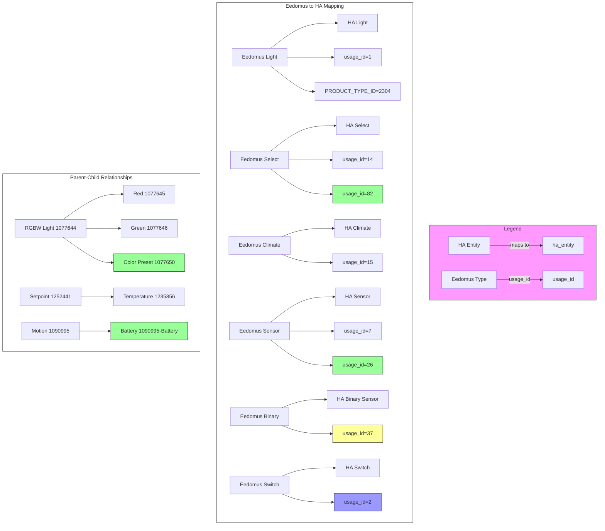
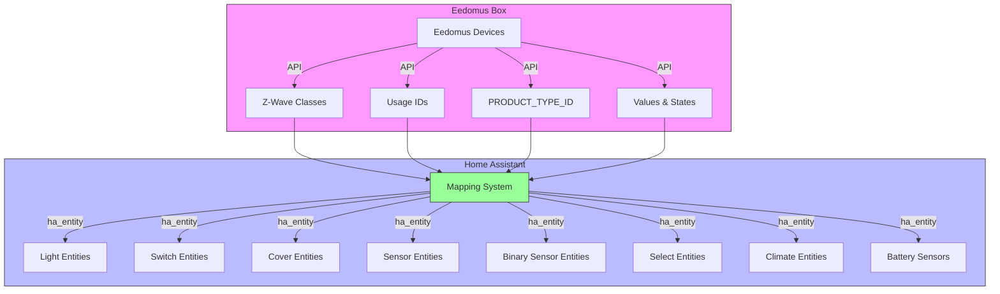
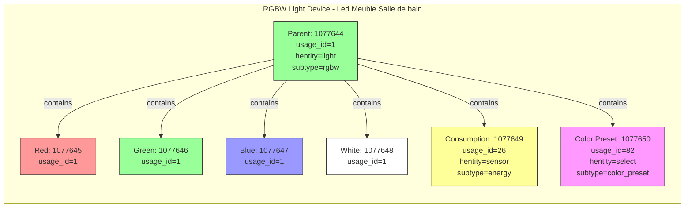
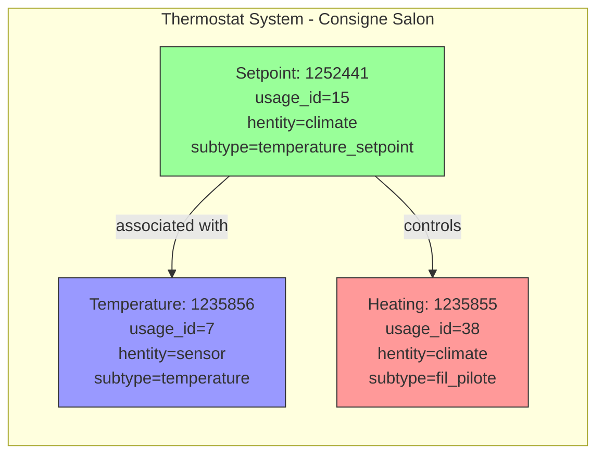
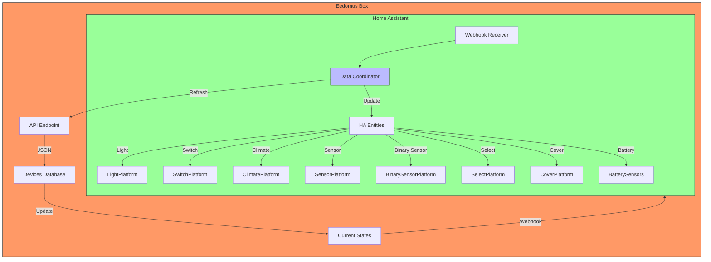
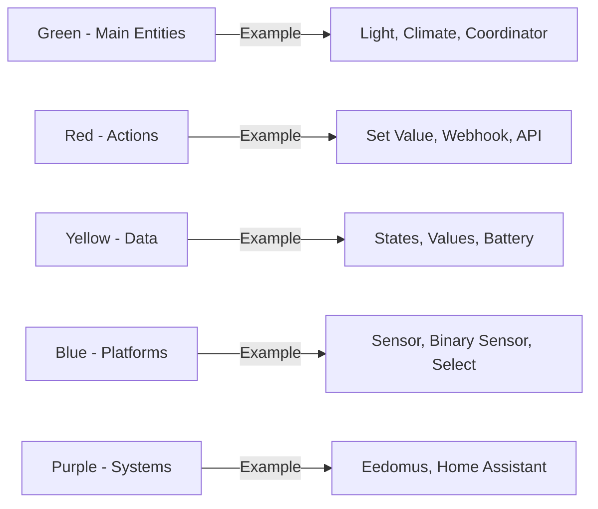
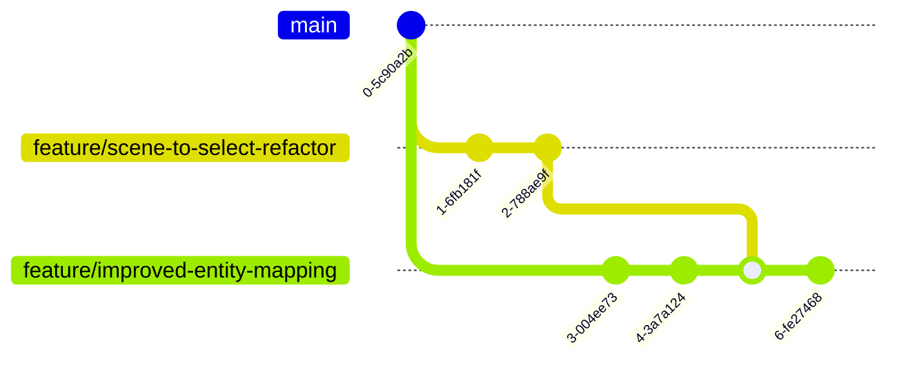

## 🗺️ Architecture Visuelle des Entités

### 🎯 Tableau de Correspondance Eedomus → Home Assistant

### Diagramme Global de Mapping des Entités

### Exemple Concret : Device RGBW avec Couleurs Prédéfinies

### Exemple Concret : Thermostat avec Capteur Associé

### Flux de Données Complet

### Légende des Couleurs

### Diagramme d'Intégration Git

## 📋 Fonctionnalités Supportées par Version

| Version | Plateformes | Entités Spéciales | Changements Majeurs |
|---------|-------------|-------------------|---------------------|
| 0.12.0 | 7 | Battery sensors, Color presets as select | Améliorations majeures des entités |
| 0.11.0 | 7 | Select entities | Migration Scene→Select |
| 0.10.0 | 7 | Climate entities | Support des thermostats |
| 0.9.0 | 6 | Mapping system | Refonte du mapping |
| 0.8.0 | 6 | Scene entities | Support des scènes |
